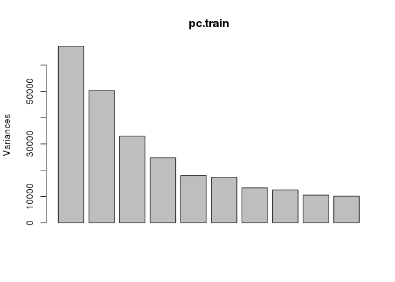

Exploratory Analysis of Processed Data
================
Nivretta, Ming

Step 0: Load Packages and Data
==============================

### Installed the necessary dependencies by:

``` r
#install.packages("gplots")
#install.packages("devtools")
#install_github("ggbiplot", "vqv")
library(devtools)
library(ggbiplot)
library(dplyr)
library(tibble)
library(gplots)
library(RColorBrewer)
library(lattice)
```

### Load in preprocessed data from dropbox.

``` r
#none of the three google drive links work
#download.file("https://drive.google.com/open?id=0B3XxI9J9w-RYN0R5Rnh6SnZNNmc", "data.txt")
#download.file("https://drive.google.com/uc?export=download&id=0B3XxI9J9w-RYN0R5Rnh6SnZNNmc", "data.txt")
#download.file("https://drive.google.com/uc?export=download&confirm=kWmX&id=0B3XxI9J9w-RYN0R5Rnh6SnZNNmc", "data.txt")

#download preprocessed data from this dropbox link directly into Exploratory Analysis folder
#data.txt is in gitignore, be sure not to try to push to github
#download.file("https://www.dropbox.com/s/s4xv0k0vsl0ka0r/data.txt?dl=1", "data.txt")

#setwd("../ExploratoryAnalysis")

data <- read.table("data.txt")

design <- read.csv("des.txt", sep="\t", header=TRUE)
```

Step 1: Exploratory Plots
=========================

A first look at the processed data with some plots.

First we need to convolve the design matrix with the processed data.

``` r
#rename processed data columns to sample names - doesn't need to be done anymore
#colnames(gsetFin2) <- c(as.character(design$Samplename))

#join the processed data with experiemtnal design info
#note, couldn't do this on my local computer - data too large. Ran code on lab's rstudio which runs on a server
full <- cbind(design, t(data))
```

### 1.1 Explore a random CpG Site

``` r
#random cpg site from 1 to 464923
probe_row <- 6000

#get the site name 
probe_name <- colnames(full)[probe_row]


#plot y = beta values for random cpg site for all samples, x= gestational age, plots divided by sample group, points colored by ethnicity
ggplot(full, aes(x = as.factor(ga), y = full[probe_name], colour = Ethnicity)) + 
  #geom_boxplot(aes(fill=Ethnicity), show.legend = TRUE) + 
  geom_jitter(width = 0.5) + 
  facet_wrap(~Sample_Group) + 
  xlab("Gestational Age") + 
  ylab("Beta values") +
  ggtitle(paste("Beta values for CpG site", probe_name)) #+
```

    ## Don't know how to automatically pick scale for object of type data.frame. Defaulting to continuous.


``` r
  #stat_summary(fun.y = mean, geom="point", colour="darkred", size= 3)

#beta values for random cpG site
ggplot(full, aes(x = Ethnicity, y = full[probe_name])) + 
  geom_violin(show.legend = FALSE) + 
  geom_jitter(width = 0.3, aes(colour = sex)) + 
  #facet_wrap(~sex) + 
  xlab("Ethnicity") + 
  ylab("Beta values") +
  ggtitle(paste("Beta values for CpG site", probe_name)) +
  stat_summary(fun.y = mean, geom="point", colour="darkred", size= 3)
```

    ## Don't know how to automatically pick scale for object of type data.frame. Defaulting to continuous.


### 1.2 Sample to Sample Correlations

``` r
#obtain sample names in order of ethnicity and then sample group
full_ethnicity <- full[order(full$Ethnicity, full$Sample_Group),]
order_ethnicity <- row.names(full_ethnicity)

#order expression data by ethnicity and then sample group
gsetFin2_ethnicity <- data[, order_ethnicity]

#set the color pallette for heatmap
cols<-c(rev(brewer.pal(9,"YlOrRd")), "#FFFFFF")

col <- c(rep("darkgoldenrod1", times = ncol(gsetFin2_ethnicity)))
col[grepl("Asian", full_ethnicity$Ethnicity)] <- "forestgreen"
op <- par(mai = rep(0.5, 4))
heatmap.2(cor(gsetFin2_ethnicity), 
          Rowv=FALSE, 
          Colv=FALSE, 
          dendrogram = "none",
          symm = TRUE,
          trace="none",
          col = cols, 
          margins = c(1,1),
          RowSideColors = col,
          ColSideColors = col,
          labRow = FALSE,
          labCol = FALSE,
          key.title = NA,
          main = "Sample Correlations, 
        Ordered by Ethnicity then sample group")
legend("bottomleft", c("Caucasian", "Asian"), col = c("darkgoldenrod1", "forestgreen"), 
    pch = 15)
```


``` r
par(op)
```

Sample group (Control, LOPET, IUGR) does not seem to affect the clustering of the samples. This fits with what it is known in the literature (control, LOPET, IUGR do not affect DNAm). Most of the samples seem to correlate evenly with each other.

Now let's look at sample to sample correlation, ordered by ethnicity then gender.

``` r
#obtain sample names in order of ethnicity and then gender
full_ethnicity_sex <- full[order(full$Ethnicity, full$sex),]
order_ethnicity_sex <- row.names(full_ethnicity_sex)

#order expression data by ethnicity and then gender
gsetFin2_ethnicity_sex <- data[, order_ethnicity_sex]

#set the color pallette for heatmap
cols<-c(rev(brewer.pal(9,"YlOrRd")), "#FFFFFF")

col <- c(rep("darkgoldenrod1", times = ncol(gsetFin2_ethnicity_sex)))
col[grepl("Asian", full_ethnicity_sex$Ethnicity)] <- "forestgreen"
op <- par(mai = rep(0.5, 4))
heatmap.2(cor(gsetFin2_ethnicity_sex), 
           Rowv=FALSE, 
          Colv=FALSE, 
          dendrogram = "none",
          symm = TRUE,
          trace="none",
          col = cols, 
          margins = c(1,1),
          RowSideColors = col,
          ColSideColors = col,
          labRow = FALSE,
          labCol = FALSE,
          key.title = NA,
          main = "Sample Correlations, 
        Ordered by Ethnicity then Gender")
legend("bottomleft", c("Caucasian", "Asian"), col = c("darkgoldenrod1", "forestgreen"), 
    pch = 15)
```


``` r
par(op)
```

It's difficult to tell if gender affects affects the clustering of the samples. We need to look at the data further.

Step 2: Unsupervised clustering
===============================

### 2.1: PCA on training data:

``` r
pc.train <- prcomp(scale(t(data),center=T,scale = T))

# look at the eigenvalues
plot(pc.train)
```



The `plot()` function returns a plot of the variances (y-axis) associated with the PCs (x-axis), which is useful to decide how many PCs to retain for further analysis.

``` r
summary(pc.train)
```

    ## Importance of components:
    ##                             PC1      PC2       PC3       PC4      PC5
    ## Standard deviation     259.2041 224.2972 181.58732 157.16574 134.1441
    ## Proportion of Variance   0.1445   0.1082   0.07092   0.05313   0.0387
    ## Cumulative Proportion    0.1445   0.2527   0.32364   0.37677   0.4155
    ##                             PC6       PC7       PC8       PC9      PC10
    ## Standard deviation     131.3335 115.19038 111.78600 102.59258 100.45597
    ## Proportion of Variance   0.0371   0.02854   0.02688   0.02264   0.02171
    ## Cumulative Proportion    0.4526   0.48112   0.50800   0.53063   0.55234
    ##                            PC11     PC12     PC13     PC14    PC15    PC16
    ## Standard deviation     96.94551 95.14546 91.65346 90.93416 88.3696 87.3287
    ## Proportion of Variance  0.02022  0.01947  0.01807  0.01779  0.0168  0.0164
    ## Cumulative Proportion   0.57256  0.59203  0.61009  0.62788  0.6447  0.6611
    ##                           PC17     PC18     PC19     PC20     PC21
    ## Standard deviation     85.7165 83.17625 81.48632 81.13386 80.74645
    ## Proportion of Variance  0.0158  0.01488  0.01428  0.01416  0.01402
    ## Cumulative Proportion   0.6769  0.69176  0.70605  0.72021  0.73423
    ##                            PC22     PC23     PC24     PC25    PC26
    ## Standard deviation     79.31894 78.90655 77.92852 77.06075 76.8396
    ## Proportion of Variance  0.01353  0.01339  0.01306  0.01277  0.0127
    ## Cumulative Proportion   0.74776  0.76115  0.77422  0.78699  0.7997
    ##                            PC27     PC28     PC29     PC30     PC31
    ## Standard deviation     75.96452 75.71976 75.45761 75.41986 74.56784
    ## Proportion of Variance  0.01241  0.01233  0.01225  0.01223  0.01196
    ## Cumulative Proportion   0.81210  0.82443  0.83668  0.84891  0.86087
    ##                            PC32    PC33     PC34    PC35     PC36     PC37
    ## Standard deviation     73.59897 72.7979 72.30052 71.8361 71.36743 71.23120
    ## Proportion of Variance  0.01165  0.0114  0.01124  0.0111  0.01096  0.01091
    ## Cumulative Proportion   0.87252  0.8839  0.89517  0.9063  0.91722  0.92813
    ##                            PC38     PC39     PC40     PC41     PC42
    ## Standard deviation     70.42989 70.29780 69.93740 69.32554 68.82778
    ## Proportion of Variance  0.01067  0.01063  0.01052  0.01034  0.01019
    ## Cumulative Proportion   0.93880  0.94943  0.95995  0.97029  0.98048
    ##                            PC43     PC44      PC45
    ## Standard deviation     67.80424 66.91702 5.257e-13
    ## Proportion of Variance  0.00989  0.00963 0.000e+00
    ## Cumulative Proportion   0.99037  1.00000 1.000e+00

The `summary()` function describes the importance of the PCs. The first row describe again the standard deviation associated with each PC. The second row shows the proportion of the variance in the data explained by each component while the third row describe the cumulative proportion of explained variance.

``` r
PC123 <- data.frame(pc.train$x[,1:5])              # Take out first 3 PCs
PC123 <- PC123 %>% tibble::rownames_to_column('Samplename') %>%             # Put sample names into column to 
                    left_join(design, 'Samplename')                         # Join the metadata info 
```

    ## Warning in left_join_impl(x, y, by$x, by$y, suffix$x, suffix$y): joining
    ## factor and character vector, coercing into character vector

``` r
head(PC123)            
```

    ##   Samplename        PC1        PC2        PC3        PC4         PC5
    ## 1      PM104 -310.82132  674.38294  211.61370 -338.25619  -3.2404917
    ## 2      PM112  -19.51124  189.42528   32.35514  -29.26408 183.9969164
    ## 3      PM114  215.71694 -161.16184   20.59990 -247.45606 128.7184147
    ## 4      PM115  -43.50295 -121.84379  308.02825 -330.68767 -44.1440423
    ## 5      PM119 -197.22937   76.16583   92.79710  -63.09708   0.8875455
    ## 6      PM120  297.25072 -140.71185 -215.60583  -62.03467 -32.5173271
    ##   Sample_Group   ga sex Ethnicity
    ## 1      CONTROL 40.7   M Caucasian
    ## 2      CONTROL 38.9   F     Asian
    ## 3      CONTROL 38.6   M Caucasian
    ## 4        LOPET 41.1   M Caucasian
    ## 5        LOPET 37.1   M     Asian
    ## 6      CONTROL 38.0   F Caucasian

``` r
ggplot(PC123, aes(x = PC1, y = PC2)) + 
  geom_point(aes(color = Ethnicity)) +
  ggtitle('PC1 and PC2: Ethnicity')
```


``` r
ggplot(PC123, aes(x = PC1, y = PC3)) + 
  geom_point(aes(color = Ethnicity)) +
  ggtitle('PC1 and PC3: Ethnicity')
```


``` r
ggplot(PC123, aes(x = PC2, y = PC3)) + 
  geom_point(aes(color = Ethnicity)) +
  ggtitle('PC2 and PC3: Ethnicity')
```


We can see from plotting the first three principal components that our groups (Asian, Caucasian) do not seem to separate. This indicates that the main drivers of the variance in the data is something else.

``` r
ggplot(PC123, aes(x = PC1, y = PC2)) + 
  geom_point(aes(color = sex)) +
  ggtitle('Sex')
```


``` r
ggplot(PC123, aes(x = PC1, y = PC2)) + 
  geom_point(aes(color = ga)) +
  ggtitle('Gestational Age')
```


``` r
ggplot(PC123, aes(x = PC1, y = PC2)) + 
  geom_point(aes(color = Sample_Group)) +
  ggtitle('Sample Group')
```


It's not clear that our other variables are driving the variance in the data (sex, gestational age, and sample group).

``` r
# scatter plot matrix for the first 5 PCs

splom(PC123[,c(2:6,10)], panel = panel.smoothScatter, raster = TRUE)
```


Plotting scatter plots of the top 5 PCs against ethnicity, none of the PCs can clearly separate samples by ethnicity, disappointing.

### PCA projection of loadings to test data:

We can use the predict function if we observe new data and want to predict their PCs values.

``` r
#download test data from dropbox
#testdata.txt is in gitignore, be sure not to try to push to github
#download.file("https://www.dropbox.com/s/gjmtofnktayl6m1/testdata.txt?dl=1", "testdata.txt")

#read in test data
test.data <- read.table("testdata.txt", row.names = 1, header = T)
test.data <- as.data.frame(t(test.data))
sum(is.na(test.data)) # 52000 total entries that are NA
```

    ## [1] 52000

``` r
test.rmna <- test.data[, colSums(is.na(test.data)) == 0]  # remove columns with NAs present

#predict PCs for test set by projecting PC loadings to test data
predicted <- predict(pc.train, new.data = test.rmna)
```

    ## Warning: In predict.prcomp(pc.train, new.data = test.rmna) :
    ##  extra argument 'new.data' will be disregarded

``` r
str(predicted)
```

    ##  num [1:45, 1:45] -310.8 -19.5 215.7 -43.5 -197.2 ...
    ##  - attr(*, "dimnames")=List of 2
    ##   ..$ : chr [1:45] "PM104" "PM112" "PM114" "PM115" ...
    ##   ..$ : chr [1:45] "PC1" "PC2" "PC3" "PC4" ...
