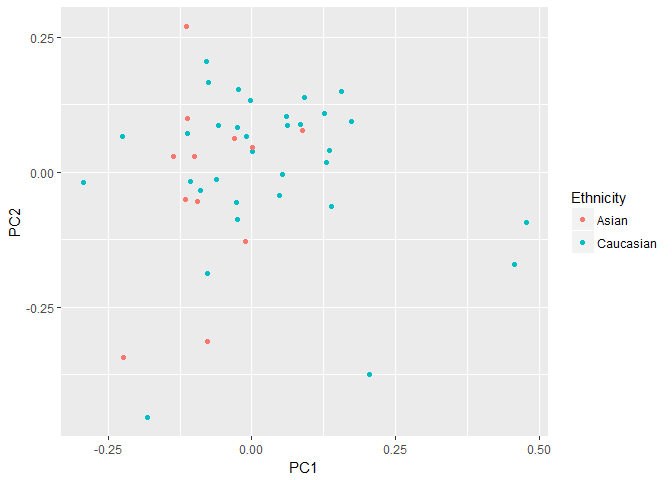
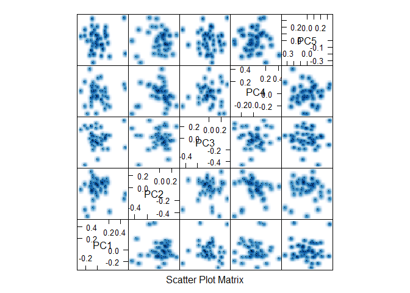

Predictive Modeling Analysis
================
Ming Wan, Victor Yuan

-   [Step 0: Load Packages and Data](#step-0-load-packages-and-data)
-   [Step 1: Unsupervised clustering:](#step-1-unsupervised-clustering)
    -   [PCA on training data:](#pca-on-training-data)
    -   [PCA projection of loadings to test data:](#pca-projection-of-loadings-to-test-data)
-   [Step 2: Supervised classification:](#step-2-supervised-classification)
    -   [logistic regression with elastic net regularization](#logistic-regression-with-elastic-net-regularization)
        -   [Compare the different methods of cross validation. Why pick repeatedcv](#compare-the-different-methods-of-cross-validation.-why-pick-repeatedcv)
        -   [Horvath et al. (2013) uses an 'elastic net generalized linear model' to build an across-tissue DNAm predictor on age. Since our data is the same type, we'll try glmnet.](#horvath-et-al.-2013-uses-an-elastic-net-generalized-linear-model-to-build-an-across-tissue-dnam-predictor-on-age.-since-our-data-is-the-same-type-well-try-glmnet.)
        -   [Horvath, S. (2013). DNA methylation age of human tissues and cell types. Genome Biology, 14(10), R115. <http://doi.org/10.1186/gb-2013-14-10-r115>](#horvath-s.-2013.-dna-methylation-age-of-human-tissues-and-cell-types.-genome-biology-1410-r115.-httpdoi.org10.1186gb-2013-14-10-r115)

Step 0: Load Packages and Data
==============================

Load required packages:

``` r
#source("https://bioconductor.org/biocLite.R")
#biocLite('e1071')                                    # required for glmnet in caret
library(ggplot2)
library(limma)
library(caret)
```

    ## Loading required package: lattice

``` r
library(dplyr)
```

    ## 
    ## Attaching package: 'dplyr'

    ## The following objects are masked from 'package:stats':
    ## 
    ##     filter, lag

    ## The following objects are masked from 'package:base':
    ## 
    ##     intersect, setdiff, setequal, union

``` r
library(glmnet)
```

    ## Loading required package: Matrix

    ## Loading required package: foreach

    ## Loaded glmnet 2.0-5

Read in pre-processed data: \*Make sure the pre-processed data (data.txt, which is in data.zip) is present in the ../processed\_data/ directory.

``` r
setwd('../')                                           # note: all of these relative file path calls work only for knitting

# load data (pre-processed training set)
train.data <- read.table('../Data/Processed Data/data.txt')
str(train.data)
```

    ## 'data.frame':    464923 obs. of  45 variables:
    ##  $ PM104: num  0.9219 0.569 0.0435 0.0635 0.0368 ...
    ##  $ PM112: num  0.8546 0.6886 0.0724 0.0856 0.0364 ...
    ##  $ PM114: num  0.8319 0.6578 0.0906 0.0909 0.0393 ...
    ##  $ PM115: num  0.9021 0.6146 0.0665 0.0839 0.0389 ...
    ##  $ PM119: num  0.896 0.6565 0.0591 0.0987 0.0336 ...
    ##  $ PM120: num  0.8658 0.6338 0.0982 0.1254 0.0421 ...
    ##  $ PM123: num  0.8769 0.6214 0.0571 0.0582 0.0477 ...
    ##  $ PM124: num  0.8481 0.6759 0.0711 0.1022 0.0437 ...
    ##  $ PM130: num  0.821 0.6326 0.1116 0.1038 0.0449 ...
    ##  $ PM136: num  0.9024 0.569 0.0674 0.0671 0.0493 ...
    ##  $ PM139: num  0.8259 0.6098 0.0556 0.0628 0.0371 ...
    ##  $ PM142: num  0.8099 0.6414 0.1094 0.1451 0.0435 ...
    ##  $ PM153: num  0.8911 0.6525 0.0939 0.0888 0.044 ...
    ##  $ PM155: num  0.8384 0.5506 0.0802 0.0984 0.0458 ...
    ##  $ PM158: num  0.835 0.6604 0.1136 0.1122 0.0393 ...
    ##  $ PM167: num  0.8618 0.5825 0.0807 0.0774 0.0424 ...
    ##  $ PM181: num  0.9024 0.6273 0.0885 0.1101 0.0416 ...
    ##  $ PM20 : num  0.8925 0.677 0.1326 0.1507 0.0538 ...
    ##  $ PM205: num  0.851 0.641 0.139 0.142 0.125 ...
    ##  $ PM226: num  0.8822 0.693 0.0972 0.1074 0.0367 ...
    ##  $ PM227: num  0.9049 0.6118 0.0462 0.0719 0.0343 ...
    ##  $ PM233: num  0.8022 0.6165 0.0744 0.1352 0.0448 ...
    ##  $ PM243: num  0.8551 0.6229 0.0896 0.1001 0.0376 ...
    ##  $ PM249: num  0.9153 0.6164 0.0654 0.0946 0.0345 ...
    ##  $ PM29 : num  0.9114 0.6393 0.0399 0.0364 0.0296 ...
    ##  $ PM30 : num  0.8835 0.5735 0.0885 0.1435 0.0407 ...
    ##  $ PM4  : num  0.8463 0.5852 0.0733 0.0869 0.0408 ...
    ##  $ PM40 : num  0.8385 0.6786 0.0586 0.0718 0.0364 ...
    ##  $ PM41 : num  0.8149 0.6576 0.0663 0.1045 0.0485 ...
    ##  $ PM44 : num  0.8089 0.5596 0.1227 0.1471 0.0378 ...
    ##  $ PM46 : num  0.9026 0.6467 0.0751 0.1048 0.0372 ...
    ##  $ PM47 : num  0.8491 0.6345 0.0653 0.0967 0.0468 ...
    ##  $ PM52 : num  0.8891 0.5681 0.0782 0.1018 0.0362 ...
    ##  $ PM53 : num  0.8566 0.6803 0.0866 0.1076 0.0466 ...
    ##  $ PM54 : num  0.8513 0.7054 0.0998 0.1685 0.0427 ...
    ##  $ PM55 : num  0.8317 0.5979 0.0954 0.1153 0.0354 ...
    ##  $ PM58 : num  0.8322 0.6706 0.0754 0.1237 0.0492 ...
    ##  $ PM66 : num  0.9138 0.6296 0.0859 0.1162 0.041 ...
    ##  $ PM71 : num  0.7972 0.5837 0.1344 0.1746 0.0477 ...
    ##  $ PM72 : num  0.8706 0.6164 0.1114 0.1194 0.0396 ...
    ##  $ PM74 : num  0.8611 0.5987 0.0988 0.0997 0.037 ...
    ##  $ PM76 : num  0.8401 0.5985 0.0728 0.1062 0.0409 ...
    ##  $ PM84 : num  0.8955 0.6762 0.2148 0.1548 0.0433 ...
    ##  $ PM9  : num  0.8784 0.6027 0.1118 0.1305 0.0441 ...
    ##  $ PM98 : num  0.8279 0.629 0.0827 0.0837 0.0418 ...

``` r
## row names are CpG sites, column names are sample names

# load metadata
design <- read.csv("../Data/Processed Data/des.txt", sep="\t", header=TRUE)
str(design)
```

    ## 'data.frame':    45 obs. of  5 variables:
    ##  $ Samplename  : Factor w/ 45 levels "PM104","PM112",..: 1 2 3 4 5 6 7 8 9 10 ...
    ##  $ Sample_Group: Factor w/ 3 levels "CONTROL","IUGR",..: 1 1 1 3 3 1 2 1 2 1 ...
    ##  $ ga          : num  40.7 38.9 38.6 41.1 37.1 38 35.7 40 36.9 38.6 ...
    ##  $ sex         : Factor w/ 2 levels "F","M": 2 1 2 2 2 1 1 2 2 1 ...
    ##  $ Ethnicity   : Factor w/ 2 levels "Asian","Caucasian": 2 1 2 2 1 2 2 2 2 2 ...

``` r
colnames(train.data) == design$Samplename               # check that the samples are in same order
```

    ##  [1] TRUE TRUE TRUE TRUE TRUE TRUE TRUE TRUE TRUE TRUE TRUE TRUE TRUE TRUE
    ## [15] TRUE TRUE TRUE TRUE TRUE TRUE TRUE TRUE TRUE TRUE TRUE TRUE TRUE TRUE
    ## [29] TRUE TRUE TRUE TRUE TRUE TRUE TRUE TRUE TRUE TRUE TRUE TRUE TRUE TRUE
    ## [43] TRUE TRUE TRUE

Step 1: Unsupervised clustering:
================================

As Rob suggested, PCA should be the precursor to supervised classification, more like an exploration.

PCA on training data:
---------------------

``` r
pc.train <- prcomp(t(scale(t(train.data), center = T, scale = T)), center = F, scale = F)

# look at the eigenvalues
plot(pc.train)
```


``` r
pc.train$sdev
```

    ##  [1] 2.521611e+00 2.182027e+00 1.766533e+00 1.528953e+00 1.304992e+00
    ##  [6] 1.277649e+00 1.120605e+00 1.087486e+00 9.980499e-01 9.772643e-01
    ## [11] 9.431135e-01 9.256022e-01 8.916310e-01 8.846334e-01 8.596849e-01
    ## [16] 8.495581e-01 8.338742e-01 8.091623e-01 7.927222e-01 7.892933e-01
    ## [21] 7.855245e-01 7.716372e-01 7.676254e-01 7.581108e-01 7.496689e-01
    ## [26] 7.475174e-01 7.390045e-01 7.366234e-01 7.340731e-01 7.337059e-01
    ## [31] 7.254172e-01 7.159917e-01 7.081990e-01 7.033600e-01 6.988418e-01
    ## [36] 6.942827e-01 6.929574e-01 6.851620e-01 6.838771e-01 6.803709e-01
    ## [41] 6.744187e-01 6.695762e-01 6.596190e-01 6.509879e-01 1.994944e-14

``` r
## apparently the first PC can explain most of the variances in our data
diag((pc.train$sdev)^2)
```

    ##           [,1]    [,2]    [,3]     [,4]     [,5]     [,6]     [,7]
    ##  [1,] 6.358523 0.00000 0.00000 0.000000 0.000000 0.000000 0.000000
    ##  [2,] 0.000000 4.76124 0.00000 0.000000 0.000000 0.000000 0.000000
    ##  [3,] 0.000000 0.00000 3.12064 0.000000 0.000000 0.000000 0.000000
    ##  [4,] 0.000000 0.00000 0.00000 2.337698 0.000000 0.000000 0.000000
    ##  [5,] 0.000000 0.00000 0.00000 0.000000 1.703005 0.000000 0.000000
    ##  [6,] 0.000000 0.00000 0.00000 0.000000 0.000000 1.632388 0.000000
    ##  [7,] 0.000000 0.00000 0.00000 0.000000 0.000000 0.000000 1.255755
    ##  [8,] 0.000000 0.00000 0.00000 0.000000 0.000000 0.000000 0.000000
    ##  [9,] 0.000000 0.00000 0.00000 0.000000 0.000000 0.000000 0.000000
    ## [10,] 0.000000 0.00000 0.00000 0.000000 0.000000 0.000000 0.000000
    ## [11,] 0.000000 0.00000 0.00000 0.000000 0.000000 0.000000 0.000000
    ## [12,] 0.000000 0.00000 0.00000 0.000000 0.000000 0.000000 0.000000
    ## [13,] 0.000000 0.00000 0.00000 0.000000 0.000000 0.000000 0.000000
    ## [14,] 0.000000 0.00000 0.00000 0.000000 0.000000 0.000000 0.000000
    ## [15,] 0.000000 0.00000 0.00000 0.000000 0.000000 0.000000 0.000000
    ## [16,] 0.000000 0.00000 0.00000 0.000000 0.000000 0.000000 0.000000
    ## [17,] 0.000000 0.00000 0.00000 0.000000 0.000000 0.000000 0.000000
    ## [18,] 0.000000 0.00000 0.00000 0.000000 0.000000 0.000000 0.000000
    ## [19,] 0.000000 0.00000 0.00000 0.000000 0.000000 0.000000 0.000000
    ## [20,] 0.000000 0.00000 0.00000 0.000000 0.000000 0.000000 0.000000
    ## [21,] 0.000000 0.00000 0.00000 0.000000 0.000000 0.000000 0.000000
    ## [22,] 0.000000 0.00000 0.00000 0.000000 0.000000 0.000000 0.000000
    ## [23,] 0.000000 0.00000 0.00000 0.000000 0.000000 0.000000 0.000000
    ## [24,] 0.000000 0.00000 0.00000 0.000000 0.000000 0.000000 0.000000
    ## [25,] 0.000000 0.00000 0.00000 0.000000 0.000000 0.000000 0.000000
    ## [26,] 0.000000 0.00000 0.00000 0.000000 0.000000 0.000000 0.000000
    ## [27,] 0.000000 0.00000 0.00000 0.000000 0.000000 0.000000 0.000000
    ## [28,] 0.000000 0.00000 0.00000 0.000000 0.000000 0.000000 0.000000
    ## [29,] 0.000000 0.00000 0.00000 0.000000 0.000000 0.000000 0.000000
    ## [30,] 0.000000 0.00000 0.00000 0.000000 0.000000 0.000000 0.000000
    ## [31,] 0.000000 0.00000 0.00000 0.000000 0.000000 0.000000 0.000000
    ## [32,] 0.000000 0.00000 0.00000 0.000000 0.000000 0.000000 0.000000
    ## [33,] 0.000000 0.00000 0.00000 0.000000 0.000000 0.000000 0.000000
    ## [34,] 0.000000 0.00000 0.00000 0.000000 0.000000 0.000000 0.000000
    ## [35,] 0.000000 0.00000 0.00000 0.000000 0.000000 0.000000 0.000000
    ## [36,] 0.000000 0.00000 0.00000 0.000000 0.000000 0.000000 0.000000
    ## [37,] 0.000000 0.00000 0.00000 0.000000 0.000000 0.000000 0.000000
    ## [38,] 0.000000 0.00000 0.00000 0.000000 0.000000 0.000000 0.000000
    ## [39,] 0.000000 0.00000 0.00000 0.000000 0.000000 0.000000 0.000000
    ## [40,] 0.000000 0.00000 0.00000 0.000000 0.000000 0.000000 0.000000
    ## [41,] 0.000000 0.00000 0.00000 0.000000 0.000000 0.000000 0.000000
    ## [42,] 0.000000 0.00000 0.00000 0.000000 0.000000 0.000000 0.000000
    ## [43,] 0.000000 0.00000 0.00000 0.000000 0.000000 0.000000 0.000000
    ## [44,] 0.000000 0.00000 0.00000 0.000000 0.000000 0.000000 0.000000
    ## [45,] 0.000000 0.00000 0.00000 0.000000 0.000000 0.000000 0.000000
    ##           [,8]      [,9]     [,10]     [,11]     [,12]     [,13]     [,14]
    ##  [1,] 0.000000 0.0000000 0.0000000 0.0000000 0.0000000 0.0000000 0.0000000
    ##  [2,] 0.000000 0.0000000 0.0000000 0.0000000 0.0000000 0.0000000 0.0000000
    ##  [3,] 0.000000 0.0000000 0.0000000 0.0000000 0.0000000 0.0000000 0.0000000
    ##  [4,] 0.000000 0.0000000 0.0000000 0.0000000 0.0000000 0.0000000 0.0000000
    ##  [5,] 0.000000 0.0000000 0.0000000 0.0000000 0.0000000 0.0000000 0.0000000
    ##  [6,] 0.000000 0.0000000 0.0000000 0.0000000 0.0000000 0.0000000 0.0000000
    ##  [7,] 0.000000 0.0000000 0.0000000 0.0000000 0.0000000 0.0000000 0.0000000
    ##  [8,] 1.182626 0.0000000 0.0000000 0.0000000 0.0000000 0.0000000 0.0000000
    ##  [9,] 0.000000 0.9961036 0.0000000 0.0000000 0.0000000 0.0000000 0.0000000
    ## [10,] 0.000000 0.0000000 0.9550455 0.0000000 0.0000000 0.0000000 0.0000000
    ## [11,] 0.000000 0.0000000 0.0000000 0.8894631 0.0000000 0.0000000 0.0000000
    ## [12,] 0.000000 0.0000000 0.0000000 0.0000000 0.8567393 0.0000000 0.0000000
    ## [13,] 0.000000 0.0000000 0.0000000 0.0000000 0.0000000 0.7950058 0.0000000
    ## [14,] 0.000000 0.0000000 0.0000000 0.0000000 0.0000000 0.0000000 0.7825763
    ## [15,] 0.000000 0.0000000 0.0000000 0.0000000 0.0000000 0.0000000 0.0000000
    ## [16,] 0.000000 0.0000000 0.0000000 0.0000000 0.0000000 0.0000000 0.0000000
    ## [17,] 0.000000 0.0000000 0.0000000 0.0000000 0.0000000 0.0000000 0.0000000
    ## [18,] 0.000000 0.0000000 0.0000000 0.0000000 0.0000000 0.0000000 0.0000000
    ## [19,] 0.000000 0.0000000 0.0000000 0.0000000 0.0000000 0.0000000 0.0000000
    ## [20,] 0.000000 0.0000000 0.0000000 0.0000000 0.0000000 0.0000000 0.0000000
    ## [21,] 0.000000 0.0000000 0.0000000 0.0000000 0.0000000 0.0000000 0.0000000
    ## [22,] 0.000000 0.0000000 0.0000000 0.0000000 0.0000000 0.0000000 0.0000000
    ## [23,] 0.000000 0.0000000 0.0000000 0.0000000 0.0000000 0.0000000 0.0000000
    ## [24,] 0.000000 0.0000000 0.0000000 0.0000000 0.0000000 0.0000000 0.0000000
    ## [25,] 0.000000 0.0000000 0.0000000 0.0000000 0.0000000 0.0000000 0.0000000
    ## [26,] 0.000000 0.0000000 0.0000000 0.0000000 0.0000000 0.0000000 0.0000000
    ## [27,] 0.000000 0.0000000 0.0000000 0.0000000 0.0000000 0.0000000 0.0000000
    ## [28,] 0.000000 0.0000000 0.0000000 0.0000000 0.0000000 0.0000000 0.0000000
    ## [29,] 0.000000 0.0000000 0.0000000 0.0000000 0.0000000 0.0000000 0.0000000
    ## [30,] 0.000000 0.0000000 0.0000000 0.0000000 0.0000000 0.0000000 0.0000000
    ## [31,] 0.000000 0.0000000 0.0000000 0.0000000 0.0000000 0.0000000 0.0000000
    ## [32,] 0.000000 0.0000000 0.0000000 0.0000000 0.0000000 0.0000000 0.0000000
    ## [33,] 0.000000 0.0000000 0.0000000 0.0000000 0.0000000 0.0000000 0.0000000
    ## [34,] 0.000000 0.0000000 0.0000000 0.0000000 0.0000000 0.0000000 0.0000000
    ## [35,] 0.000000 0.0000000 0.0000000 0.0000000 0.0000000 0.0000000 0.0000000
    ## [36,] 0.000000 0.0000000 0.0000000 0.0000000 0.0000000 0.0000000 0.0000000
    ## [37,] 0.000000 0.0000000 0.0000000 0.0000000 0.0000000 0.0000000 0.0000000
    ## [38,] 0.000000 0.0000000 0.0000000 0.0000000 0.0000000 0.0000000 0.0000000
    ## [39,] 0.000000 0.0000000 0.0000000 0.0000000 0.0000000 0.0000000 0.0000000
    ## [40,] 0.000000 0.0000000 0.0000000 0.0000000 0.0000000 0.0000000 0.0000000
    ## [41,] 0.000000 0.0000000 0.0000000 0.0000000 0.0000000 0.0000000 0.0000000
    ## [42,] 0.000000 0.0000000 0.0000000 0.0000000 0.0000000 0.0000000 0.0000000
    ## [43,] 0.000000 0.0000000 0.0000000 0.0000000 0.0000000 0.0000000 0.0000000
    ## [44,] 0.000000 0.0000000 0.0000000 0.0000000 0.0000000 0.0000000 0.0000000
    ## [45,] 0.000000 0.0000000 0.0000000 0.0000000 0.0000000 0.0000000 0.0000000
    ##           [,15]    [,16]     [,17]     [,18]     [,19]     [,20]     [,21]
    ##  [1,] 0.0000000 0.000000 0.0000000 0.0000000 0.0000000 0.0000000 0.0000000
    ##  [2,] 0.0000000 0.000000 0.0000000 0.0000000 0.0000000 0.0000000 0.0000000
    ##  [3,] 0.0000000 0.000000 0.0000000 0.0000000 0.0000000 0.0000000 0.0000000
    ##  [4,] 0.0000000 0.000000 0.0000000 0.0000000 0.0000000 0.0000000 0.0000000
    ##  [5,] 0.0000000 0.000000 0.0000000 0.0000000 0.0000000 0.0000000 0.0000000
    ##  [6,] 0.0000000 0.000000 0.0000000 0.0000000 0.0000000 0.0000000 0.0000000
    ##  [7,] 0.0000000 0.000000 0.0000000 0.0000000 0.0000000 0.0000000 0.0000000
    ##  [8,] 0.0000000 0.000000 0.0000000 0.0000000 0.0000000 0.0000000 0.0000000
    ##  [9,] 0.0000000 0.000000 0.0000000 0.0000000 0.0000000 0.0000000 0.0000000
    ## [10,] 0.0000000 0.000000 0.0000000 0.0000000 0.0000000 0.0000000 0.0000000
    ## [11,] 0.0000000 0.000000 0.0000000 0.0000000 0.0000000 0.0000000 0.0000000
    ## [12,] 0.0000000 0.000000 0.0000000 0.0000000 0.0000000 0.0000000 0.0000000
    ## [13,] 0.0000000 0.000000 0.0000000 0.0000000 0.0000000 0.0000000 0.0000000
    ## [14,] 0.0000000 0.000000 0.0000000 0.0000000 0.0000000 0.0000000 0.0000000
    ## [15,] 0.7390581 0.000000 0.0000000 0.0000000 0.0000000 0.0000000 0.0000000
    ## [16,] 0.0000000 0.721749 0.0000000 0.0000000 0.0000000 0.0000000 0.0000000
    ## [17,] 0.0000000 0.000000 0.6953462 0.0000000 0.0000000 0.0000000 0.0000000
    ## [18,] 0.0000000 0.000000 0.0000000 0.6547436 0.0000000 0.0000000 0.0000000
    ## [19,] 0.0000000 0.000000 0.0000000 0.0000000 0.6284084 0.0000000 0.0000000
    ## [20,] 0.0000000 0.000000 0.0000000 0.0000000 0.0000000 0.6229839 0.0000000
    ## [21,] 0.0000000 0.000000 0.0000000 0.0000000 0.0000000 0.0000000 0.6170488
    ## [22,] 0.0000000 0.000000 0.0000000 0.0000000 0.0000000 0.0000000 0.0000000
    ## [23,] 0.0000000 0.000000 0.0000000 0.0000000 0.0000000 0.0000000 0.0000000
    ## [24,] 0.0000000 0.000000 0.0000000 0.0000000 0.0000000 0.0000000 0.0000000
    ## [25,] 0.0000000 0.000000 0.0000000 0.0000000 0.0000000 0.0000000 0.0000000
    ## [26,] 0.0000000 0.000000 0.0000000 0.0000000 0.0000000 0.0000000 0.0000000
    ## [27,] 0.0000000 0.000000 0.0000000 0.0000000 0.0000000 0.0000000 0.0000000
    ## [28,] 0.0000000 0.000000 0.0000000 0.0000000 0.0000000 0.0000000 0.0000000
    ## [29,] 0.0000000 0.000000 0.0000000 0.0000000 0.0000000 0.0000000 0.0000000
    ## [30,] 0.0000000 0.000000 0.0000000 0.0000000 0.0000000 0.0000000 0.0000000
    ## [31,] 0.0000000 0.000000 0.0000000 0.0000000 0.0000000 0.0000000 0.0000000
    ## [32,] 0.0000000 0.000000 0.0000000 0.0000000 0.0000000 0.0000000 0.0000000
    ## [33,] 0.0000000 0.000000 0.0000000 0.0000000 0.0000000 0.0000000 0.0000000
    ## [34,] 0.0000000 0.000000 0.0000000 0.0000000 0.0000000 0.0000000 0.0000000
    ## [35,] 0.0000000 0.000000 0.0000000 0.0000000 0.0000000 0.0000000 0.0000000
    ## [36,] 0.0000000 0.000000 0.0000000 0.0000000 0.0000000 0.0000000 0.0000000
    ## [37,] 0.0000000 0.000000 0.0000000 0.0000000 0.0000000 0.0000000 0.0000000
    ## [38,] 0.0000000 0.000000 0.0000000 0.0000000 0.0000000 0.0000000 0.0000000
    ## [39,] 0.0000000 0.000000 0.0000000 0.0000000 0.0000000 0.0000000 0.0000000
    ## [40,] 0.0000000 0.000000 0.0000000 0.0000000 0.0000000 0.0000000 0.0000000
    ## [41,] 0.0000000 0.000000 0.0000000 0.0000000 0.0000000 0.0000000 0.0000000
    ## [42,] 0.0000000 0.000000 0.0000000 0.0000000 0.0000000 0.0000000 0.0000000
    ## [43,] 0.0000000 0.000000 0.0000000 0.0000000 0.0000000 0.0000000 0.0000000
    ## [44,] 0.0000000 0.000000 0.0000000 0.0000000 0.0000000 0.0000000 0.0000000
    ## [45,] 0.0000000 0.000000 0.0000000 0.0000000 0.0000000 0.0000000 0.0000000
    ##          [,22]     [,23]     [,24]     [,25]     [,26]     [,27]     [,28]
    ##  [1,] 0.000000 0.0000000 0.0000000 0.0000000 0.0000000 0.0000000 0.0000000
    ##  [2,] 0.000000 0.0000000 0.0000000 0.0000000 0.0000000 0.0000000 0.0000000
    ##  [3,] 0.000000 0.0000000 0.0000000 0.0000000 0.0000000 0.0000000 0.0000000
    ##  [4,] 0.000000 0.0000000 0.0000000 0.0000000 0.0000000 0.0000000 0.0000000
    ##  [5,] 0.000000 0.0000000 0.0000000 0.0000000 0.0000000 0.0000000 0.0000000
    ##  [6,] 0.000000 0.0000000 0.0000000 0.0000000 0.0000000 0.0000000 0.0000000
    ##  [7,] 0.000000 0.0000000 0.0000000 0.0000000 0.0000000 0.0000000 0.0000000
    ##  [8,] 0.000000 0.0000000 0.0000000 0.0000000 0.0000000 0.0000000 0.0000000
    ##  [9,] 0.000000 0.0000000 0.0000000 0.0000000 0.0000000 0.0000000 0.0000000
    ## [10,] 0.000000 0.0000000 0.0000000 0.0000000 0.0000000 0.0000000 0.0000000
    ## [11,] 0.000000 0.0000000 0.0000000 0.0000000 0.0000000 0.0000000 0.0000000
    ## [12,] 0.000000 0.0000000 0.0000000 0.0000000 0.0000000 0.0000000 0.0000000
    ## [13,] 0.000000 0.0000000 0.0000000 0.0000000 0.0000000 0.0000000 0.0000000
    ## [14,] 0.000000 0.0000000 0.0000000 0.0000000 0.0000000 0.0000000 0.0000000
    ## [15,] 0.000000 0.0000000 0.0000000 0.0000000 0.0000000 0.0000000 0.0000000
    ## [16,] 0.000000 0.0000000 0.0000000 0.0000000 0.0000000 0.0000000 0.0000000
    ## [17,] 0.000000 0.0000000 0.0000000 0.0000000 0.0000000 0.0000000 0.0000000
    ## [18,] 0.000000 0.0000000 0.0000000 0.0000000 0.0000000 0.0000000 0.0000000
    ## [19,] 0.000000 0.0000000 0.0000000 0.0000000 0.0000000 0.0000000 0.0000000
    ## [20,] 0.000000 0.0000000 0.0000000 0.0000000 0.0000000 0.0000000 0.0000000
    ## [21,] 0.000000 0.0000000 0.0000000 0.0000000 0.0000000 0.0000000 0.0000000
    ## [22,] 0.595424 0.0000000 0.0000000 0.0000000 0.0000000 0.0000000 0.0000000
    ## [23,] 0.000000 0.5892487 0.0000000 0.0000000 0.0000000 0.0000000 0.0000000
    ## [24,] 0.000000 0.0000000 0.5747321 0.0000000 0.0000000 0.0000000 0.0000000
    ## [25,] 0.000000 0.0000000 0.0000000 0.5620035 0.0000000 0.0000000 0.0000000
    ## [26,] 0.000000 0.0000000 0.0000000 0.0000000 0.5587822 0.0000000 0.0000000
    ## [27,] 0.000000 0.0000000 0.0000000 0.0000000 0.0000000 0.5461277 0.0000000
    ## [28,] 0.000000 0.0000000 0.0000000 0.0000000 0.0000000 0.0000000 0.5426141
    ## [29,] 0.000000 0.0000000 0.0000000 0.0000000 0.0000000 0.0000000 0.0000000
    ## [30,] 0.000000 0.0000000 0.0000000 0.0000000 0.0000000 0.0000000 0.0000000
    ## [31,] 0.000000 0.0000000 0.0000000 0.0000000 0.0000000 0.0000000 0.0000000
    ## [32,] 0.000000 0.0000000 0.0000000 0.0000000 0.0000000 0.0000000 0.0000000
    ## [33,] 0.000000 0.0000000 0.0000000 0.0000000 0.0000000 0.0000000 0.0000000
    ## [34,] 0.000000 0.0000000 0.0000000 0.0000000 0.0000000 0.0000000 0.0000000
    ## [35,] 0.000000 0.0000000 0.0000000 0.0000000 0.0000000 0.0000000 0.0000000
    ## [36,] 0.000000 0.0000000 0.0000000 0.0000000 0.0000000 0.0000000 0.0000000
    ## [37,] 0.000000 0.0000000 0.0000000 0.0000000 0.0000000 0.0000000 0.0000000
    ## [38,] 0.000000 0.0000000 0.0000000 0.0000000 0.0000000 0.0000000 0.0000000
    ## [39,] 0.000000 0.0000000 0.0000000 0.0000000 0.0000000 0.0000000 0.0000000
    ## [40,] 0.000000 0.0000000 0.0000000 0.0000000 0.0000000 0.0000000 0.0000000
    ## [41,] 0.000000 0.0000000 0.0000000 0.0000000 0.0000000 0.0000000 0.0000000
    ## [42,] 0.000000 0.0000000 0.0000000 0.0000000 0.0000000 0.0000000 0.0000000
    ## [43,] 0.000000 0.0000000 0.0000000 0.0000000 0.0000000 0.0000000 0.0000000
    ## [44,] 0.000000 0.0000000 0.0000000 0.0000000 0.0000000 0.0000000 0.0000000
    ## [45,] 0.000000 0.0000000 0.0000000 0.0000000 0.0000000 0.0000000 0.0000000
    ##           [,29]     [,30]     [,31]     [,32]     [,33]     [,34]
    ##  [1,] 0.0000000 0.0000000 0.0000000 0.0000000 0.0000000 0.0000000
    ##  [2,] 0.0000000 0.0000000 0.0000000 0.0000000 0.0000000 0.0000000
    ##  [3,] 0.0000000 0.0000000 0.0000000 0.0000000 0.0000000 0.0000000
    ##  [4,] 0.0000000 0.0000000 0.0000000 0.0000000 0.0000000 0.0000000
    ##  [5,] 0.0000000 0.0000000 0.0000000 0.0000000 0.0000000 0.0000000
    ##  [6,] 0.0000000 0.0000000 0.0000000 0.0000000 0.0000000 0.0000000
    ##  [7,] 0.0000000 0.0000000 0.0000000 0.0000000 0.0000000 0.0000000
    ##  [8,] 0.0000000 0.0000000 0.0000000 0.0000000 0.0000000 0.0000000
    ##  [9,] 0.0000000 0.0000000 0.0000000 0.0000000 0.0000000 0.0000000
    ## [10,] 0.0000000 0.0000000 0.0000000 0.0000000 0.0000000 0.0000000
    ## [11,] 0.0000000 0.0000000 0.0000000 0.0000000 0.0000000 0.0000000
    ## [12,] 0.0000000 0.0000000 0.0000000 0.0000000 0.0000000 0.0000000
    ## [13,] 0.0000000 0.0000000 0.0000000 0.0000000 0.0000000 0.0000000
    ## [14,] 0.0000000 0.0000000 0.0000000 0.0000000 0.0000000 0.0000000
    ## [15,] 0.0000000 0.0000000 0.0000000 0.0000000 0.0000000 0.0000000
    ## [16,] 0.0000000 0.0000000 0.0000000 0.0000000 0.0000000 0.0000000
    ## [17,] 0.0000000 0.0000000 0.0000000 0.0000000 0.0000000 0.0000000
    ## [18,] 0.0000000 0.0000000 0.0000000 0.0000000 0.0000000 0.0000000
    ## [19,] 0.0000000 0.0000000 0.0000000 0.0000000 0.0000000 0.0000000
    ## [20,] 0.0000000 0.0000000 0.0000000 0.0000000 0.0000000 0.0000000
    ## [21,] 0.0000000 0.0000000 0.0000000 0.0000000 0.0000000 0.0000000
    ## [22,] 0.0000000 0.0000000 0.0000000 0.0000000 0.0000000 0.0000000
    ## [23,] 0.0000000 0.0000000 0.0000000 0.0000000 0.0000000 0.0000000
    ## [24,] 0.0000000 0.0000000 0.0000000 0.0000000 0.0000000 0.0000000
    ## [25,] 0.0000000 0.0000000 0.0000000 0.0000000 0.0000000 0.0000000
    ## [26,] 0.0000000 0.0000000 0.0000000 0.0000000 0.0000000 0.0000000
    ## [27,] 0.0000000 0.0000000 0.0000000 0.0000000 0.0000000 0.0000000
    ## [28,] 0.0000000 0.0000000 0.0000000 0.0000000 0.0000000 0.0000000
    ## [29,] 0.5388633 0.0000000 0.0000000 0.0000000 0.0000000 0.0000000
    ## [30,] 0.0000000 0.5383244 0.0000000 0.0000000 0.0000000 0.0000000
    ## [31,] 0.0000000 0.0000000 0.5262301 0.0000000 0.0000000 0.0000000
    ## [32,] 0.0000000 0.0000000 0.0000000 0.5126442 0.0000000 0.0000000
    ## [33,] 0.0000000 0.0000000 0.0000000 0.0000000 0.5015458 0.0000000
    ## [34,] 0.0000000 0.0000000 0.0000000 0.0000000 0.0000000 0.4947154
    ## [35,] 0.0000000 0.0000000 0.0000000 0.0000000 0.0000000 0.0000000
    ## [36,] 0.0000000 0.0000000 0.0000000 0.0000000 0.0000000 0.0000000
    ## [37,] 0.0000000 0.0000000 0.0000000 0.0000000 0.0000000 0.0000000
    ## [38,] 0.0000000 0.0000000 0.0000000 0.0000000 0.0000000 0.0000000
    ## [39,] 0.0000000 0.0000000 0.0000000 0.0000000 0.0000000 0.0000000
    ## [40,] 0.0000000 0.0000000 0.0000000 0.0000000 0.0000000 0.0000000
    ## [41,] 0.0000000 0.0000000 0.0000000 0.0000000 0.0000000 0.0000000
    ## [42,] 0.0000000 0.0000000 0.0000000 0.0000000 0.0000000 0.0000000
    ## [43,] 0.0000000 0.0000000 0.0000000 0.0000000 0.0000000 0.0000000
    ## [44,] 0.0000000 0.0000000 0.0000000 0.0000000 0.0000000 0.0000000
    ## [45,] 0.0000000 0.0000000 0.0000000 0.0000000 0.0000000 0.0000000
    ##           [,35]     [,36]     [,37]    [,38]     [,39]     [,40]     [,41]
    ##  [1,] 0.0000000 0.0000000 0.0000000 0.000000 0.0000000 0.0000000 0.0000000
    ##  [2,] 0.0000000 0.0000000 0.0000000 0.000000 0.0000000 0.0000000 0.0000000
    ##  [3,] 0.0000000 0.0000000 0.0000000 0.000000 0.0000000 0.0000000 0.0000000
    ##  [4,] 0.0000000 0.0000000 0.0000000 0.000000 0.0000000 0.0000000 0.0000000
    ##  [5,] 0.0000000 0.0000000 0.0000000 0.000000 0.0000000 0.0000000 0.0000000
    ##  [6,] 0.0000000 0.0000000 0.0000000 0.000000 0.0000000 0.0000000 0.0000000
    ##  [7,] 0.0000000 0.0000000 0.0000000 0.000000 0.0000000 0.0000000 0.0000000
    ##  [8,] 0.0000000 0.0000000 0.0000000 0.000000 0.0000000 0.0000000 0.0000000
    ##  [9,] 0.0000000 0.0000000 0.0000000 0.000000 0.0000000 0.0000000 0.0000000
    ## [10,] 0.0000000 0.0000000 0.0000000 0.000000 0.0000000 0.0000000 0.0000000
    ## [11,] 0.0000000 0.0000000 0.0000000 0.000000 0.0000000 0.0000000 0.0000000
    ## [12,] 0.0000000 0.0000000 0.0000000 0.000000 0.0000000 0.0000000 0.0000000
    ## [13,] 0.0000000 0.0000000 0.0000000 0.000000 0.0000000 0.0000000 0.0000000
    ## [14,] 0.0000000 0.0000000 0.0000000 0.000000 0.0000000 0.0000000 0.0000000
    ## [15,] 0.0000000 0.0000000 0.0000000 0.000000 0.0000000 0.0000000 0.0000000
    ## [16,] 0.0000000 0.0000000 0.0000000 0.000000 0.0000000 0.0000000 0.0000000
    ## [17,] 0.0000000 0.0000000 0.0000000 0.000000 0.0000000 0.0000000 0.0000000
    ## [18,] 0.0000000 0.0000000 0.0000000 0.000000 0.0000000 0.0000000 0.0000000
    ## [19,] 0.0000000 0.0000000 0.0000000 0.000000 0.0000000 0.0000000 0.0000000
    ## [20,] 0.0000000 0.0000000 0.0000000 0.000000 0.0000000 0.0000000 0.0000000
    ## [21,] 0.0000000 0.0000000 0.0000000 0.000000 0.0000000 0.0000000 0.0000000
    ## [22,] 0.0000000 0.0000000 0.0000000 0.000000 0.0000000 0.0000000 0.0000000
    ## [23,] 0.0000000 0.0000000 0.0000000 0.000000 0.0000000 0.0000000 0.0000000
    ## [24,] 0.0000000 0.0000000 0.0000000 0.000000 0.0000000 0.0000000 0.0000000
    ## [25,] 0.0000000 0.0000000 0.0000000 0.000000 0.0000000 0.0000000 0.0000000
    ## [26,] 0.0000000 0.0000000 0.0000000 0.000000 0.0000000 0.0000000 0.0000000
    ## [27,] 0.0000000 0.0000000 0.0000000 0.000000 0.0000000 0.0000000 0.0000000
    ## [28,] 0.0000000 0.0000000 0.0000000 0.000000 0.0000000 0.0000000 0.0000000
    ## [29,] 0.0000000 0.0000000 0.0000000 0.000000 0.0000000 0.0000000 0.0000000
    ## [30,] 0.0000000 0.0000000 0.0000000 0.000000 0.0000000 0.0000000 0.0000000
    ## [31,] 0.0000000 0.0000000 0.0000000 0.000000 0.0000000 0.0000000 0.0000000
    ## [32,] 0.0000000 0.0000000 0.0000000 0.000000 0.0000000 0.0000000 0.0000000
    ## [33,] 0.0000000 0.0000000 0.0000000 0.000000 0.0000000 0.0000000 0.0000000
    ## [34,] 0.0000000 0.0000000 0.0000000 0.000000 0.0000000 0.0000000 0.0000000
    ## [35,] 0.4883799 0.0000000 0.0000000 0.000000 0.0000000 0.0000000 0.0000000
    ## [36,] 0.0000000 0.4820285 0.0000000 0.000000 0.0000000 0.0000000 0.0000000
    ## [37,] 0.0000000 0.0000000 0.4801899 0.000000 0.0000000 0.0000000 0.0000000
    ## [38,] 0.0000000 0.0000000 0.0000000 0.469447 0.0000000 0.0000000 0.0000000
    ## [39,] 0.0000000 0.0000000 0.0000000 0.000000 0.4676879 0.0000000 0.0000000
    ## [40,] 0.0000000 0.0000000 0.0000000 0.000000 0.0000000 0.4629046 0.0000000
    ## [41,] 0.0000000 0.0000000 0.0000000 0.000000 0.0000000 0.0000000 0.4548405
    ## [42,] 0.0000000 0.0000000 0.0000000 0.000000 0.0000000 0.0000000 0.0000000
    ## [43,] 0.0000000 0.0000000 0.0000000 0.000000 0.0000000 0.0000000 0.0000000
    ## [44,] 0.0000000 0.0000000 0.0000000 0.000000 0.0000000 0.0000000 0.0000000
    ## [45,] 0.0000000 0.0000000 0.0000000 0.000000 0.0000000 0.0000000 0.0000000
    ##           [,42]     [,43]     [,44]        [,45]
    ##  [1,] 0.0000000 0.0000000 0.0000000 0.000000e+00
    ##  [2,] 0.0000000 0.0000000 0.0000000 0.000000e+00
    ##  [3,] 0.0000000 0.0000000 0.0000000 0.000000e+00
    ##  [4,] 0.0000000 0.0000000 0.0000000 0.000000e+00
    ##  [5,] 0.0000000 0.0000000 0.0000000 0.000000e+00
    ##  [6,] 0.0000000 0.0000000 0.0000000 0.000000e+00
    ##  [7,] 0.0000000 0.0000000 0.0000000 0.000000e+00
    ##  [8,] 0.0000000 0.0000000 0.0000000 0.000000e+00
    ##  [9,] 0.0000000 0.0000000 0.0000000 0.000000e+00
    ## [10,] 0.0000000 0.0000000 0.0000000 0.000000e+00
    ## [11,] 0.0000000 0.0000000 0.0000000 0.000000e+00
    ## [12,] 0.0000000 0.0000000 0.0000000 0.000000e+00
    ## [13,] 0.0000000 0.0000000 0.0000000 0.000000e+00
    ## [14,] 0.0000000 0.0000000 0.0000000 0.000000e+00
    ## [15,] 0.0000000 0.0000000 0.0000000 0.000000e+00
    ## [16,] 0.0000000 0.0000000 0.0000000 0.000000e+00
    ## [17,] 0.0000000 0.0000000 0.0000000 0.000000e+00
    ## [18,] 0.0000000 0.0000000 0.0000000 0.000000e+00
    ## [19,] 0.0000000 0.0000000 0.0000000 0.000000e+00
    ## [20,] 0.0000000 0.0000000 0.0000000 0.000000e+00
    ## [21,] 0.0000000 0.0000000 0.0000000 0.000000e+00
    ## [22,] 0.0000000 0.0000000 0.0000000 0.000000e+00
    ## [23,] 0.0000000 0.0000000 0.0000000 0.000000e+00
    ## [24,] 0.0000000 0.0000000 0.0000000 0.000000e+00
    ## [25,] 0.0000000 0.0000000 0.0000000 0.000000e+00
    ## [26,] 0.0000000 0.0000000 0.0000000 0.000000e+00
    ## [27,] 0.0000000 0.0000000 0.0000000 0.000000e+00
    ## [28,] 0.0000000 0.0000000 0.0000000 0.000000e+00
    ## [29,] 0.0000000 0.0000000 0.0000000 0.000000e+00
    ## [30,] 0.0000000 0.0000000 0.0000000 0.000000e+00
    ## [31,] 0.0000000 0.0000000 0.0000000 0.000000e+00
    ## [32,] 0.0000000 0.0000000 0.0000000 0.000000e+00
    ## [33,] 0.0000000 0.0000000 0.0000000 0.000000e+00
    ## [34,] 0.0000000 0.0000000 0.0000000 0.000000e+00
    ## [35,] 0.0000000 0.0000000 0.0000000 0.000000e+00
    ## [36,] 0.0000000 0.0000000 0.0000000 0.000000e+00
    ## [37,] 0.0000000 0.0000000 0.0000000 0.000000e+00
    ## [38,] 0.0000000 0.0000000 0.0000000 0.000000e+00
    ## [39,] 0.0000000 0.0000000 0.0000000 0.000000e+00
    ## [40,] 0.0000000 0.0000000 0.0000000 0.000000e+00
    ## [41,] 0.0000000 0.0000000 0.0000000 0.000000e+00
    ## [42,] 0.4483323 0.0000000 0.0000000 0.000000e+00
    ## [43,] 0.0000000 0.4350972 0.0000000 0.000000e+00
    ## [44,] 0.0000000 0.0000000 0.4237852 0.000000e+00
    ## [45,] 0.0000000 0.0000000 0.0000000 3.979803e-28

``` r
sum(diag((pc.train$sdev)^2))
```

    ## [1] 44.00009

``` r
diag((pc.train$sdev)^2)[1,1]/sum(diag((pc.train$sdev)^2))
```

    ## [1] 0.1445116

``` r
# first 2 PCS
PC12 <- data.frame(pc.train$rotation[,c("PC1","PC2")])              # Take out first 2 PCs
PC12 <- PC12 %>% tibble::rownames_to_column('Samplename') %>%       # Put sample names into column to match on
                    left_join(design, 'Samplename')                 # Join the metadata info 
```

    ## Warning in left_join_impl(x, y, by$x, by$y, suffix$x, suffix$y): joining
    ## factor and character vector, coercing into character vector

``` r
head(PC12)
```

    ##   Samplename         PC1         PC2 Sample_Group   ga sex Ethnicity
    ## 1      PM104 -0.18077677 -0.45326948      CONTROL 40.7   M Caucasian
    ## 2      PM112 -0.01134793 -0.12731742      CONTROL 38.9   F     Asian
    ## 3      PM114  0.12546312  0.10832086      CONTROL 38.6   M Caucasian
    ## 4      PM115 -0.02530175  0.08189423        LOPET 41.1   M Caucasian
    ## 5      PM119 -0.11471056 -0.05119294        LOPET 37.1   M     Asian
    ## 6      PM120  0.17288398  0.09457592      CONTROL 38.0   F Caucasian

``` r
ggplot(PC12, aes(x = PC1, y = PC2)) + 
  geom_point(aes(color = Ethnicity))
```



``` r
## to do: add title

# scatter plot matrix for the first 5 PCs
splom(pc.train$rotation[,1:5], panel = panel.smoothScatter, raster = TRUE)
```

    ## (loaded the KernSmooth namespace)



PCA projection of loadings to test data:
----------------------------------------

``` r
# read pre-processed test data

# project PC loadings to test data
```

--------End of exploratory Analysis-----------

Step 2: Supervised classification:
==================================

logistic regression with elastic net regularization
---------------------------------------------------

``` r
fitControl <- trainControl(method = "repeatedcv", 
                                                     number = 5,                 # Number of folds
                                                     repeats = )                 # Repeat 5 times
```

##### Compare the different methods of cross validation. Why pick repeatedcv

``` r
set.seed(2017)                                         # training models requires the use of random #s. Setting (set.seed()) the randomness                                                             ensures reproducibility

# system.time measures the time it takes to run a function
system.time(netFit <- train(x = t(train.data),         # samples need to be in rows, features need to be columns
                                y = design$Ethnicity, #Predicts probability of being Asian, because this is 1st level
                                method = "glmnet",                     # glmnet model
                                trControl = fitControl,                # use fitControl to specify repeated cross validation
                                preProcess = c( "center", "scale"))    # Center and Scale the data
)
Sys.time()
netFit
```

#### Horvath et al. (2013) uses an 'elastic net generalized linear model' to build an across-tissue DNAm predictor on age. Since our data is the same type, we'll try glmnet.

#### Horvath, S. (2013). DNA methylation age of human tissues and cell types. Genome Biology, 14(10), R115. <http://doi.org/10.1186/gb-2013-14-10-r115>
