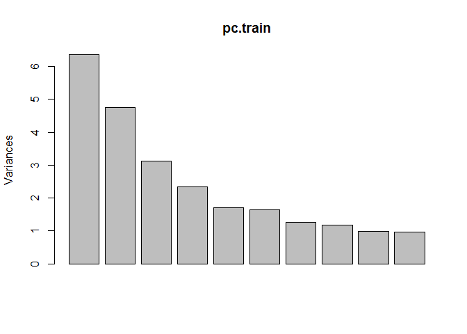

Predictive Modeling Analysis
================
Ming Wan, Victor Yuan

-   [Step 0: Load Packages and Data](#step-0-load-packages-and-data)
-   [Step 1: Unsupervised clustering:](#step-1-unsupervised-clustering)
    -   [PCA on training data:](#pca-on-training-data)
    -   [PCA projection of loadings to test data:](#pca-projection-of-loadings-to-test-data)
-   [Step 2: Supervised classification:](#step-2-supervised-classification)
    -   [logistic regression with elastic net regularization](#logistic-regression-with-elastic-net-regularization)
        -   [Compare the different methods of cross validation. Why pick repeatedcv](#compare-the-different-methods-of-cross-validation.-why-pick-repeatedcv)

Step 0: Load Packages and Data
==============================

Load required packages:

``` r
#source("https://bioconductor.org/biocLite.R")
#biocLite('e1071')                                    # required for glmnet in caret
library(ggplot2)
library(limma)
library(caret)
```

    ## Loading required package: lattice

``` r
library(dplyr)
```

    ## 
    ## Attaching package: 'dplyr'

    ## The following objects are masked from 'package:stats':
    ## 
    ##     filter, lag

    ## The following objects are masked from 'package:base':
    ## 
    ##     intersect, setdiff, setequal, union

``` r
library(glmnet)
```

    ## Loading required package: Matrix

    ## Loading required package: foreach

    ## Loaded glmnet 2.0-5

Read in pre-processed data: \*Make sure the pre-processed data (data.txt, which is in data.zip) is present in the ../processed\_data/ directory.

``` r
setwd('../')                                           # note: all of these relative file path calls work only for knitting

# load data (pre-processed training set)
train.data <- read.table('../Data/Processed Data/data.txt')
str(train.data)
```

    ## 'data.frame':    464923 obs. of  45 variables:
    ##  $ PM104: num  0.9219 0.569 0.0435 0.0635 0.0368 ...
    ##  $ PM112: num  0.8546 0.6886 0.0724 0.0856 0.0364 ...
    ##  $ PM114: num  0.8319 0.6578 0.0906 0.0909 0.0393 ...
    ##  $ PM115: num  0.9021 0.6146 0.0665 0.0839 0.0389 ...
    ##  $ PM119: num  0.896 0.6565 0.0591 0.0987 0.0336 ...
    ##  $ PM120: num  0.8658 0.6338 0.0982 0.1254 0.0421 ...
    ##  $ PM123: num  0.8769 0.6214 0.0571 0.0582 0.0477 ...
    ##  $ PM124: num  0.8481 0.6759 0.0711 0.1022 0.0437 ...
    ##  $ PM130: num  0.821 0.6326 0.1116 0.1038 0.0449 ...
    ##  $ PM136: num  0.9024 0.569 0.0674 0.0671 0.0493 ...
    ##  $ PM139: num  0.8259 0.6098 0.0556 0.0628 0.0371 ...
    ##  $ PM142: num  0.8099 0.6414 0.1094 0.1451 0.0435 ...
    ##  $ PM153: num  0.8911 0.6525 0.0939 0.0888 0.044 ...
    ##  $ PM155: num  0.8384 0.5506 0.0802 0.0984 0.0458 ...
    ##  $ PM158: num  0.835 0.6604 0.1136 0.1122 0.0393 ...
    ##  $ PM167: num  0.8618 0.5825 0.0807 0.0774 0.0424 ...
    ##  $ PM181: num  0.9024 0.6273 0.0885 0.1101 0.0416 ...
    ##  $ PM20 : num  0.8925 0.677 0.1326 0.1507 0.0538 ...
    ##  $ PM205: num  0.851 0.641 0.139 0.142 0.125 ...
    ##  $ PM226: num  0.8822 0.693 0.0972 0.1074 0.0367 ...
    ##  $ PM227: num  0.9049 0.6118 0.0462 0.0719 0.0343 ...
    ##  $ PM233: num  0.8022 0.6165 0.0744 0.1352 0.0448 ...
    ##  $ PM243: num  0.8551 0.6229 0.0896 0.1001 0.0376 ...
    ##  $ PM249: num  0.9153 0.6164 0.0654 0.0946 0.0345 ...
    ##  $ PM29 : num  0.9114 0.6393 0.0399 0.0364 0.0296 ...
    ##  $ PM30 : num  0.8835 0.5735 0.0885 0.1435 0.0407 ...
    ##  $ PM4  : num  0.8463 0.5852 0.0733 0.0869 0.0408 ...
    ##  $ PM40 : num  0.8385 0.6786 0.0586 0.0718 0.0364 ...
    ##  $ PM41 : num  0.8149 0.6576 0.0663 0.1045 0.0485 ...
    ##  $ PM44 : num  0.8089 0.5596 0.1227 0.1471 0.0378 ...
    ##  $ PM46 : num  0.9026 0.6467 0.0751 0.1048 0.0372 ...
    ##  $ PM47 : num  0.8491 0.6345 0.0653 0.0967 0.0468 ...
    ##  $ PM52 : num  0.8891 0.5681 0.0782 0.1018 0.0362 ...
    ##  $ PM53 : num  0.8566 0.6803 0.0866 0.1076 0.0466 ...
    ##  $ PM54 : num  0.8513 0.7054 0.0998 0.1685 0.0427 ...
    ##  $ PM55 : num  0.8317 0.5979 0.0954 0.1153 0.0354 ...
    ##  $ PM58 : num  0.8322 0.6706 0.0754 0.1237 0.0492 ...
    ##  $ PM66 : num  0.9138 0.6296 0.0859 0.1162 0.041 ...
    ##  $ PM71 : num  0.7972 0.5837 0.1344 0.1746 0.0477 ...
    ##  $ PM72 : num  0.8706 0.6164 0.1114 0.1194 0.0396 ...
    ##  $ PM74 : num  0.8611 0.5987 0.0988 0.0997 0.037 ...
    ##  $ PM76 : num  0.8401 0.5985 0.0728 0.1062 0.0409 ...
    ##  $ PM84 : num  0.8955 0.6762 0.2148 0.1548 0.0433 ...
    ##  $ PM9  : num  0.8784 0.6027 0.1118 0.1305 0.0441 ...
    ##  $ PM98 : num  0.8279 0.629 0.0827 0.0837 0.0418 ...

``` r
## row names are CpG sites, column names are sample names

# load metadata
design <- read.csv("../Data/Processed Data/des.txt", sep="\t", header=TRUE)
str(design)
```

    ## 'data.frame':    45 obs. of  5 variables:
    ##  $ Samplename  : Factor w/ 45 levels "PM104","PM112",..: 1 2 3 4 5 6 7 8 9 10 ...
    ##  $ Sample_Group: Factor w/ 3 levels "CONTROL","IUGR",..: 1 1 1 3 3 1 2 1 2 1 ...
    ##  $ ga          : num  40.7 38.9 38.6 41.1 37.1 38 35.7 40 36.9 38.6 ...
    ##  $ sex         : Factor w/ 2 levels "F","M": 2 1 2 2 2 1 1 2 2 1 ...
    ##  $ Ethnicity   : Factor w/ 2 levels "Asian","Caucasian": 2 1 2 2 1 2 2 2 2 2 ...

``` r
colnames(train.data) == design$Samplename               # check that the samples are in same order
```

    ##  [1] TRUE TRUE TRUE TRUE TRUE TRUE TRUE TRUE TRUE TRUE TRUE TRUE TRUE TRUE
    ## [15] TRUE TRUE TRUE TRUE TRUE TRUE TRUE TRUE TRUE TRUE TRUE TRUE TRUE TRUE
    ## [29] TRUE TRUE TRUE TRUE TRUE TRUE TRUE TRUE TRUE TRUE TRUE TRUE TRUE TRUE
    ## [43] TRUE TRUE TRUE

Step 1: Unsupervised clustering:
================================

---------------this section is exploratory analysis, we should move this to Nivi's exploratory file---------- As Rob suggested, PCA should be the precursor to supervised classification, more like an exploration.

PCA on training data:
---------------------

``` r
pc.train <- prcomp(t(scale(t(train.data), center = T, scale = T)), center = F, scale = F)

# look at the eigenvalues
plot(pc.train) # can we add some labels here (PC1, PC2, PC3,...)
```

 Say something about the plot

``` r
# first 2 PCS
PC123 <- data.frame(pc.train$rotation[,c("PC1","PC2", "PC3")])              # Take out first 3 PCs
PC123 <- PC123 %>% tibble::rownames_to_column('Samplename') %>%             # Put sample names into column to 
                    left_join(design, 'Samplename')                         # Join the metadata info 
```

    ## Warning in left_join_impl(x, y, by$x, by$y, suffix$x, suffix$y): joining
    ## factor and character vector, coercing into character vector

``` r
head(PC123)            
```

    ##   Samplename         PC1         PC2         PC3 Sample_Group   ga sex
    ## 1      PM104 -0.18077677 -0.45326948  0.17568389      CONTROL 40.7   M
    ## 2      PM112 -0.01134793 -0.12731742  0.02686157      CONTROL 38.9   F
    ## 3      PM114  0.12546312  0.10832086  0.01710225      CONTROL 38.6   M
    ## 4      PM115 -0.02530175  0.08189423  0.25572824        LOPET 41.1   M
    ## 5      PM119 -0.11471056 -0.05119294  0.07704112        LOPET 37.1   M
    ## 6      PM120  0.17288398  0.09457592 -0.17899820      CONTROL 38.0   F
    ##   Ethnicity
    ## 1 Caucasian
    ## 2     Asian
    ## 3 Caucasian
    ## 4 Caucasian
    ## 5     Asian
    ## 6 Caucasian

``` r
ggplot(PC123, aes(x = PC1, y = PC2)) + 
  geom_point(aes(color = Ethnicity)) +
  ggtitle('PC1 and PC2: Ethnicity')
```


``` r
ggplot(PC123, aes(x = PC1, y = PC3)) + 
  geom_point(aes(color = Ethnicity)) +
  ggtitle('PC1 and PC3: Ethnicity')
```


``` r
ggplot(PC123, aes(x = PC2, y = PC3)) + 
  geom_point(aes(color = Ethnicity)) +
  ggtitle('PC2 and PC3: Ethnicity')
```

 We can see from plotting the first three principal components that our groups (Asian, Caucasian) do not seem to separate. This indicates that the main drivers of the variance in the data is something else.

``` r
ggplot(PC123, aes(x = PC1, y = PC2)) + 
  geom_point(aes(color = sex)) +
  ggtitle('Sex')
```


``` r
ggplot(PC123, aes(x = PC1, y = PC2)) + 
  geom_point(aes(color = ga)) +
  ggtitle('Gestational Age')
```


``` r
ggplot(PC123, aes(x = PC1, y = PC2)) + 
  geom_point(aes(color = Sample_Group)) +
  ggtitle('Sample Group')
```

 It's not clear that our other variables are driving the variance in the data (sex, gestational age, and sample group).

``` r
# scatter plot matrix for the first 5 PCs
splom(pc.train$rotation[,1:5], panel = panel.smoothScatter, raster = TRUE)
```

    ## (loaded the KernSmooth namespace)

 What does this plot show?

PCA projection of loadings to test data:
----------------------------------------

``` r
# read pre-processed test data

# project PC loadings to test data
```

--------End of exploratory Analysis-----------

Step 2: Supervised classification:
==================================

logistic regression with elastic net regularization
---------------------------------------------------

``` r
fitControl <- trainControl(method = "repeatedcv", 
                                                     number = 5,                 # Number of folds
                                                     repeats = )                 # Repeat 5 times
```

##### Compare the different methods of cross validation. Why pick repeatedcv

``` r
set.seed(2017)                                         # training models requires the use of random #s. Setting (set.seed()) the randomness                                                             ensures reproducibility

# system.time measures the time it takes to run a function
system.time(netFit <- train(x = t(train.data),         # samples need to be in rows, features need to be columns
                                y = design$Ethnicity, #Predicts probability of being Asian, because this is 1st level
                                method = "glmnet",                     # glmnet model
                                trControl = fitControl,                # use fitControl to specify repeated cross validation
                                preProcess = c( "center", "scale"))    # Center and Scale the data
)
```

    ##    user  system elapsed 
    ##  545.69   26.51  574.01

``` r
netFit
```

    ## glmnet 
    ## 
    ##     45 samples
    ## 464923 predictors
    ##      2 classes: 'Asian', 'Caucasian' 
    ## 
    ## Pre-processing: centered (464923), scaled (464923) 
    ## Resampling: Cross-Validated (5 fold, repeated 1 times) 
    ## Summary of sample sizes: 37, 36, 35, 36, 36 
    ## Resampling results across tuning parameters:
    ## 
    ##   alpha  lambda      Accuracy   Kappa    
    ##   0.10   0.02429921  0.9555556  0.8800000
    ##   0.10   0.07684085  0.9555556  0.8800000
    ##   0.10   0.24299210  0.9555556  0.8800000
    ##   0.55   0.02429921  0.9777778  0.9454545
    ##   0.55   0.07684085  0.9555556  0.8434783
    ##   0.55   0.24299210  0.9333333  0.7889328
    ##   1.00   0.02429921  0.9555556  0.8434783
    ##   1.00   0.07684085  0.9555556  0.8434783
    ##   1.00   0.24299210  0.8266667  0.4040921
    ## 
    ## Accuracy was used to select the optimal model using  the largest value.
    ## The final values used for the model were alpha = 0.55 and lambda
    ##  = 0.02429921.

Horvath et al. (2013) uses an 'elastic net generalized linear model' to build an across-tissue DNAm predictor on age. Since our data is the same type, we'll try glmnet.

Horvath, S. (2013). DNA methylation age of human tissues and cell types. Genome Biology, 14(10), R115. <http://doi.org/10.1186/gb-2013-14-10-r115>
