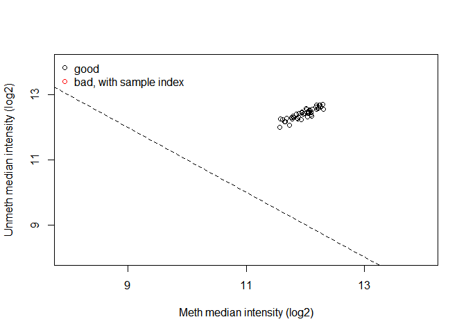
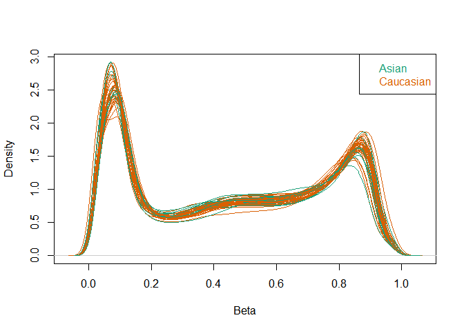
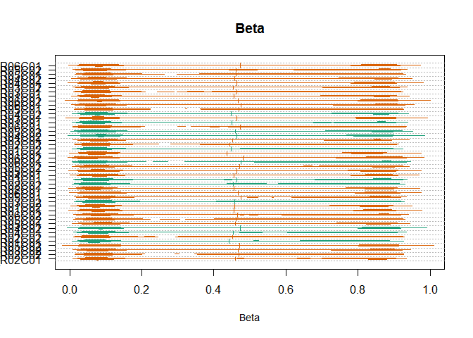
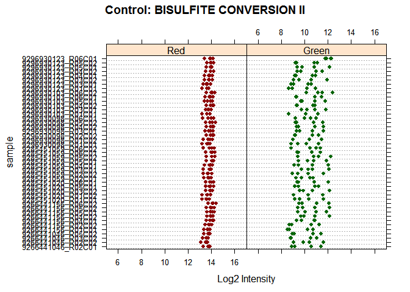
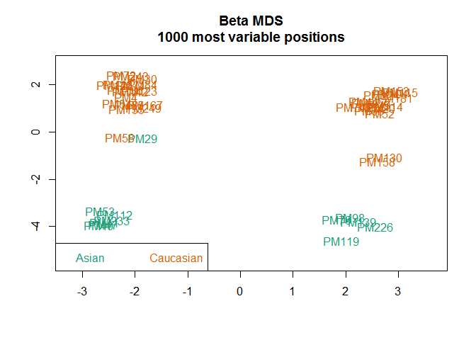
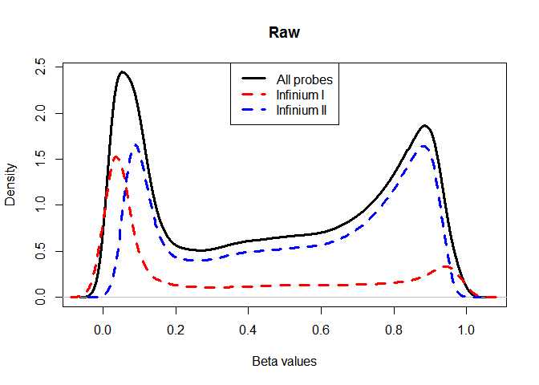
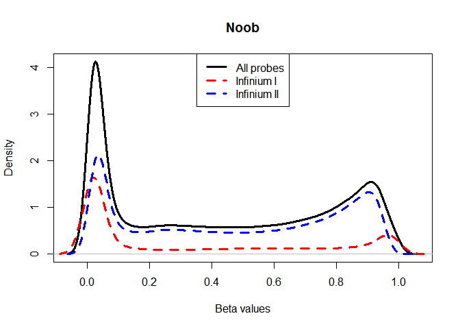
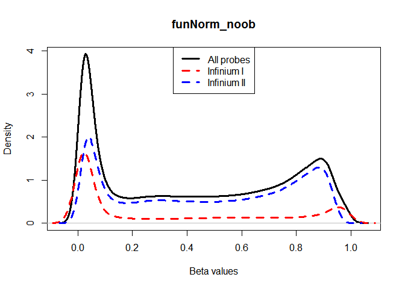
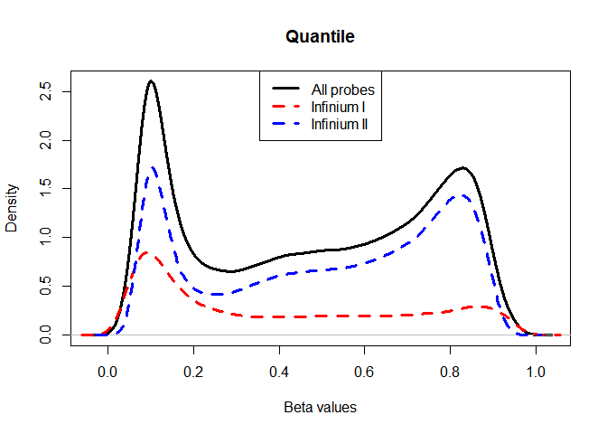

# PreprocessQC
Victor, Ming, Michael  

We are following this Minfi tutorial:
https://www.bioconductor.org/help/course-materials/2015/BioC2015/methylation450k.html

And we used some additional Minfi functions for QC following the advice of helpful grad students (Thanks Robinson lab!) and [Dr. Meaghan's STAT540 DNA methylation lecture] (http://stat540-ubc.github.io/lectures/lect15_STAT540_Methylation_Presentation%20MJ%20March%202017.pdf)

For general information on Minfi, consult the user guide:
http://bioconductor.org/packages/release/bioc/vignettes/minfi/inst/doc/minfi.pdf

Further info about the functions and capabilities of Minfi can be found in the Minfi reference manual:
http://bioconductor.org/packages/release/bioc/manuals/minfi/man/minfi.pdf

For the relevant paper with more comprehensive discussion of Minfi:
https://academic.oup.com/bioinformatics/article/30/10/1363/267584/Minfi-a-flexible-and-comprehensive-Bioconductor

#1.0 Introduction

Minfi package separates data from annotation and annotation from array design. The annotation means how methylation loci are associated with gneomic locations and design means how probes on the array are matched with relevant color channels to produce the Meth and Unmeth signals. 

Minfi has a couple of different classes to enable flexible development of preprocessing and analysis methods. Quality control and normalization methods can, therefore, be optimally customized to fit unique datasets. The starting point is the raw intensity (RGchannelset) and the end point is the GenomicRatioSet object, which can be exported into a .txt file for downstream analyses.

The following classes and their details:

**RGChannelSet**: a binary format containing the raw green and red channel intensities.  

**MethylSet** represents the Meth and Unmeth measurements and are useful for preprocessing routines delivering final measurements in these channels.

**GenomicMethylSet** represents the Meth and Unmeth measurements and are useful for preprocessing routines delivering final measurements in these channels. Also, the methylation loci have been associated with genomic location.

**RatioSet** represents the data as beta values (methylation ratios) or M-values (log ratios of beta values).

**GenomicRatioSet** represents the data as beta values (methylation ratios) or M-values (log ratios of beta values). Also, the methylation loci have been associated with genomic location.

#1.1 Dependencies

Installed the necessary dependencies by: 


```r
#source("https://bioconductor.org/biocLite.R")
#biocLite("wateRmelon")
#biocLite('limma')
#biocLite('minfi')
library(wateRmelon)
library(minfi)
library(dplyr)
library(ggplot2)
library(tibble)
```

#1.2 Load data

We start with reading the .IDAT files and we read in a sample sheet, and then use the sample sheet to load the data into a RGChannelSet. 


```r
#input the right base directory
getwd() #input the right base directory
```

```
## [1] "C:/Users/Toshiba/Documents/Github Repos/team_Methylation-Badassays/data/Scripts"
```

```r
setwd("../Raw Data/")
basedir <- getwd()
samplesheet <- read.metharray.sheet(basedir, recursive = TRUE) # read in sample sheet .csv file
```

```
## [read.metharray.sheet] Found the following CSV files:
```

```
## [1] "C:/Users/Toshiba/Documents/Github Repos/team_Methylation-Badassays/data/Raw Data/samplesheet.csv"
```

```r
Eth_rgset <- read.metharray.exp(targets = samplesheet) # read in iDAT files using sample sheet
Eth_rgset2 <- read.metharray.exp(targets = samplesheet, extended = TRUE) #extended Rgset to get bead count info
```

The Eth_rgset class contains the intensities of the internal control probes as well and as our data were read from a data sheet experiment, the phenotype data is also stored in the Eth_rgset and can be accessed via the accessor command pData.


```r
pheno <- pData(Eth_rgset) # phenotype data (from sample sheet)
pheno[,1:6]
```

```
##                   Sample_Name Sample_Group   ga    sex Ethnicity
## 9285451059_R06C02       PM104      CONTROL 40.7   MALE Caucasian
## 9296930098_R01C02       PM112      CONTROL 38.9 FEMALE     Asian
## 9296930123_R06C01       PM114      CONTROL 38.6   MALE Caucasian
## 9285451059_R05C02       PM115        LOPET 41.1   MALE Caucasian
## 9285451059_R02C02       PM119        LOPET 37.1   MALE     Asian
## 9266441156_R05C02       PM120      CONTROL 38.0 FEMALE Caucasian
## 9285451059_R05C01       PM123         IUGR 35.7 FEMALE Caucasian
## 9296930098_R01C01       PM124      CONTROL 40.0   MALE Caucasian
## 9266441156_R05C01       PM130         IUGR 36.9   MALE Caucasian
## 9296930103_R06C02       PM136      CONTROL 38.6 FEMALE Caucasian
## 9296930098_R05C02       PM139         IUGR 36.0   MALE     Asian
## 9285451020_R05C01       PM142      CONTROL 37.3 FEMALE Caucasian
## 9285451020_R01C02       PM153      CONTROL 38.7   MALE Caucasian
## 9296930098_R06C01       PM155      CONTROL 41.6 FEMALE Caucasian
## 9266441156_R06C02       PM158      CONTROL 37.7   MALE Caucasian
## 9285451059_R04C01       PM167      CONTROL 39.7 FEMALE Caucasian
## 9296930103_R03C01       PM181      CONTROL 39.0   MALE Caucasian
## 9296930123_R03C01        PM20      CONTROL 36.7   MALE Caucasian
## 9296930098_R03C01       PM205      CONTROL 38.6   MALE Caucasian
## 9266441156_R04C02       PM226         IUGR 38.4   MALE     Asian
## 9285451059_R02C01       PM227      CONTROL 39.0   MALE Caucasian
## 9285451020_R03C02       PM233      CONTROL 39.7 FEMALE     Asian
## 9296930123_R04C02       PM243      CONTROL 39.6 FEMALE Caucasian
## 9296930098_R02C02       PM249      CONTROL 36.1 FEMALE Caucasian
## 9285451059_R06C01        PM29         IUGR 36.0 FEMALE     Asian
## 9296930123_R01C01        PM30         IUGR 36.3 FEMALE Caucasian
## 9285451020_R06C01         PM4         IUGR 37.7 FEMALE Caucasian
## 9285451059_R03C01        PM40        LOPET 38.3 FEMALE     Asian
## 9296930103_R04C02        PM41         IUGR 37.3 FEMALE     Asian
## 9296930123_R04C01        PM44        LOPET 39.1   MALE Caucasian
## 9296930123_R05C01        PM46        LOPET 40.0 FEMALE Caucasian
## 9266441156_R01C01        PM47         IUGR 38.0 FEMALE     Asian
## 9266441156_R02C02        PM52        LOPET 35.9   MALE Caucasian
## 9266441156_R04C01        PM53        LOPET 38.6 FEMALE     Asian
## 9266441046_R05C02        PM54        LOPET 34.6 FEMALE Caucasian
## 9266441046_R03C02        PM55        LOPET 40.0 FEMALE Caucasian
## 9296930123_R05C02        PM58        LOPET 37.4 FEMALE Caucasian
## 9296930103_R06C01        PM66        LOPET 35.7   MALE Caucasian
## 9296930103_R05C01        PM71        LOPET 39.0 FEMALE Caucasian
## 9266441046_R02C02        PM72         IUGR 35.0 FEMALE Caucasian
## 9266441046_R02C01        PM74      CONTROL 37.9   MALE Caucasian
## 9296930103_R01C01        PM76      CONTROL 39.7   MALE     Asian
## 9285451020_R01C01        PM84      CONTROL 40.3 FEMALE Caucasian
## 9296930123_R03C02         PM9      CONTROL 39.1   MALE Caucasian
## 9296930098_R04C02        PM98        LOPET 37.4   MALE     Asian
##                     Sample_Plate
## 9285451059_R06C02 WG0011624-MSA4
## 9296930098_R01C02 WG0011624-MSA4
## 9296930123_R06C01 WG0011624-MSA4
## 9285451059_R05C02 WG0011624-MSA4
## 9285451059_R02C02 WG0011624-MSA4
## 9266441156_R05C02 WG0011624-MSA4
## 9285451059_R05C01 WG0011624-MSA4
## 9296930098_R01C01 WG0011624-MSA4
## 9266441156_R05C01 WG0011624-MSA4
## 9296930103_R06C02 WG0011624-MSA4
## 9296930098_R05C02 WG0011624-MSA4
## 9285451020_R05C01 WG0011624-MSA4
## 9285451020_R01C02 WG0011624-MSA4
## 9296930098_R06C01 WG0011624-MSA4
## 9266441156_R06C02 WG0011624-MSA4
## 9285451059_R04C01 WG0011624-MSA4
## 9296930103_R03C01 WG0011624-MSA4
## 9296930123_R03C01 WG0011624-MSA4
## 9296930098_R03C01 WG0011624-MSA4
## 9266441156_R04C02 WG0011624-MSA4
## 9285451059_R02C01 WG0011624-MSA4
## 9285451020_R03C02 WG0011624-MSA4
## 9296930123_R04C02 WG0011624-MSA4
## 9296930098_R02C02 WG0011624-MSA4
## 9285451059_R06C01 WG0011624-MSA4
## 9296930123_R01C01 WG0011624-MSA4
## 9285451020_R06C01 WG0011624-MSA4
## 9285451059_R03C01 WG0011624-MSA4
## 9296930103_R04C02 WG0011624-MSA4
## 9296930123_R04C01 WG0011624-MSA4
## 9296930123_R05C01 WG0011624-MSA4
## 9266441156_R01C01 WG0011624-MSA4
## 9266441156_R02C02 WG0011624-MSA4
## 9266441156_R04C01 WG0011624-MSA4
## 9266441046_R05C02 WG0011624-MSA4
## 9266441046_R03C02 WG0011624-MSA4
## 9296930123_R05C02 WG0011624-MSA4
## 9296930103_R06C01 WG0011624-MSA4
## 9296930103_R05C01 WG0011624-MSA4
## 9266441046_R02C02 WG0011624-MSA4
## 9266441046_R02C01 WG0011624-MSA4
## 9296930103_R01C01 WG0011624-MSA4
## 9285451020_R01C01 WG0011624-MSA4
## 9296930123_R03C02 WG0011624-MSA4
## 9296930098_R04C02 WG0011624-MSA4
```

```r
getManifest(Eth_rgset) # manifest probe design information of the array.
```

```
## Loading required package: IlluminaHumanMethylation450kmanifest
```

```
## IlluminaMethylationManifest object
## Annotation
##   array: IlluminaHumanMethylation450k
## Number of type I probes: 135476 
## Number of type II probes: 350036 
## Number of control probes: 850 
## Number of SNP type I probes: 25 
## Number of SNP type II probes: 40
```
Manifest verifies that we are working with 450K data.

#1.3 Create Classes - with no normalization
Generating **MethylSet**, which contains only the methylated and unmethylated signals, and **RatioSet**, which stores Beta vlues and/or M values instead of the methylated and unmethylated signals: 


```r
MSet <- preprocessRaw(Eth_rgset) # Processes raw intensity data into Methylated and Unmethylated values (can conver to Beta or 'M' values). Beta values are the estimate of methylation level at each position using the ratio of intensities between methylated and unmethylated probes. Beta values are expected to follow a bimodel distribution of roughly 0s and 1s, corresponding to unmethylated and methylated respectively.
```
preprocessRaw() converts raw intensity data (in the form of IDAT files) into Methylated and Unmethylated values. These values are called Beta or M-values. Beta values are the estimate of methylation level at each position using the ratio of intensities between methylated and unmethylated probes. Beta values are expected to follow a bimodel distribution of roughly 0s and 1s. M-values are the same information just on a log scale, which has been shown to be better for some downstream statistical analyses.


```r
RSet <- ratioConvert(MSet, what = "both", keepCN = TRUE) #CN is the sum of the methylated and unmethylated signals
```
ratioConvert() consolidates methylated and unmethylated values per CpG site into one value (a ratio of Methylated / Unmethylated).

Get **GenomicRatioSet**: 

```r
GRset <- mapToGenome(RSet) 
```
The function mapToGenome() applied to a RatioSet object adds genomic coordinates to each probe together with some additional annotation information.
granges(GRset) can be used to return the probe locations as a genomic ranges. 

#2. Quality Control (QC) - before normalization

Before we do normalization we should remove samples that are globally much different than the rest. If a sample has too many failed probes or a very different distribution of methylation measurements, then this is an indication that something went technically wrong with the sample, and therefore carries unreliable data.

In this section we will use some tools from the Minfi package to see if there are any 'bad' samples, obvious outliers, and to remove non-useful probes. What is considered a 'bad' sample? Samples that have been processed poorly due to human error can have global unpredictable affects on DNAm readings.Most of these biases we hope to identify in this section and correct for.

Samples with lots of bad detection p value probes will appear as outliers in the following QC plots. Bad detection p value probes are basically probes that fail to be statistically different (p value > 0.01) from background intensity. Illumina has a set a of negative control probes that give us the 'background intensity value'.


```r
qc <- getQC(MSet)
plotQC(qc)
```

<!-- -->
> The plot estimates samples-specific probe intensities from the MethylSet, comparing methylation probes (M) against unmethylation probes (UM). Intensities for each M and UM are plotted to ensure that they have similar intensities and that the intensities stronger than 10. Bad samples (with lots of bad detection p value probes) will cluster together and lower on the plot. We can see that our samples seem to cluster all together in the 1st quadrant with no obvious outliers.


```r
densityPlot(MSet, sampGroups = pheno$Ethnicity) #bit hard to see
```

<!-- -->
> This is a density plot of the beta values for all samples annotated by ethnicity. We can see that there are no obvious outliers as each sample follows a relatively similar average beta value distribution across all probes.


```r
densityBeanPlot(MSet, sampGroups = pheno$Ethnicity)
```

<!-- -->
> Similar to the density plot above, but plotted as a bean plot, color coded by ethnicity. Again, no obvious outliers.


```r
controlStripPlot(Eth_rgset, controls="BISULFITE CONVERSION II") #Red is type 1, green is type 2
```

<!-- -->
> The 450k array contains several internal control probes that can be used to assess the quality control of different sample preparation steps, in this case, bisulfite conversion. Each control probe is plotted as a strip plot here, showing the consistency of each control probe, suggesting that the changes in our probe sets are not due to errors in preparation.


```r
mdsPlot(Eth_rgset, sampNames = pheno$Sample_Name, sampGroups = pheno$Ethnicity)
```

<!-- -->

> The Multi-Dimensional Scaling (MDS) plot showss a 2D projection of beta values. The distance between samples show their similarity to each other. It is used as a mean to visually conceptualize the data without making claims to its significance.

> So far all of our QC checks have shown no evidence that there are any obvious outliers or samples that might need to be removed. Here is our first piece of evidence that some samples might be more *interesting*. 

> PM58 and PM29 are from different ethnic groups but cluster closer together than they do to the rest of the samples in their group. PM130 and PM158 are also noted.

#2. Normalization

There are a couple different normalization methods used in DNA methylation analysis. There isn't a consensus on which method is the best. And metrics to evaluate how good normalization methods perform are vague and unclear. So we will try the different available normalization methods:

* **Noob**: "Implements the noob background subtraction method with dye-bias normalization"
* **Functional Normalization**: "This function applies the preprocessNoob function as a first step for background substraction, and uses the first two principal components of the control probes to infer the unwanted variation"
* **Quantile Normalization**: "Implements stratified quantile normalization preprocessing"

Minfi's preprocessing functions all exclusively take an RGset and convert into a downstream object (MSet, GRset).

### 3.1 Comparing normalization methodology

**preprocessNoob**
First, we use preprocessNoob function to implement the noob background subtraction method with dye-bias normalization. In this background subtraction method, background noise is estimated from the out-of-band probes and is removed from each sample separately, while the dye-bias normalization utilizes a subset of the control probes to estimate the dye bias (red and green dyes have certain hybridization biases that need to be corrected for).

```r
MSet.noob <- preprocessNoob(Eth_rgset)
```

```
## [preprocessNoob] Applying R/G ratio flip to fix dye bias...
```

```r
MSet.noob <- MSet.noob[order(featureNames(MSet.noob)), ]
```
**preprocessFunnorm**
We use preprocessFunnorm function to implement the functional normalization alogrithm which uses the internal control probes present on the array to infer between-array technical variation.

```r
GRset_funnorm <- preprocessFunnorm(Eth_rgset, nPCs = 2, sex = NULL, bgCorr = TRUE, dyeCorr = TRUE, verbose = TRUE)
```

```
## [preprocessFunnorm] Background and dye bias correction with noob
```

```
## [preprocessNoob] Applying R/G ratio flip to fix dye bias...
```

```
## [preprocessFunnorm] Mapping to genome
```

```
## [preprocessFunnorm] Quantile extraction
```

```
## [preprocessFunnorm] Normalization
```

```r
GRset_funnorm <- GRset_funnorm[order(featureNames(GRset_funnorm)), ]
```
**preprocessQuantile**

```r
GRset_quant <- preprocessQuantile(Eth_rgset, fixOutliers = TRUE, removeBadSamples = FALSE, quantileNormalize = TRUE, stratified = TRUE, mergeManifest = FALSE, sex = NULL)
```

```
## [preprocessQuantile] Mapping to genome.
```

```
## [preprocessQuantile] Fixing outliers.
```

```
## [preprocessQuantile] Quantile normalizing.
```

```r
GRset_quant <- GRset_quant[order(featureNames(GRset_quant)),]
```
Okay, now we have all of our data into objects that correspond to each normalization method. We will assess how they normalized based on the distribution of Type I and Type II probes after normalization.

```r
probeTypes <- data.frame(Name = featureNames(MSet),
                         Type = getProbeType(MSet)) #legendpos = "btm" is used to generate an error to remove the legend all together. 
plotBetasByType(MSet[,1], main = "Raw")
```

<!-- -->
> preprocessRaw does no normalization so we can see that the type I and type II (infinium I & II) probes have a distinct distribution. As we try different normalization methods we will assess how they perform by looking how close the distributions shift towards overlapping.


```r
plotBetasByType(MSet.noob[,1], main = "Noob")
```

<!-- -->

```r
plotBetasByType(getBeta(GRset_funnorm[,1]), probeTypes = probeTypes, main = "funNorm_noob")
```

<!-- -->

```r
plotBetasByType(getBeta(GRset_quant[,1]), probeTypes = probeTypes, main = "Quantile")
```

<!-- -->
> A good preprocessing method should make the peaks of type 1 & 2 probe distributions close together, so functional normalization and quantile normalization appears to be better at this task with our dataset.
>  Hansen et al. 2014 suggests quantile normalization will be better for datasets where we are looking for small differences. FunNorm is more appropriate for when global changes are expected.

### Sex check
Here we use Minfi's preprocessFunnorm's built-in sex prediction function to verify that there were no sample mixups:

```r
GRset_funnorm@colData$sex
```

```
##  [1] "MALE"   "FEMALE" "MALE"   "MALE"   "MALE"   "FEMALE" "FEMALE"
##  [8] "MALE"   "MALE"   "FEMALE" "MALE"   "FEMALE" "MALE"   "FEMALE"
## [15] "MALE"   "FEMALE" "MALE"   "MALE"   "MALE"   "MALE"   "MALE"  
## [22] "FEMALE" "FEMALE" "FEMALE" "FEMALE" "FEMALE" "FEMALE" "FEMALE"
## [29] "FEMALE" "MALE"   "FEMALE" "FEMALE" "MALE"   "FEMALE" "FEMALE"
## [36] "FEMALE" "FEMALE" "MALE"   "FEMALE" "FEMALE" "MALE"   "MALE"  
## [43] "FEMALE" "MALE"   "MALE"
```

```r
predicted_sex <- GRset_funnorm@colData$predictedSex
for (i in 1:length(predicted_sex)){
  if (predicted_sex[i] == "F") {predicted_sex[i] = "FEMALE"}
  else {predicted_sex[i] = "MALE"} }
predicted_sex == GRset_funnorm@colData$sex
```

```
##  [1] TRUE TRUE TRUE TRUE TRUE TRUE TRUE TRUE TRUE TRUE TRUE TRUE TRUE TRUE
## [15] TRUE TRUE TRUE TRUE TRUE TRUE TRUE TRUE TRUE TRUE TRUE TRUE TRUE TRUE
## [29] TRUE TRUE TRUE TRUE TRUE TRUE TRUE TRUE TRUE TRUE TRUE TRUE TRUE TRUE
## [43] TRUE TRUE TRUE
```
> No sex-specific sample mix ups.

### Next we check for the presence of SNPs inside the probe body or CpG or at the nucleotide extension. Such probes will be removed.

```r
# check presence of SNPs inside probe body or single nucleotide extensions
snps <- getSnpInfo(GRset_funnorm)
str(snps@listData$Probe_rs)
```

```
##  chr [1:485512] NA "rs9857774" NA NA NA NA "rs62037371" ...
```

```r
GRset_funnorm <- addSnpInfo(GRset_funnorm)
# drop the probes that contain either a SNP at the CpG interrogation or at the single nucleotide extension
GRset_funnorm2 <- dropLociWithSnps(GRset_funnorm, snps=c("SBE","CpG"), maf=0)
GRset_funnorm2
```

```
## class: GenomicRatioSet 
## dim: 467971 45 
## metadata(0):
## assays(2): Beta CN
## rownames(467971): cg00000029 cg00000108 ... ch.X.97737721F
##   ch.X.98007042R
## rowData names(6): Probe_rs Probe_maf ... SBE_rs SBE_maf
## colnames(45): 9285451059_R06C02 9296930098_R01C02 ...
##   9296930123_R03C02 9296930098_R04C02
## colData names(11): Sample_Name Sample_Group ... filenames
##   predictedSex
## Annotation
##   array: IlluminaHumanMethylation450k
##   annotation: ilmn12.hg19
## Preprocessing
##   Method: NA
##   minfi version: NA
##   Manifest version: NA
```


```r
MSet2 <- pfilter(Eth_rgset2, pnthresh = 0.01) #removes all bad detection p value probes and bead count <3.
```

```
## 0 samples having 1 % of sites with a detection p-value greater than 0.01 were removed 
## Samples removed:  
## 1686 sites were removed as beadcount <3 in 5 % of samples 
## 2314 sites having 1 % of samples with a detection p-value greater than 0.01 were removed
```

> We used the pfilter() function from watermelon package to remove bad detection p value probes and probes with bead count < 3.
> We started with 'r nrow(MSet)' to 'r nrow(MSet2)' number of probes. 

> Now to remove these probes from our genomic ranges object (normalized object)


```r
GRset_funnorm2B <- getBeta(GRset_funnorm2) #take out beta values
GRset_funnorm2B <- rownames_to_column(as.data.frame(GRset_funnorm2B), 'cpg') #add rownames to a column
gset <- mapToGenome(MSet2) #maps filtered data to genome so 
gsetB <- getBeta(gset) #gsetB will act as filtering index to remove additional probes from the normalized data
gsetB <- rownames_to_column(as.data.frame(gsetB), 'cpg') #dplyr requires rownames to be in colun for joining dataframes
dim(gsetB)
```

```
## [1] 481783     46
```

```r
dim(GRset_funnorm2B)
```

```
## [1] 467971     46
```

```r
gsetFin2 <- semi_join(GRset_funnorm2B, gsetB, by = 'cpg')
dim(gsetFin2)
```

```
## [1] 464923     46
```

```r
#464923 CpGs left
gsetFin2 <- column_to_rownames(gsetFin2, 'cpg') #add cpg row names back (I found this reduces the file size significantly - this is kind of weird)
head(gsetFin2) #yay
```

```
##            9285451059_R06C02 9296930098_R01C02 9296930123_R06C01
## cg13869341        0.92187542        0.85461805        0.83191115
## cg14008030        0.56896748        0.68862876        0.65783771
## cg12045430        0.04348766        0.07238798        0.09064378
## cg20826792        0.06354812        0.08556048        0.09092605
## cg00381604        0.03675038        0.03637115        0.03932896
## cg20253340        0.24778824        0.42714500        0.39329242
##            9285451059_R05C02 9285451059_R02C02 9266441156_R05C02
## cg13869341        0.90208185        0.89597350        0.86583307
## cg14008030        0.61455999        0.65651806        0.63379801
## cg12045430        0.06651309        0.05907979        0.09815622
## cg20826792        0.08389725        0.09870526        0.12544475
## cg00381604        0.03892760        0.03355388        0.04209156
## cg20253340        0.30311331        0.35527642        0.32533772
##            9285451059_R05C01 9296930098_R01C01 9266441156_R05C01
## cg13869341        0.87691824        0.84809736        0.82100710
## cg14008030        0.62142690        0.67594188        0.63259355
## cg12045430        0.05707285        0.07105339        0.11158564
## cg20826792        0.05820250        0.10222241        0.10376473
## cg00381604        0.04768210        0.04369583        0.04493212
## cg20253340        0.31604208        0.45579372        0.37585477
##            9296930103_R06C02 9296930098_R05C02 9285451020_R05C01
## cg13869341        0.90241456        0.82585909        0.80993248
## cg14008030        0.56896619        0.60979141        0.64140534
## cg12045430        0.06742360        0.05559617        0.10944199
## cg20826792        0.06705440        0.06280265        0.14509429
## cg00381604        0.04930031        0.03709227        0.04346882
## cg20253340        0.29234641        0.29155329        0.32035837
##            9285451020_R01C02 9296930098_R06C01 9266441156_R06C02
## cg13869341        0.89105922        0.83844329        0.83501847
## cg14008030        0.65254487        0.55064084        0.66042197
## cg12045430        0.09392026        0.08021536        0.11363530
## cg20826792        0.08881734        0.09836993        0.11216593
## cg00381604        0.04402327        0.04575822        0.03928133
## cg20253340        0.43635202        0.37228603        0.30351854
##            9285451059_R04C01 9296930103_R03C01 9296930123_R03C01
## cg13869341        0.86180129        0.90243746        0.89245508
## cg14008030        0.58245465        0.62729715        0.67699991
## cg12045430        0.08074586        0.08846659        0.13255759
## cg20826792        0.07735929        0.11010611        0.15073294
## cg00381604        0.04238333        0.04155876        0.05375512
## cg20253340        0.29021461        0.35534667        0.42912448
##            9296930098_R03C01 9266441156_R04C02 9285451059_R02C01
## cg13869341         0.8510836        0.88221581        0.90490422
## cg14008030         0.6412271        0.69295880        0.61182090
## cg12045430         0.1391108        0.09722351        0.04623862
## cg20826792         0.1419362        0.10740527        0.07186156
## cg00381604         0.1254726        0.03673146        0.03425547
## cg20253340         0.2760344        0.35439742        0.30163601
##            9285451020_R03C02 9296930123_R04C02 9296930098_R02C02
## cg13869341        0.80215647        0.85508894        0.91534742
## cg14008030        0.61645396        0.62291838        0.61635880
## cg12045430        0.07441959        0.08962879        0.06538105
## cg20826792        0.13520482        0.10007894        0.09460646
## cg00381604        0.04478538        0.03756044        0.03447122
## cg20253340        0.34468756        0.30642791        0.34121662
##            9285451059_R06C01 9296930123_R01C01 9285451020_R06C01
## cg13869341        0.91143170        0.88350903        0.84628064
## cg14008030        0.63932300        0.57346807        0.58520973
## cg12045430        0.03985804        0.08854227        0.07326474
## cg20826792        0.03637003        0.14350035        0.08687478
## cg00381604        0.02961779        0.04072397        0.04079934
## cg20253340        0.27894475        0.36099222        0.35217916
##            9285451059_R03C01 9296930103_R04C02 9296930123_R04C01
## cg13869341        0.83848982        0.81485044        0.80893110
## cg14008030        0.67861107        0.65761761        0.55962527
## cg12045430        0.05858317        0.06626188        0.12273982
## cg20826792        0.07178989        0.10454003        0.14706361
## cg00381604        0.03636621        0.04847847        0.03779845
## cg20253340        0.31129337        0.27269262        0.36038437
##            9296930123_R05C01 9266441156_R01C01 9266441156_R02C02
## cg13869341        0.90259196        0.84914645        0.88909466
## cg14008030        0.64673810        0.63450186        0.56806687
## cg12045430        0.07510554        0.06528280        0.07816300
## cg20826792        0.10479620        0.09668977        0.10182473
## cg00381604        0.03715141        0.04677175        0.03619329
## cg20253340        0.29595339        0.21502432        0.27593147
##            9266441156_R04C01 9266441046_R05C02 9266441046_R03C02
## cg13869341        0.85656783        0.85128062        0.83171617
## cg14008030        0.68026236        0.70540498        0.59786086
## cg12045430        0.08664887        0.09983654        0.09535257
## cg20826792        0.10764829        0.16846167        0.11528269
## cg00381604        0.04661833        0.04265476        0.03539057
## cg20253340        0.30261826        0.35609958        0.28023481
##            9296930123_R05C02 9296930103_R06C01 9296930103_R05C01
## cg13869341        0.83224582        0.91382751        0.79721094
## cg14008030        0.67059618        0.62956964        0.58367493
## cg12045430        0.07543839        0.08593180        0.13439168
## cg20826792        0.12369616        0.11620696        0.17463611
## cg00381604        0.04921553        0.04097734        0.04768285
## cg20253340        0.33757439        0.32347945        0.41950858
##            9266441046_R02C02 9266441046_R02C01 9296930103_R01C01
## cg13869341        0.87061235        0.86112184        0.84013830
## cg14008030        0.61637104        0.59874607        0.59849061
## cg12045430        0.11138446        0.09876862        0.07282321
## cg20826792        0.11938644        0.09974206        0.10624554
## cg00381604        0.03963083        0.03697920        0.04093105
## cg20253340        0.36913815        0.32791296        0.28657222
##            9285451020_R01C01 9296930123_R03C02 9296930098_R04C02
## cg13869341         0.8955338        0.87844179        0.82790502
## cg14008030         0.6761712        0.60270346        0.62899525
## cg12045430         0.2148430        0.11181879        0.08267949
## cg20826792         0.1548022        0.13054612        0.08368183
## cg00381604         0.0432668        0.04411788        0.04181206
## cg20253340         0.3994270        0.33750644        0.28004296
```
# 4. Export processed data files (data.txt, and des.txt)

```r
getwd()
write.table(gsetFin2, '../processed_data/data.txt')
```
