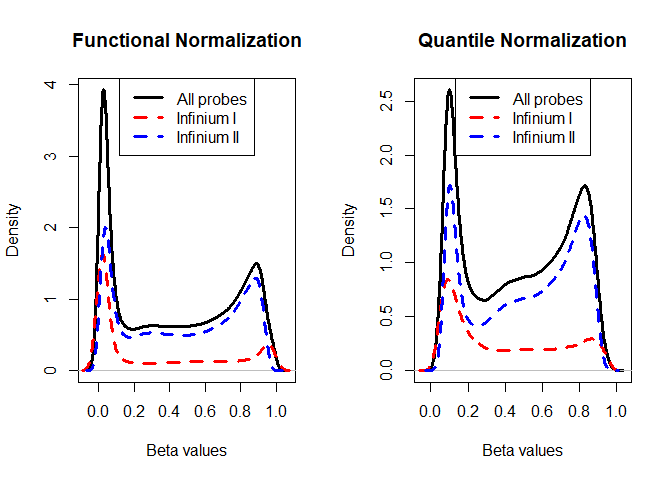

# PreprocessQC
Victor, Ming, Michael  


```r
library(minfi)
library(dplyr)
library(ggplot2)
```


```r
getwd()
```

```
## [1] "C:/Users/wanmi/Documents/R Directory/ming_wan/stat540/team_Methylation-Badassays/data/processed_data"
```

```r
#input the right base directory
setwd("../Raw Data/")
basedir <- getwd()
# read in sample sheet .csv file
samplesheet <- read.metharray.sheet(basedir, recursive = TRUE)
```

```
## [read.metharray.sheet] Found the following CSV files:
```

```
## [1] "C:/Users/wanmi/Documents/R Directory/ming_wan/stat540/team_Methylation-Badassays/data/Raw Data/samplesheet.csv"
```

```r
# read in iDAT files using sample sheet
Eth_rgset <- read.metharray.exp(targets = samplesheet)
```


```r
# phenotype data (from sample sheet)
pheno <- pData(Eth_rgset)
pheno[,1:6]
```

```
##                   Sample_Name Sample_Group   ga    sex Ethnicity
## 9285451059_R06C02       PM104      CONTROL 40.7   MALE Caucasian
## 9296930098_R01C02       PM112      CONTROL 38.9 FEMALE     Asian
## 9296930123_R06C01       PM114      CONTROL 38.6   MALE Caucasian
## 9285451059_R05C02       PM115        LOPET 41.1   MALE Caucasian
## 9285451059_R02C02       PM119        LOPET 37.1   MALE     Asian
## 9266441156_R05C02       PM120      CONTROL 38.0 FEMALE Caucasian
## 9285451059_R05C01       PM123         IUGR 35.7 FEMALE Caucasian
## 9296930098_R01C01       PM124      CONTROL 40.0   MALE Caucasian
## 9266441156_R05C01       PM130         IUGR 36.9   MALE Caucasian
## 9296930103_R06C02       PM136      CONTROL 38.6 FEMALE Caucasian
## 9296930098_R05C02       PM139         IUGR 36.0   MALE     Asian
## 9285451020_R05C01       PM142      CONTROL 37.3 FEMALE Caucasian
## 9285451020_R01C02       PM153      CONTROL 38.7   MALE Caucasian
## 9296930098_R06C01       PM155      CONTROL 41.6 FEMALE Caucasian
## 9266441156_R06C02       PM158      CONTROL 37.7   MALE Caucasian
## 9285451059_R04C01       PM167      CONTROL 39.7 FEMALE Caucasian
## 9296930103_R03C01       PM181      CONTROL 39.0   MALE Caucasian
## 9296930123_R03C01        PM20      CONTROL 36.7   MALE Caucasian
## 9296930098_R03C01       PM205      CONTROL 38.6   MALE Caucasian
## 9266441156_R04C02       PM226         IUGR 38.4   MALE     Asian
## 9285451059_R02C01       PM227      CONTROL 39.0   MALE Caucasian
## 9285451020_R03C02       PM233      CONTROL 39.7 FEMALE     Asian
## 9296930123_R04C02       PM243      CONTROL 39.6 FEMALE Caucasian
## 9296930098_R02C02       PM249      CONTROL 36.1 FEMALE Caucasian
## 9285451059_R06C01        PM29         IUGR 36.0 FEMALE     Asian
## 9296930123_R01C01        PM30         IUGR 36.3 FEMALE Caucasian
## 9285451020_R06C01         PM4         IUGR 37.7 FEMALE Caucasian
## 9285451059_R03C01        PM40        LOPET 38.3 FEMALE     Asian
## 9296930103_R04C02        PM41         IUGR 37.3 FEMALE     Asian
## 9296930123_R04C01        PM44        LOPET 39.1   MALE Caucasian
## 9296930123_R05C01        PM46        LOPET 40.0 FEMALE Caucasian
## 9266441156_R01C01        PM47         IUGR 38.0 FEMALE     Asian
## 9266441156_R02C02        PM52        LOPET 35.9   MALE Caucasian
## 9266441156_R04C01        PM53        LOPET 38.6 FEMALE     Asian
## 9266441046_R05C02        PM54        LOPET 34.6 FEMALE Caucasian
## 9266441046_R03C02        PM55        LOPET 40.0 FEMALE Caucasian
## 9296930123_R05C02        PM58        LOPET 37.4 FEMALE Caucasian
## 9296930103_R06C01        PM66        LOPET 35.7   MALE Caucasian
## 9296930103_R05C01        PM71        LOPET 39.0 FEMALE Caucasian
## 9266441046_R02C02        PM72         IUGR 35.0 FEMALE Caucasian
## 9266441046_R02C01        PM74      CONTROL 37.9   MALE Caucasian
## 9296930103_R01C01        PM76      CONTROL 39.7   MALE     Asian
## 9285451020_R01C01        PM84      CONTROL 40.3 FEMALE Caucasian
## 9296930123_R03C02         PM9      CONTROL 39.1   MALE Caucasian
## 9296930098_R04C02        PM98        LOPET 37.4   MALE     Asian
##                     Sample_Plate
## 9285451059_R06C02 WG0011624-MSA4
## 9296930098_R01C02 WG0011624-MSA4
## 9296930123_R06C01 WG0011624-MSA4
## 9285451059_R05C02 WG0011624-MSA4
## 9285451059_R02C02 WG0011624-MSA4
## 9266441156_R05C02 WG0011624-MSA4
## 9285451059_R05C01 WG0011624-MSA4
## 9296930098_R01C01 WG0011624-MSA4
## 9266441156_R05C01 WG0011624-MSA4
## 9296930103_R06C02 WG0011624-MSA4
## 9296930098_R05C02 WG0011624-MSA4
## 9285451020_R05C01 WG0011624-MSA4
## 9285451020_R01C02 WG0011624-MSA4
## 9296930098_R06C01 WG0011624-MSA4
## 9266441156_R06C02 WG0011624-MSA4
## 9285451059_R04C01 WG0011624-MSA4
## 9296930103_R03C01 WG0011624-MSA4
## 9296930123_R03C01 WG0011624-MSA4
## 9296930098_R03C01 WG0011624-MSA4
## 9266441156_R04C02 WG0011624-MSA4
## 9285451059_R02C01 WG0011624-MSA4
## 9285451020_R03C02 WG0011624-MSA4
## 9296930123_R04C02 WG0011624-MSA4
## 9296930098_R02C02 WG0011624-MSA4
## 9285451059_R06C01 WG0011624-MSA4
## 9296930123_R01C01 WG0011624-MSA4
## 9285451020_R06C01 WG0011624-MSA4
## 9285451059_R03C01 WG0011624-MSA4
## 9296930103_R04C02 WG0011624-MSA4
## 9296930123_R04C01 WG0011624-MSA4
## 9296930123_R05C01 WG0011624-MSA4
## 9266441156_R01C01 WG0011624-MSA4
## 9266441156_R02C02 WG0011624-MSA4
## 9266441156_R04C01 WG0011624-MSA4
## 9266441046_R05C02 WG0011624-MSA4
## 9266441046_R03C02 WG0011624-MSA4
## 9296930123_R05C02 WG0011624-MSA4
## 9296930103_R06C01 WG0011624-MSA4
## 9296930103_R05C01 WG0011624-MSA4
## 9266441046_R02C02 WG0011624-MSA4
## 9266441046_R02C01 WG0011624-MSA4
## 9296930103_R01C01 WG0011624-MSA4
## 9285451020_R01C01 WG0011624-MSA4
## 9296930123_R03C02 WG0011624-MSA4
## 9296930098_R04C02 WG0011624-MSA4
```

```r
# manifest
mani <- getManifest(Eth_rgset)
```

```
## Loading required package: IlluminaHumanMethylation450kmanifest
```
Try different preporcessing methods:

* Noob: "Implements the noob background subtraction method with dye-bias normalization"
* Functional Normalization: "This function applies the preprocessNoob function as a first step for background substraction, and uses the first two principal components of the control probes to infer the unwanted variation"
* Quantile Normalization: "Implements stratified quantile normalization preprocessing"


```r
# noob 
eth_proproc_noob <- preprocessNoob(Eth_rgset)
```

```
## Loading required package: IlluminaHumanMethylation450kanno.ilmn12.hg19
```

```
## [preprocessNoob] Applying R/G ratio flip to fix dye bias...
```

```r
eth_proproc_noob
```

```
## MethylSet (storageMode: lockedEnvironment)
## assayData: 485512 features, 45 samples 
##   element names: Meth, Unmeth 
## An object of class 'AnnotatedDataFrame'
##   sampleNames: 9285451059_R06C02 9296930098_R01C02 ...
##     9296930098_R04C02 (45 total)
##   varLabels: Sample_Name Sample_Group ... filenames (10 total)
##   varMetadata: labelDescription
## Annotation
##   array: IlluminaHumanMethylation450k
##   annotation: ilmn12.hg19
## Preprocessing
##   Method: NA
##   minfi version: NA
##   Manifest version: NA
```

```r
# functional normalization
eth_preproc_funnorm <- preprocessFunnorm(Eth_rgset)
```

```
## [preprocessFunnorm] Background and dye bias correction with noob
```

```
## [preprocessNoob] Applying R/G ratio flip to fix dye bias...
```

```
## [preprocessFunnorm] Mapping to genome
```

```
## [preprocessFunnorm] Quantile extraction
```

```
## [preprocessFunnorm] Normalization
```

```r
eth_preproc_funnorm
```

```
## class: GenomicRatioSet 
## dim: 485512 45 
## metadata(0):
## assays(2): Beta CN
## rownames(485512): cg13869341 cg14008030 ... cg08265308 cg14273923
## rowData names(0):
## colnames(45): 9285451059_R06C02 9296930098_R01C02 ...
##   9296930123_R03C02 9296930098_R04C02
## colData names(11): Sample_Name Sample_Group ... filenames
##   predictedSex
## Annotation
##   array: IlluminaHumanMethylation450k
##   annotation: ilmn12.hg19
## Preprocessing
##   Method: NA
##   minfi version: NA
##   Manifest version: NA
```

```r
# quantile normalization
eth_preproc_quant <- preprocessQuantile(Eth_rgset,fixOutliers = TRUE,
  removeBadSamples = FALSE, quantileNormalize = TRUE, stratified = TRUE, 
  mergeManifest = FALSE, sex = NULL)
```

```
## [preprocessQuantile] Mapping to genome.
```

```
## [preprocessQuantile] Fixing outliers.
```

```
## [preprocessQuantile] Quantile normalizing.
```

```r
eth_preproc_quant
```

```
## class: GenomicRatioSet 
## dim: 485512 45 
## metadata(0):
## assays(2): M CN
## rownames(485512): cg13869341 cg14008030 ... cg08265308 cg14273923
## rowData names(0):
## colnames(45): 9285451059_R06C02 9296930098_R01C02 ...
##   9296930123_R03C02 9296930098_R04C02
## colData names(11): Sample_Name Sample_Group ... filenames
##   predictedSex
## Annotation
##   array: IlluminaHumanMethylation450k
##   annotation: ilmn12.hg19
## Preprocessing
##   Method: Raw (no normalization or bg correction)
##   minfi version: 1.20.2
##   Manifest version: 0.4.0
```

```r
## later on we can use getSex() on preprocessed data to double check genders for each observation
```


Compare different preprocessing methods:

Credit: https://github.com/swils6/PE_IUGR_DataPreprocessing/blob/master/PE_IUGR_FNormalization_Jan2016.md


```r
probeTypes <- data.frame(Name = featureNames(eth_proproc_noob),
                         Type = getProbeType(eth_proproc_noob))


par(mfrow = c(1, 2))
# can't plot noob for now, will fix later
#plotBetasByType(eth_preproc_noob, main = "Noob")
plotBetasByType(getBeta(eth_preproc_funnorm[,1]), main = "Functional Normalization", probeTypes = probeTypes)
plotBetasByType(getBeta(eth_preproc_quant[,1]), main = "Quantile Normalization", probeTypes = probeTypes)
```

<!-- -->

A good preprocessing method should make the peaks of type 1 & 2 probe distributions close together, so functional normalization appears to be better.

Next step: QC
