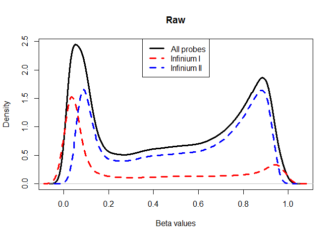
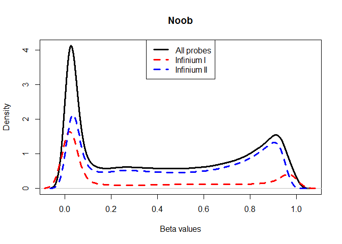
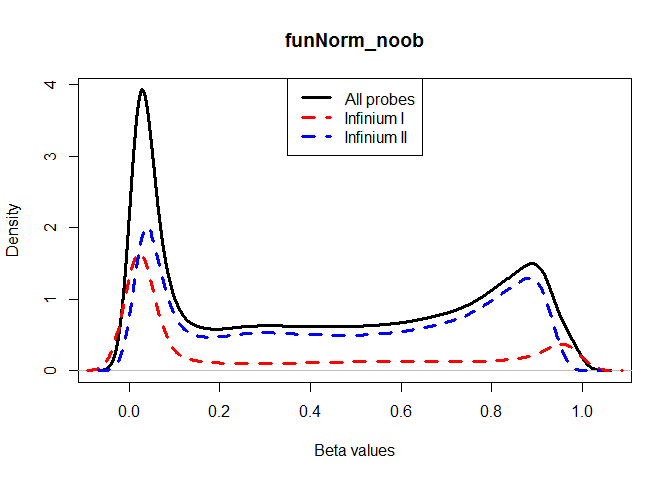
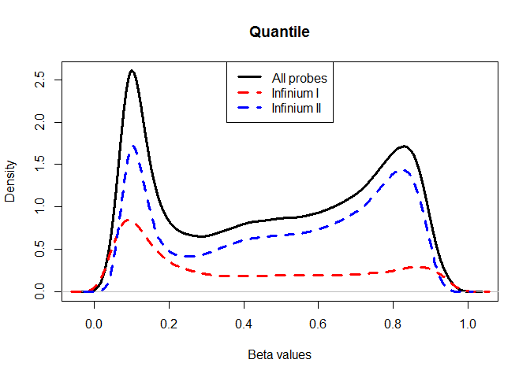
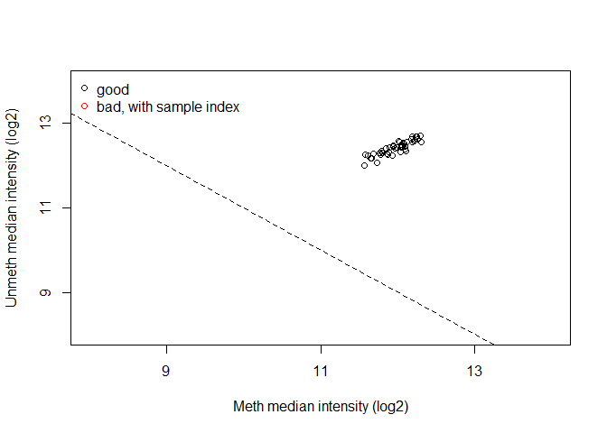
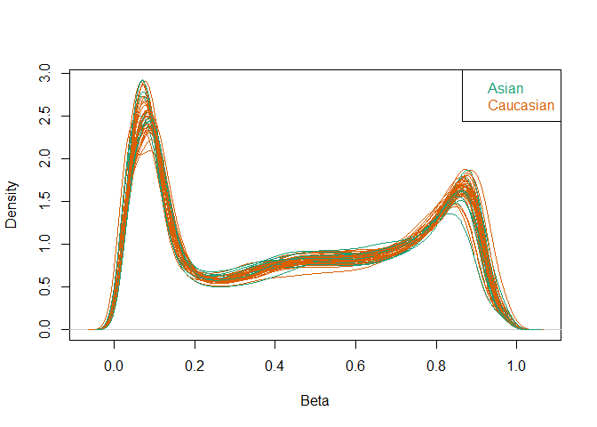
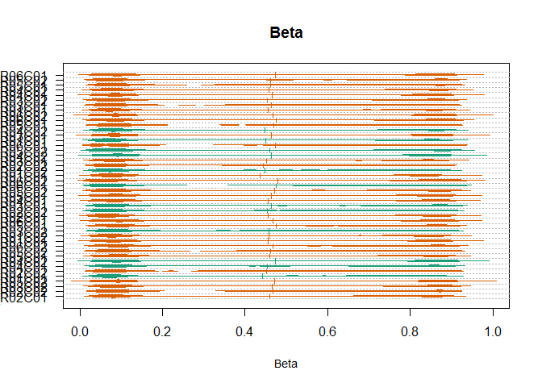
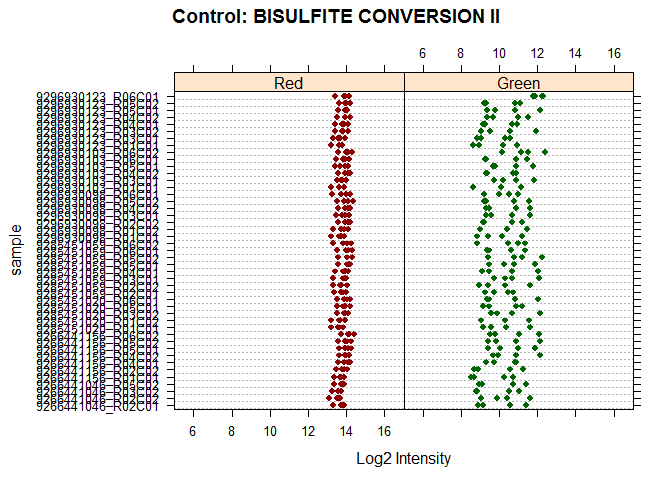
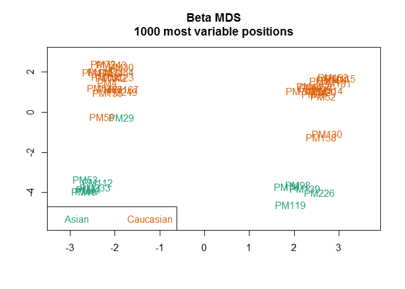

PreprocessQC\_MY
================
Michael Yuen
March 10, 2017

We are following this [Minfi tutorial](https://www.bioconductor.org/help/course-materials/2015/BioC2015/methylation450k.html).

And we used some additional Minfi functions for QC following the advice of helpful grad students (Thanks Robinson lab!) and [Dr. Meaghan's STAT540 DNA methylation lecture](https://stat540-ubc.github.io/subpages/lectures.html)

For general information on Minfi, consult the [user guide](http://bioconductor.org/packages/release/bioc/vignettes/minfi/inst/doc/minfi.pdf)

Further info about the functions and capabilities of Minfi can be found in the [Minfi reference manual](http://bioconductor.org/packages/release/bioc/manuals/minfi/man/minfi.pdf)

For the relevant paper with more comprehensive discussion of Minfi check out this [paper](https://academic.oup.com/bioinformatics/article/30/10/1363/267584/Minfi-a-flexible-and-comprehensive-Bioconductor)

``` r
library(minfi)
library(dplyr)
library(ggplot2)
```

1.0 Introduction
================

Different classes present in Minfi and their details: 1) RGChannelSet - Raw data from IDAT files, organized by probe color (green & red), instead of CpG sites. 2) MethylSet - Raw data organized by the CpG locus, not mapped to genome. This data has two types: methylated and unmethylated probes 3) GenomicMethylSet - MethylSet data mapped to genome (hg19) 4) RatioSet - Raw data organized by the CpG locus, but not mapped to genome. The data contains beta values 5) GenomicRatioSet - RatioSet data mapped to genome (hg19)

The natural starting point for analysis is usually the GenomicRatioSet class.

### 1.1 Load data

``` r
getwd() #input the right base directory
```

    ## [1] "C:/Users/micha/Desktop/stat540/grp_proj/team_Methylation-Badassays"

``` r
setwd("./data/Raw Data/")
basedir <- getwd()
samplesheet <- read.metharray.sheet(basedir, recursive = TRUE) # read in sample sheet .csv file
```

    ## [read.metharray.sheet] Found the following CSV files:

    ## [1] "C:/Users/micha/Desktop/stat540/grp_proj/team_Methylation-Badassays/data/Raw Data/samplesheet.csv"

``` r
Eth_rgset <- read.metharray.exp(targets = samplesheet) # read in iDAT files using sample sheet
```

### 1.2 Adding phenotype data

``` r
pheno <- pData(Eth_rgset) # phenotype data (from sample sheet)
pheno[,1:6]
```

    ##                   Sample_Name Sample_Group   ga    sex Ethnicity
    ## 9285451059_R06C02       PM104      CONTROL 40.7   MALE Caucasian
    ## 9296930098_R01C02       PM112      CONTROL 38.9 FEMALE     Asian
    ## 9296930123_R06C01       PM114      CONTROL 38.6   MALE Caucasian
    ## 9285451059_R05C02       PM115        LOPET 41.1   MALE Caucasian
    ## 9285451059_R02C02       PM119        LOPET 37.1   MALE     Asian
    ## 9266441156_R05C02       PM120      CONTROL 38.0 FEMALE Caucasian
    ## 9285451059_R05C01       PM123         IUGR 35.7 FEMALE Caucasian
    ## 9296930098_R01C01       PM124      CONTROL 40.0   MALE Caucasian
    ## 9266441156_R05C01       PM130         IUGR 36.9   MALE Caucasian
    ## 9296930103_R06C02       PM136      CONTROL 38.6 FEMALE Caucasian
    ## 9296930098_R05C02       PM139         IUGR 36.0   MALE     Asian
    ## 9285451020_R05C01       PM142      CONTROL 37.3 FEMALE Caucasian
    ## 9285451020_R01C02       PM153      CONTROL 38.7   MALE Caucasian
    ## 9296930098_R06C01       PM155      CONTROL 41.6 FEMALE Caucasian
    ## 9266441156_R06C02       PM158      CONTROL 37.7   MALE Caucasian
    ## 9285451059_R04C01       PM167      CONTROL 39.7 FEMALE Caucasian
    ## 9296930103_R03C01       PM181      CONTROL 39.0   MALE Caucasian
    ## 9296930123_R03C01        PM20      CONTROL 36.7   MALE Caucasian
    ## 9296930098_R03C01       PM205      CONTROL 38.6   MALE Caucasian
    ## 9266441156_R04C02       PM226         IUGR 38.4   MALE     Asian
    ## 9285451059_R02C01       PM227      CONTROL 39.0   MALE Caucasian
    ## 9285451020_R03C02       PM233      CONTROL 39.7 FEMALE     Asian
    ## 9296930123_R04C02       PM243      CONTROL 39.6 FEMALE Caucasian
    ## 9296930098_R02C02       PM249      CONTROL 36.1 FEMALE Caucasian
    ## 9285451059_R06C01        PM29         IUGR 36.0 FEMALE     Asian
    ## 9296930123_R01C01        PM30         IUGR 36.3 FEMALE Caucasian
    ## 9285451020_R06C01         PM4         IUGR 37.7 FEMALE Caucasian
    ## 9285451059_R03C01        PM40        LOPET 38.3 FEMALE     Asian
    ## 9296930103_R04C02        PM41         IUGR 37.3 FEMALE     Asian
    ## 9296930123_R04C01        PM44        LOPET 39.1   MALE Caucasian
    ## 9296930123_R05C01        PM46        LOPET 40.0 FEMALE Caucasian
    ## 9266441156_R01C01        PM47         IUGR 38.0 FEMALE     Asian
    ## 9266441156_R02C02        PM52        LOPET 35.9   MALE Caucasian
    ## 9266441156_R04C01        PM53        LOPET 38.6 FEMALE     Asian
    ## 9266441046_R05C02        PM54        LOPET 34.6 FEMALE Caucasian
    ## 9266441046_R03C02        PM55        LOPET 40.0 FEMALE Caucasian
    ## 9296930123_R05C02        PM58        LOPET 37.4 FEMALE Caucasian
    ## 9296930103_R06C01        PM66        LOPET 35.7   MALE Caucasian
    ## 9296930103_R05C01        PM71        LOPET 39.0 FEMALE Caucasian
    ## 9266441046_R02C02        PM72         IUGR 35.0 FEMALE Caucasian
    ## 9266441046_R02C01        PM74      CONTROL 37.9   MALE Caucasian
    ## 9296930103_R01C01        PM76      CONTROL 39.7   MALE     Asian
    ## 9285451020_R01C01        PM84      CONTROL 40.3 FEMALE Caucasian
    ## 9296930123_R03C02         PM9      CONTROL 39.1   MALE Caucasian
    ## 9296930098_R04C02        PM98        LOPET 37.4   MALE     Asian
    ##                     Sample_Plate
    ## 9285451059_R06C02 WG0011624-MSA4
    ## 9296930098_R01C02 WG0011624-MSA4
    ## 9296930123_R06C01 WG0011624-MSA4
    ## 9285451059_R05C02 WG0011624-MSA4
    ## 9285451059_R02C02 WG0011624-MSA4
    ## 9266441156_R05C02 WG0011624-MSA4
    ## 9285451059_R05C01 WG0011624-MSA4
    ## 9296930098_R01C01 WG0011624-MSA4
    ## 9266441156_R05C01 WG0011624-MSA4
    ## 9296930103_R06C02 WG0011624-MSA4
    ## 9296930098_R05C02 WG0011624-MSA4
    ## 9285451020_R05C01 WG0011624-MSA4
    ## 9285451020_R01C02 WG0011624-MSA4
    ## 9296930098_R06C01 WG0011624-MSA4
    ## 9266441156_R06C02 WG0011624-MSA4
    ## 9285451059_R04C01 WG0011624-MSA4
    ## 9296930103_R03C01 WG0011624-MSA4
    ## 9296930123_R03C01 WG0011624-MSA4
    ## 9296930098_R03C01 WG0011624-MSA4
    ## 9266441156_R04C02 WG0011624-MSA4
    ## 9285451059_R02C01 WG0011624-MSA4
    ## 9285451020_R03C02 WG0011624-MSA4
    ## 9296930123_R04C02 WG0011624-MSA4
    ## 9296930098_R02C02 WG0011624-MSA4
    ## 9285451059_R06C01 WG0011624-MSA4
    ## 9296930123_R01C01 WG0011624-MSA4
    ## 9285451020_R06C01 WG0011624-MSA4
    ## 9285451059_R03C01 WG0011624-MSA4
    ## 9296930103_R04C02 WG0011624-MSA4
    ## 9296930123_R04C01 WG0011624-MSA4
    ## 9296930123_R05C01 WG0011624-MSA4
    ## 9266441156_R01C01 WG0011624-MSA4
    ## 9266441156_R02C02 WG0011624-MSA4
    ## 9266441156_R04C01 WG0011624-MSA4
    ## 9266441046_R05C02 WG0011624-MSA4
    ## 9266441046_R03C02 WG0011624-MSA4
    ## 9296930123_R05C02 WG0011624-MSA4
    ## 9296930103_R06C01 WG0011624-MSA4
    ## 9296930103_R05C01 WG0011624-MSA4
    ## 9266441046_R02C02 WG0011624-MSA4
    ## 9266441046_R02C01 WG0011624-MSA4
    ## 9296930103_R01C01 WG0011624-MSA4
    ## 9285451020_R01C01 WG0011624-MSA4
    ## 9296930123_R03C02 WG0011624-MSA4
    ## 9296930098_R04C02 WG0011624-MSA4

``` r
mani <- getManifest(Eth_rgset) # manifest probe design information
```

    ## Loading required package: IlluminaHumanMethylation450kmanifest

### 1.3 Comparing preprocessing methodology

``` r
MSet.raw <- preprocessRaw(Eth_rgset)
MSet.raw <- MSet.raw[order(featureNames(MSet.raw)), ]

MSet.noob <- preprocessNoob(Eth_rgset)
```

    ## Loading required package: IlluminaHumanMethylation450kanno.ilmn12.hg19

    ## [preprocessNoob] Applying R/G ratio flip to fix dye bias...

``` r
MSet.noob <- MSet.noob[order(featureNames(MSet.noob)), ]

eth_preproc_funnorm <- preprocessFunnorm(Eth_rgset, nPCs = 2, sex = NULL, bgCorr = TRUE, dyeCorr = TRUE, verbose = TRUE)
```

    ## [preprocessFunnorm] Background and dye bias correction with noob

    ## [preprocessNoob] Applying R/G ratio flip to fix dye bias...

    ## [preprocessFunnorm] Mapping to genome

    ## [preprocessFunnorm] Quantile extraction

    ## [preprocessFunnorm] Normalization

``` r
eth_preproc_funnorm <- eth_preproc_funnorm[order(featureNames(eth_preproc_funnorm)), ]

eth_preproc_quant <- preprocessQuantile(Eth_rgset, fixOutliers = TRUE, removeBadSamples = FALSE, quantileNormalize = TRUE, stratified = TRUE, mergeManifest = FALSE, sex = NULL)
```

    ## [preprocessQuantile] Mapping to genome.

    ## [preprocessQuantile] Fixing outliers.

    ## [preprocessQuantile] Quantile normalizing.

``` r
eth_preproc_quant <- eth_preproc_quant[order(featureNames(eth_preproc_quant)),]

## later on we can use getSex() on preprocessed data to double check genders for each observation
    
probeTypes <- data.frame(Name = featureNames(MSet.raw),
                         Type = getProbeType(MSet.raw))

#legendpos = "btm" is used to generate an error to remove the legend all together. 
plotBetasByType(MSet.raw[,1], main = "Raw")
```



``` r
plotBetasByType(MSet.noob[,1], main = "Noob")
```



``` r
plotBetasByType(getBeta(eth_preproc_funnorm[,1]), probeTypes = probeTypes, main = "funNorm_noob")
```



``` r
plotBetasByType(getBeta(eth_preproc_quant[,1]), probeTypes = probeTypes, main = "Quantile")
```



> A good preprocessing method should make the peaks of type 1 & 2 probe distributions close together, so functional normalization appears to be better. PreprocessingFunnorm is best.

-   Raw: "Converts the Red/Green channel for an Illumina methylation array into methylation signal, without using any normalization."
-   Noob: "Implements the noob background subtraction method with dye-bias normalization"
-   Functional Normalization: "This function applies the preprocessNoob function as a first step for background substraction, and uses the first two principal components of the control probes to infer the unwanted variation"
-   Quantile Normalization: "Implements stratified quantile normalization preprocessing"

1.3a Create Classes (no longer needed in preprocessFunnorm)
===========================================================

Generating MethylSet and RatioSet for preprocessingRaw and preprocessingNoob

``` r
#MSet.raw <- preprocessRaw(Eth_rgset)
#MSet.noob <- preprocessNoob(Eth_rgset)
```

Get GenomicRatioSet

``` r
#GRset <- mapToGenome(RSet)# Various functions available to access GRSet data
#gr <- granges(GRset)
```

\#2. Quality Controls
---------------------

Note: I think we should move all of the QC to here, so that it is obvious that we do QC before normalization -victor Note: I'm just going to move your section over here Ming, -Victor --------------------------------------------------------------------------------------------------------------------------------------------

``` r
qc <- getQC(MSet.raw)
plotQC(qc)
```



> The plot estimates samples-specific probe intensities from the MethylSet, comparing methylation probes (M) against unmethylation probes (UM). Intensities for each M and UM are plotted to ensure that they have similar intensities and that the intensities stronger than 10.

``` r
densityPlot(MSet.raw, sampGroups = pheno$Ethnicity) #bit hard to see
```



> This is a density plot of the beta values for all samples annotated by ethnicity. Beta values are the estimate of methylation level at each position using the ratio of intensities between methylated and unmethylated probes. Beta values are expected to follow a bimodel distribution of roughly 0s and 1s.

``` r
densityBeanPlot(MSet.raw, sampGroups = pheno$Ethnicity) #This is pretty messy, can we make it look betteR? (split into two graphs maybe?)
```



> Similar to the density plot above, but plotted as a bean plot, color coded by ethnicity

``` r
controlStripPlot(Eth_rgset, controls="BISULFITE CONVERSION II") #Red is type 1, green is type 2
```



> The 450k array contains several internal control probes that can be used to assess the quality control of different sample preparation steps, in this case, bisulfite conversion. Each control probe is plotted as a strip plot here, showing the consistency of each control probe, suggesting that the changes in our probe sets are not due to errors in preparation.

``` r
mdsPlot(Eth_rgset, sampNames = pheno$Sample_Name, sampGroups = pheno$Ethnicity)
```



> The Multi-Dimensional Scaling (MDS) plot showss a 2D projection of beta values. The distance between samples show their similarity to each other. It is used as a mean to visually conceptualize the data without making claims to its significance.

### Sex check

``` r
eth_preproc_funnorm@colData$sex
```

    ##  [1] "MALE"   "FEMALE" "MALE"   "MALE"   "MALE"   "FEMALE" "FEMALE"
    ##  [8] "MALE"   "MALE"   "FEMALE" "MALE"   "FEMALE" "MALE"   "FEMALE"
    ## [15] "MALE"   "FEMALE" "MALE"   "MALE"   "MALE"   "MALE"   "MALE"  
    ## [22] "FEMALE" "FEMALE" "FEMALE" "FEMALE" "FEMALE" "FEMALE" "FEMALE"
    ## [29] "FEMALE" "MALE"   "FEMALE" "FEMALE" "MALE"   "FEMALE" "FEMALE"
    ## [36] "FEMALE" "FEMALE" "MALE"   "FEMALE" "FEMALE" "MALE"   "MALE"  
    ## [43] "FEMALE" "MALE"   "MALE"

``` r
predicted_sex <- eth_preproc_funnorm@colData$predictedSex
for (i in 1:length(predicted_sex)){
  if (predicted_sex[i] == "F") {predicted_sex[i] = "FEMALE"}
  else {predicted_sex[i] = "MALE"} }
predicted_sex == eth_preproc_funnorm@colData$sex
```

    ##  [1] TRUE TRUE TRUE TRUE TRUE TRUE TRUE TRUE TRUE TRUE TRUE TRUE TRUE TRUE
    ## [15] TRUE TRUE TRUE TRUE TRUE TRUE TRUE TRUE TRUE TRUE TRUE TRUE TRUE TRUE
    ## [29] TRUE TRUE TRUE TRUE TRUE TRUE TRUE TRUE TRUE TRUE TRUE TRUE TRUE TRUE
    ## [43] TRUE TRUE TRUE

``` r
## all match
```

### Checking for the presence of SNPs inside the probe body or CpG or at the nucleotide extension

``` r
# check presence of SNPs inside probe body or single nucleotide extensions
snps <- getSnpInfo(eth_preproc_funnorm)
str(snps@listData$Probe_rs)
```

    ##  chr [1:485512] NA "rs9857774" NA NA NA NA "rs62037371" ...

``` r
eth_preproc_funnorm <- addSnpInfo(eth_preproc_funnorm)
# drop the probes that contain either a SNP at the CpG interrogation or at the single nucleotide extension
eth_preproc_funnorm_rmSNP <- dropLociWithSnps(eth_preproc_funnorm, snps=c("SBE","CpG"), maf=0)
eth_preproc_funnorm_rmSNP
```

    ## class: GenomicRatioSet 
    ## dim: 467971 45 
    ## metadata(0):
    ## assays(2): Beta CN
    ## rownames(467971): cg00000029 cg00000108 ... ch.X.97737721F
    ##   ch.X.98007042R
    ## rowData names(6): Probe_rs Probe_maf ... SBE_rs SBE_maf
    ## colnames(45): 9285451059_R06C02 9296930098_R01C02 ...
    ##   9296930123_R03C02 9296930098_R04C02
    ## colData names(11): Sample_Name Sample_Group ... filenames
    ##   predictedSex
    ## Annotation
    ##   array: IlluminaHumanMethylation450k
    ##   annotation: ilmn12.hg19
    ## Preprocessing
    ##   Method: NA
    ##   minfi version: NA
    ##   Manifest version: NA
