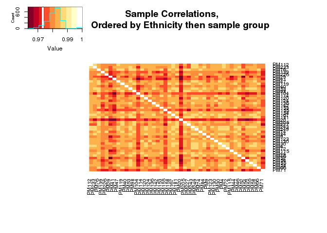
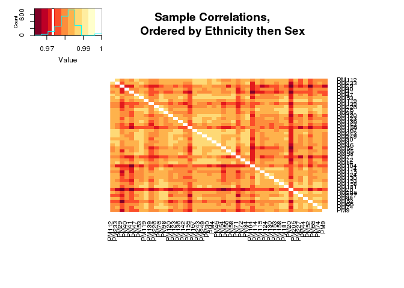

Exploratory Analysis of Processed Data
================
Nivretta

### NOTE: Please scroll down to 4.0 for exploratory analysis

Currently we have to run most of the pre-processing script to generate the processed data, instead of reading in the processed data. Saving (save, saveRDS, write.table) the processed data (as txt, rds, Rdata), zipping (zip, gz), unzipping, and trying to read in the data is not working...file size too big. Victor created a data.zip file after processing - when extracted, data is in txt format, but read.csv does not work and read\_delim incorrectly shifts the column names one column to the left.

### 1.0 PREPROCESSING: INTRODUCTION

Please see processing script.

### 1.1 Dependencies

Installed the necessary dependencies by:

``` r
source("https://bioconductor.org/biocLite.R")
#biocLite("wateRmelon")
#biocLite('limma')
#biocLite('minfi')
#biocLite('IlluminaHumanMethylation450kmanifest') 
#biocLite('IlluminaHumanMethylation450kanno.ilmn12.hg19')
#install.packages("gplots")
library(wateRmelon) 
library(IlluminaHumanMethylation450kmanifest)
library(IlluminaHumanMethylation450kanno.ilmn12.hg19)
library(minfi) 
library(dplyr)
library(tibble)
library(gplots)
library(RColorBrewer)
```

### 1.2 Load data

We start with reading the .IDAT files and we read in a sample sheet, and then use the sample sheet to load the data into a RGChannelSet.

``` r
#input the right base directory
getwd() 
setwd("../Raw Data/")
basedir <- getwd()
samplesheet <- read.metharray.sheet(basedir, recursive = TRUE) # read in sample sheet .csv file
```

    ## [read.metharray.sheet] Found the following CSV files:

``` r
Eth_rgset <- read.metharray.exp(targets = samplesheet) # read in iDAT files using sample sheet
Eth_rgset2 <- read.metharray.exp(targets = samplesheet, extended = TRUE) #extended Rgset to get bead count info
```

The Eth\_rgset class contains the intensities of the internal control probes as well and as our data were read from a data sheet experiment, the phenotype data is also stored in the Eth\_rgset and can be accessed via the accessor command pData.

``` r
pheno <- pData(Eth_rgset) # phenotype data (from sample sheet)
pheno[,1:6]
getManifest(Eth_rgset) # manifest probe design information of the array.
```

Manifest verifies that we are working with 450K data.

### 1.3 Create Classes - with no normalization

Generating **MethylSet**, which contains only the methylated and unmethylated signals, and **RatioSet**, which stores Beta vlues and/or M values instead of the methylated and unmethylated signals:

``` r
MSet <- preprocessRaw(Eth_rgset) 
```

preprocessRaw() converts raw intensity data (in the form of IDAT files) into Methylated and Unmethylated values. These values are called Beta or M-values. Beta values are the estimate of methylation level at each position using the ratio of intensities between methylated and unmethylated probes. Beta values are expected to follow a bimodel distribution of roughly 0s and 1s. M-values are the same information just on a log scale, which has been shown to be better for some downstream statistical analyses.

``` r
RSet <- ratioConvert(MSet, what = "both", keepCN = TRUE) #CN is the sum of the methylated and unmethylated signals
```

ratioConvert() consolidates methylated and unmethylated values per CpG site into one value (a ratio of Methylated / Unmethylated).

Get **GenomicRatioSet**:

``` r
GRset <- mapToGenome(RSet) 
```

The function mapToGenome() applied to a RatioSet object adds genomic coordinates to each probe together with some additional annotation information. granges(GRset) can be used to return the probe locations as a genomic ranges.

### 2.0 Quality Control (QC) - before normalization

``` r
qc <- getQC(MSet)
```

### 3.0 Normalization

-   **Functional Normalization**: "This function applies the preprocessNoob function as a first step for background substraction, and uses the first two principal components of the control probes to infer the unwanted variation"
-   **Quantile Normalization**: "Implements stratified quantile normalization preprocessing"

### 3.1 Comparing normalization methodology

**preprocessNoob** First, we use preprocessNoob function to implement the noob background subtraction method with dye-bias normalization. In this background subtraction method, background noise is estimated from the out-of-band probes and is removed from each sample separately, while the dye-bias normalization utilizes a subset of the control probes to estimate the dye bias (red and green dyes have certain hybridization biases that need to be corrected for).

``` r
MSet.noob <- preprocessNoob(Eth_rgset)
MSet.noob <- MSet.noob[order(featureNames(MSet.noob)), ]
```

**preprocessFunnorm** We use preprocessFunnorm function to implement the functional normalization alogrithm which uses the internal control probes present on the array to infer between-array technical variation.

``` r
GRset_funnorm <- preprocessFunnorm(Eth_rgset, nPCs = 2, sex = NULL, bgCorr = TRUE, dyeCorr = TRUE, verbose = TRUE)
```

    ## [preprocessFunnorm] Background and dye bias correction with noob

    ## [preprocessFunnorm] Mapping to genome

    ## [preprocessFunnorm] Quantile extraction

    ## [preprocessFunnorm] Normalization

``` r
GRset_funnorm <- GRset_funnorm[order(featureNames(GRset_funnorm)), ]
```

**preprocessQuantile**

``` r
GRset_quant <- preprocessQuantile(Eth_rgset, fixOutliers = TRUE, removeBadSamples = FALSE, quantileNormalize = TRUE, stratified = TRUE, mergeManifest = FALSE, sex = NULL)
```

    ## [preprocessQuantile] Mapping to genome.

    ## [preprocessQuantile] Fixing outliers.

    ## [preprocessQuantile] Quantile normalizing.

``` r
GRset_quant <- GRset_quant[order(featureNames(GRset_quant)),]
```

Okay, now we have all of our data into objects that correspond to each normalization method. We will assess how they normalized based on the distribution of Type I and Type II probes after normalization.

``` r
probeTypes <- data.frame(Name = featureNames(MSet),
                         Type = getProbeType(MSet)) #legendpos = "btm" is used to generate an error to remove the legend all together. 
```

> preprocessRaw does no normalization so we can see that the type I and type II (infinium I & II) probes have a distinct distribution. As we try different normalization methods we will assess how they perform by looking how close the distributions shift towards overlapping.

### 3.3 Probe filtering

> Next we check for the presence of SNPs inside the probe body or CpG or at the nucleotide extension. Such probes will be removed.

``` r
# check presence of SNPs inside probe body or single nucleotide extensions
snps <- getSnpInfo(GRset_funnorm)
str(snps@listData$Probe_rs)

GRset_funnorm <- addSnpInfo(GRset_funnorm)
# drop the probes that contain either a SNP at the CpG interrogation or at the single nucleotide extension
GRset_funnorm2 <- dropLociWithSnps(GRset_funnorm, snps=c("SBE","CpG"), maf=0)
GRset_funnorm2
```

``` r
MSet2 <- pfilter(Eth_rgset2, pnthresh = 0.01) #removes all bad detection p value probes and bead count <3.
```

> We used the pfilter() function from watermelon package to remove bad detection p value probes and probes with bead count &lt; 3. We started with 'r nrow(MSet)' to 'r nrow(MSet2)' number of probes.

> Now to remove these probes from our genomic ranges object (normalized object)

``` r
GRset_funnorm2B <- getBeta(GRset_funnorm2) #take out beta values
GRset_funnorm2B <- rownames_to_column(as.data.frame(GRset_funnorm2B), 'cpg') #add rownames to a column
gset <- mapToGenome(MSet2) #maps filtered data to genome so 
gsetB <- getBeta(gset) #gsetB will act as filtering index to remove additional probes from the normalized data
gsetB <- rownames_to_column(as.data.frame(gsetB), 'cpg') #dplyr requires rownames to be in colun for joining dataframes
dim(gsetB)
dim(GRset_funnorm2B)

gsetFin2 <- semi_join(GRset_funnorm2B, gsetB, by = 'cpg')
dim(gsetFin2)
#464923 CpGs left
gsetFin2 <- column_to_rownames(gsetFin2, 'cpg') #add cpg row names back (I found this reduces the file size significantly - this is kind of weird)
head(gsetFin2) #yay

#save as RDS and then compressing does not reduce gsetFin2 size
#saveRDS(design, file = "PreProcessed.rds")
#write.table(gsetFin2,"Processed.txt",sep="\t",row.names=TRUE)
#zip("Processed.zip", file = "Processed.txt")
#gzip(filename= "Processed.txt", destname = "Processed.gz")
```

4.0 Exploratory Analysis
========================

A first look at the processed data with some plots.

First we need to convolve the design matrix with the processed data.

``` r
setwd("../Raw Data/")
design <- read.csv("des.txt", sep="\t", header=TRUE)

#rename processed data columns to sample names
colnames(gsetFin2) <- c(as.character(design$Samplename))

#join the processed data with experiemtnal design info
#note, couldn't do this on my local computer - data too large. Ran code on lab's rstudio which runs on a server
full <- cbind(design, t(gsetFin2))
```

### 4.1 Explore a random CpG Site

``` r
#random cpg site from 1 to 464923
probe_row <- 2000

#get the site name 
probe_name <- colnames(full)[probe_row]

#plot y = beta values for random cpg site for all samples, x= gestational age, plots divided by sample group, points colored by ethnicity
ggplot(full, aes(x = as.factor(ga), y = full[probe_row], colour = Ethnicity)) + 
  #geom_boxplot(aes(fill=Ethnicity), show.legend = TRUE) + 
  geom_jitter(width = 0.5) + 
  facet_wrap(~Sample_Group) + 
  xlab("Gestational Age") + 
  ylab("Beta values") +
  ggtitle(paste("Beta values for CpG site", probe_name)) #+
```

    ## Don't know how to automatically pick scale for object of type data.frame. Defaulting to continuous.


``` r
  #stat_summary(fun.y = mean, geom="point", colour="darkred", size= 3)

#beta values for random cpG site, box plots of ethnicity
ggplot(full, aes(x = Ethnicity, y = full[probe_row])) + 
  geom_boxplot(aes(fill=Ethnicity), show.legend = FALSE) + 
  geom_jitter(width = 0.3) + 
  facet_wrap(~sex) + 
  xlab("Ethnicity") + 
  ylab("Beta values") +
  ggtitle(paste("Beta values for CpG site", probe_name)) +
  stat_summary(fun.y = mean, geom="point", colour="darkred", size= 3)
```

    ## Don't know how to automatically pick scale for object of type data.frame. Defaulting to continuous.


### 4.2 Sample to Sample Correlations

``` r
#obtain sample names in order of ethnicity and then sample group
full_ethnicity <- full[order(full$Ethnicity, full$Sample_Group),]
order_ethnicity <- row.names(full_ethnicity)

#order expression data by ethnicity and then sample group
gsetFin2_ethnicity <- gsetFin2[, order_ethnicity]

#set the color pallette for heatmap
cols<-c(rev(brewer.pal(9,"YlOrRd")), "#FFFFFF")

heatmap.2(cor(gsetFin2_ethnicity), 
          Rowv=NA, 
          Colv=NA, 
          dendrogram = "none",
          trace="none",
          col=cols, 
          margins = c(8,8),
          #labRow = c(full_time$labels),
          #labCol = c(full_time$labels),
          key.title = NA)
title("Sample Correlations, 
      Ordered by Ethnicity then sample group")
```



``` r
#obtain sample names in order of ethnicity and then gender
full_ethnicity_sex <- full[order(full$Ethnicity, full$sex),]
order_ethnicity_sex <- row.names(full_ethnicity_sex)

#order expression data by ethnicity and then gender
gsetFin2_ethnicity_sex <- gsetFin2[, order_ethnicity_sex]

#set the color pallette for heatmap
cols<-c(rev(brewer.pal(9,"YlOrRd")), "#FFFFFF")

heatmap.2(cor(gsetFin2_ethnicity_sex), 
          Rowv=NA, 
          Colv=NA, 
          dendrogram = "none",
          trace="none",
          col=cols, 
          margins = c(8,8),
          #labRow = c(full_time$labels),
          #labCol = c(full_time$labels),
          key.title = NA)
title("Sample Correlations, 
      Ordered by Ethnicity then Sex")
```


