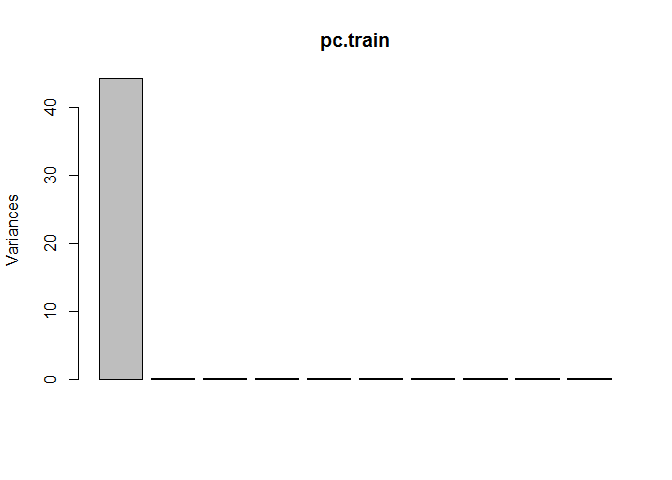
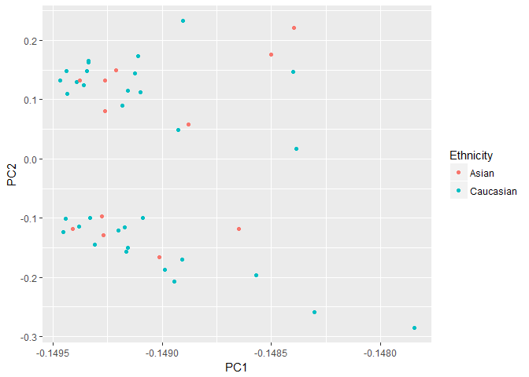
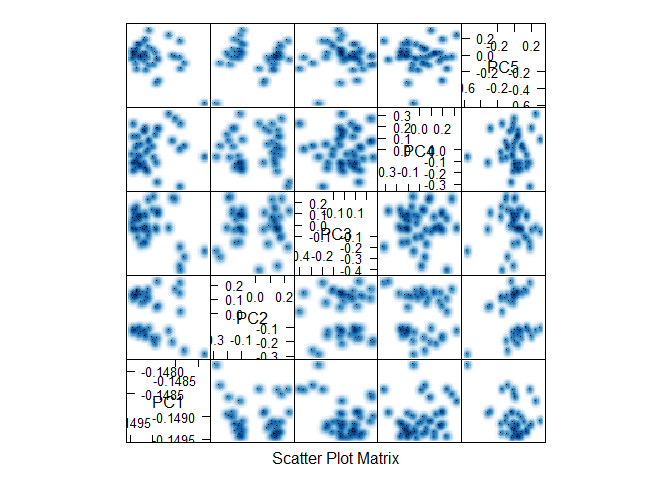

Predictive Modeling Analysis
================
Ming Wan, Victor Yuan

-   [Step 0: Load Packages and Data](#step-0-load-packages-and-data)
-   [Step 1: Unsupervised clustering:](#step-1-unsupervised-clustering)
    -   [PCA on training data:](#pca-on-training-data)
    -   [PCA projection of loadings to test data:](#pca-projection-of-loadings-to-test-data)
-   [Step 2: Supervised classification:](#step-2-supervised-classification)
    -   [logistic regression with elastic net regularization](#logistic-regression-with-elastic-net-regularization)

Step 0: Load Packages and Data
==============================

Load required packages:

``` r
library(ggplot2)
library(limma)
library(caret)
```

    ## Loading required package: lattice

``` r
library(dplyr)
```

    ## 
    ## Attaching package: 'dplyr'

    ## The following objects are masked from 'package:stats':
    ## 
    ##     filter, lag

    ## The following objects are masked from 'package:base':
    ## 
    ##     intersect, setdiff, setequal, union

``` r
library(glmnet)
```

    ## Loading required package: Matrix

    ## Loading required package: foreach

    ## Loaded glmnet 2.0-5

Read in pre-processed data: \*Make sure the pre-processed data (data.txt, which is in data.zip) is present in the ../processed\_data/ directory.

``` r
setwd('../')                                           # note: all of these relative file path calls work only for knitting
# pre-processed training set
train.data <- read.table('../data/processed_data/data.txt')

str(train.data)
```

    ## 'data.frame':    464923 obs. of  45 variables:
    ##  $ PM104: num  0.9219 0.569 0.0435 0.0635 0.0368 ...
    ##  $ PM112: num  0.8546 0.6886 0.0724 0.0856 0.0364 ...
    ##  $ PM114: num  0.8319 0.6578 0.0906 0.0909 0.0393 ...
    ##  $ PM115: num  0.9021 0.6146 0.0665 0.0839 0.0389 ...
    ##  $ PM119: num  0.896 0.6565 0.0591 0.0987 0.0336 ...
    ##  $ PM120: num  0.8658 0.6338 0.0982 0.1254 0.0421 ...
    ##  $ PM123: num  0.8769 0.6214 0.0571 0.0582 0.0477 ...
    ##  $ PM124: num  0.8481 0.6759 0.0711 0.1022 0.0437 ...
    ##  $ PM130: num  0.821 0.6326 0.1116 0.1038 0.0449 ...
    ##  $ PM136: num  0.9024 0.569 0.0674 0.0671 0.0493 ...
    ##  $ PM139: num  0.8259 0.6098 0.0556 0.0628 0.0371 ...
    ##  $ PM142: num  0.8099 0.6414 0.1094 0.1451 0.0435 ...
    ##  $ PM153: num  0.8911 0.6525 0.0939 0.0888 0.044 ...
    ##  $ PM155: num  0.8384 0.5506 0.0802 0.0984 0.0458 ...
    ##  $ PM158: num  0.835 0.6604 0.1136 0.1122 0.0393 ...
    ##  $ PM167: num  0.8618 0.5825 0.0807 0.0774 0.0424 ...
    ##  $ PM181: num  0.9024 0.6273 0.0885 0.1101 0.0416 ...
    ##  $ PM20 : num  0.8925 0.677 0.1326 0.1507 0.0538 ...
    ##  $ PM205: num  0.851 0.641 0.139 0.142 0.125 ...
    ##  $ PM226: num  0.8822 0.693 0.0972 0.1074 0.0367 ...
    ##  $ PM227: num  0.9049 0.6118 0.0462 0.0719 0.0343 ...
    ##  $ PM233: num  0.8022 0.6165 0.0744 0.1352 0.0448 ...
    ##  $ PM243: num  0.8551 0.6229 0.0896 0.1001 0.0376 ...
    ##  $ PM249: num  0.9153 0.6164 0.0654 0.0946 0.0345 ...
    ##  $ PM29 : num  0.9114 0.6393 0.0399 0.0364 0.0296 ...
    ##  $ PM30 : num  0.8835 0.5735 0.0885 0.1435 0.0407 ...
    ##  $ PM4  : num  0.8463 0.5852 0.0733 0.0869 0.0408 ...
    ##  $ PM40 : num  0.8385 0.6786 0.0586 0.0718 0.0364 ...
    ##  $ PM41 : num  0.8149 0.6576 0.0663 0.1045 0.0485 ...
    ##  $ PM44 : num  0.8089 0.5596 0.1227 0.1471 0.0378 ...
    ##  $ PM46 : num  0.9026 0.6467 0.0751 0.1048 0.0372 ...
    ##  $ PM47 : num  0.8491 0.6345 0.0653 0.0967 0.0468 ...
    ##  $ PM52 : num  0.8891 0.5681 0.0782 0.1018 0.0362 ...
    ##  $ PM53 : num  0.8566 0.6803 0.0866 0.1076 0.0466 ...
    ##  $ PM54 : num  0.8513 0.7054 0.0998 0.1685 0.0427 ...
    ##  $ PM55 : num  0.8317 0.5979 0.0954 0.1153 0.0354 ...
    ##  $ PM58 : num  0.8322 0.6706 0.0754 0.1237 0.0492 ...
    ##  $ PM66 : num  0.9138 0.6296 0.0859 0.1162 0.041 ...
    ##  $ PM71 : num  0.7972 0.5837 0.1344 0.1746 0.0477 ...
    ##  $ PM72 : num  0.8706 0.6164 0.1114 0.1194 0.0396 ...
    ##  $ PM74 : num  0.8611 0.5987 0.0988 0.0997 0.037 ...
    ##  $ PM76 : num  0.8401 0.5985 0.0728 0.1062 0.0409 ...
    ##  $ PM84 : num  0.8955 0.6762 0.2148 0.1548 0.0433 ...
    ##  $ PM9  : num  0.8784 0.6027 0.1118 0.1305 0.0441 ...
    ##  $ PM98 : num  0.8279 0.629 0.0827 0.0837 0.0418 ...

``` r
## row names are CpG sites, column names are codings of sample

# design matrix
design <- read.csv("../data/processed_data/des.txt", sep="\t", header=TRUE)

str(design)
```

    ## 'data.frame':    45 obs. of  5 variables:
    ##  $ Samplename  : Factor w/ 45 levels "PM104","PM112",..: 1 2 3 4 5 6 7 8 9 10 ...
    ##  $ Sample_Group: Factor w/ 3 levels "CONTROL","IUGR",..: 1 1 1 3 3 1 2 1 2 1 ...
    ##  $ ga          : num  40.7 38.9 38.6 41.1 37.1 38 35.7 40 36.9 38.6 ...
    ##  $ sex         : Factor w/ 2 levels "F","M": 2 1 2 2 2 1 1 2 2 1 ...
    ##  $ Ethnicity   : Factor w/ 2 levels "Asian","Caucasian": 2 1 2 2 1 2 2 2 2 2 ...

``` r
## sample names column is different from methyl data columns, need to correct 
```

Step 1: Unsupervised clustering:
================================

As Rob suggested, PCA should be the precursor to supervised classification, more like an exploration.

PCA on training data:
---------------------

``` r
pc.train <- prcomp(train.data, center = T, scale = T)

# look at the eigenvalues
plot(pc.train)
```



``` r
pc.train$sdev
```

    ##  [1] 6.64587154 0.30529749 0.26359176 0.21838360 0.19487937 0.18618339
    ##  [7] 0.16636870 0.16276166 0.14751036 0.14538416 0.14311211 0.14201040
    ## [13] 0.13234009 0.13086691 0.13029769 0.12656640 0.12615061 0.12232872
    ## [19] 0.12120261 0.12042376 0.11775061 0.11734179 0.11531707 0.11428397
    ## [25] 0.11330464 0.11187898 0.11128672 0.11006094 0.10877955 0.10789993
    ## [31] 0.10731060 0.10684364 0.10598857 0.10565253 0.10452962 0.10344314
    ## [37] 0.10255735 0.10168684 0.10151781 0.10099069 0.10094643 0.09934144
    ## [43] 0.09837651 0.09677529 0.09596319

``` r
## apparently the first PC can explain most of the variances in our data
diag((pc.train$sdev)^2)
```

    ##           [,1]       [,2]       [,3]      [,4]       [,5]       [,6]
    ##  [1,] 44.16761 0.00000000 0.00000000 0.0000000 0.00000000 0.00000000
    ##  [2,]  0.00000 0.09320656 0.00000000 0.0000000 0.00000000 0.00000000
    ##  [3,]  0.00000 0.00000000 0.06948061 0.0000000 0.00000000 0.00000000
    ##  [4,]  0.00000 0.00000000 0.00000000 0.0476914 0.00000000 0.00000000
    ##  [5,]  0.00000 0.00000000 0.00000000 0.0000000 0.03797797 0.00000000
    ##  [6,]  0.00000 0.00000000 0.00000000 0.0000000 0.00000000 0.03466426
    ##  [7,]  0.00000 0.00000000 0.00000000 0.0000000 0.00000000 0.00000000
    ##  [8,]  0.00000 0.00000000 0.00000000 0.0000000 0.00000000 0.00000000
    ##  [9,]  0.00000 0.00000000 0.00000000 0.0000000 0.00000000 0.00000000
    ## [10,]  0.00000 0.00000000 0.00000000 0.0000000 0.00000000 0.00000000
    ## [11,]  0.00000 0.00000000 0.00000000 0.0000000 0.00000000 0.00000000
    ## [12,]  0.00000 0.00000000 0.00000000 0.0000000 0.00000000 0.00000000
    ## [13,]  0.00000 0.00000000 0.00000000 0.0000000 0.00000000 0.00000000
    ## [14,]  0.00000 0.00000000 0.00000000 0.0000000 0.00000000 0.00000000
    ## [15,]  0.00000 0.00000000 0.00000000 0.0000000 0.00000000 0.00000000
    ## [16,]  0.00000 0.00000000 0.00000000 0.0000000 0.00000000 0.00000000
    ## [17,]  0.00000 0.00000000 0.00000000 0.0000000 0.00000000 0.00000000
    ## [18,]  0.00000 0.00000000 0.00000000 0.0000000 0.00000000 0.00000000
    ## [19,]  0.00000 0.00000000 0.00000000 0.0000000 0.00000000 0.00000000
    ## [20,]  0.00000 0.00000000 0.00000000 0.0000000 0.00000000 0.00000000
    ## [21,]  0.00000 0.00000000 0.00000000 0.0000000 0.00000000 0.00000000
    ## [22,]  0.00000 0.00000000 0.00000000 0.0000000 0.00000000 0.00000000
    ## [23,]  0.00000 0.00000000 0.00000000 0.0000000 0.00000000 0.00000000
    ## [24,]  0.00000 0.00000000 0.00000000 0.0000000 0.00000000 0.00000000
    ## [25,]  0.00000 0.00000000 0.00000000 0.0000000 0.00000000 0.00000000
    ## [26,]  0.00000 0.00000000 0.00000000 0.0000000 0.00000000 0.00000000
    ## [27,]  0.00000 0.00000000 0.00000000 0.0000000 0.00000000 0.00000000
    ## [28,]  0.00000 0.00000000 0.00000000 0.0000000 0.00000000 0.00000000
    ## [29,]  0.00000 0.00000000 0.00000000 0.0000000 0.00000000 0.00000000
    ## [30,]  0.00000 0.00000000 0.00000000 0.0000000 0.00000000 0.00000000
    ## [31,]  0.00000 0.00000000 0.00000000 0.0000000 0.00000000 0.00000000
    ## [32,]  0.00000 0.00000000 0.00000000 0.0000000 0.00000000 0.00000000
    ## [33,]  0.00000 0.00000000 0.00000000 0.0000000 0.00000000 0.00000000
    ## [34,]  0.00000 0.00000000 0.00000000 0.0000000 0.00000000 0.00000000
    ## [35,]  0.00000 0.00000000 0.00000000 0.0000000 0.00000000 0.00000000
    ## [36,]  0.00000 0.00000000 0.00000000 0.0000000 0.00000000 0.00000000
    ## [37,]  0.00000 0.00000000 0.00000000 0.0000000 0.00000000 0.00000000
    ## [38,]  0.00000 0.00000000 0.00000000 0.0000000 0.00000000 0.00000000
    ## [39,]  0.00000 0.00000000 0.00000000 0.0000000 0.00000000 0.00000000
    ## [40,]  0.00000 0.00000000 0.00000000 0.0000000 0.00000000 0.00000000
    ## [41,]  0.00000 0.00000000 0.00000000 0.0000000 0.00000000 0.00000000
    ## [42,]  0.00000 0.00000000 0.00000000 0.0000000 0.00000000 0.00000000
    ## [43,]  0.00000 0.00000000 0.00000000 0.0000000 0.00000000 0.00000000
    ## [44,]  0.00000 0.00000000 0.00000000 0.0000000 0.00000000 0.00000000
    ## [45,]  0.00000 0.00000000 0.00000000 0.0000000 0.00000000 0.00000000
    ##             [,7]       [,8]       [,9]      [,10]      [,11]      [,12]
    ##  [1,] 0.00000000 0.00000000 0.00000000 0.00000000 0.00000000 0.00000000
    ##  [2,] 0.00000000 0.00000000 0.00000000 0.00000000 0.00000000 0.00000000
    ##  [3,] 0.00000000 0.00000000 0.00000000 0.00000000 0.00000000 0.00000000
    ##  [4,] 0.00000000 0.00000000 0.00000000 0.00000000 0.00000000 0.00000000
    ##  [5,] 0.00000000 0.00000000 0.00000000 0.00000000 0.00000000 0.00000000
    ##  [6,] 0.00000000 0.00000000 0.00000000 0.00000000 0.00000000 0.00000000
    ##  [7,] 0.02767854 0.00000000 0.00000000 0.00000000 0.00000000 0.00000000
    ##  [8,] 0.00000000 0.02649136 0.00000000 0.00000000 0.00000000 0.00000000
    ##  [9,] 0.00000000 0.00000000 0.02175931 0.00000000 0.00000000 0.00000000
    ## [10,] 0.00000000 0.00000000 0.00000000 0.02113655 0.00000000 0.00000000
    ## [11,] 0.00000000 0.00000000 0.00000000 0.00000000 0.02048108 0.00000000
    ## [12,] 0.00000000 0.00000000 0.00000000 0.00000000 0.00000000 0.02016695
    ## [13,] 0.00000000 0.00000000 0.00000000 0.00000000 0.00000000 0.00000000
    ## [14,] 0.00000000 0.00000000 0.00000000 0.00000000 0.00000000 0.00000000
    ## [15,] 0.00000000 0.00000000 0.00000000 0.00000000 0.00000000 0.00000000
    ## [16,] 0.00000000 0.00000000 0.00000000 0.00000000 0.00000000 0.00000000
    ## [17,] 0.00000000 0.00000000 0.00000000 0.00000000 0.00000000 0.00000000
    ## [18,] 0.00000000 0.00000000 0.00000000 0.00000000 0.00000000 0.00000000
    ## [19,] 0.00000000 0.00000000 0.00000000 0.00000000 0.00000000 0.00000000
    ## [20,] 0.00000000 0.00000000 0.00000000 0.00000000 0.00000000 0.00000000
    ## [21,] 0.00000000 0.00000000 0.00000000 0.00000000 0.00000000 0.00000000
    ## [22,] 0.00000000 0.00000000 0.00000000 0.00000000 0.00000000 0.00000000
    ## [23,] 0.00000000 0.00000000 0.00000000 0.00000000 0.00000000 0.00000000
    ## [24,] 0.00000000 0.00000000 0.00000000 0.00000000 0.00000000 0.00000000
    ## [25,] 0.00000000 0.00000000 0.00000000 0.00000000 0.00000000 0.00000000
    ## [26,] 0.00000000 0.00000000 0.00000000 0.00000000 0.00000000 0.00000000
    ## [27,] 0.00000000 0.00000000 0.00000000 0.00000000 0.00000000 0.00000000
    ## [28,] 0.00000000 0.00000000 0.00000000 0.00000000 0.00000000 0.00000000
    ## [29,] 0.00000000 0.00000000 0.00000000 0.00000000 0.00000000 0.00000000
    ## [30,] 0.00000000 0.00000000 0.00000000 0.00000000 0.00000000 0.00000000
    ## [31,] 0.00000000 0.00000000 0.00000000 0.00000000 0.00000000 0.00000000
    ## [32,] 0.00000000 0.00000000 0.00000000 0.00000000 0.00000000 0.00000000
    ## [33,] 0.00000000 0.00000000 0.00000000 0.00000000 0.00000000 0.00000000
    ## [34,] 0.00000000 0.00000000 0.00000000 0.00000000 0.00000000 0.00000000
    ## [35,] 0.00000000 0.00000000 0.00000000 0.00000000 0.00000000 0.00000000
    ## [36,] 0.00000000 0.00000000 0.00000000 0.00000000 0.00000000 0.00000000
    ## [37,] 0.00000000 0.00000000 0.00000000 0.00000000 0.00000000 0.00000000
    ## [38,] 0.00000000 0.00000000 0.00000000 0.00000000 0.00000000 0.00000000
    ## [39,] 0.00000000 0.00000000 0.00000000 0.00000000 0.00000000 0.00000000
    ## [40,] 0.00000000 0.00000000 0.00000000 0.00000000 0.00000000 0.00000000
    ## [41,] 0.00000000 0.00000000 0.00000000 0.00000000 0.00000000 0.00000000
    ## [42,] 0.00000000 0.00000000 0.00000000 0.00000000 0.00000000 0.00000000
    ## [43,] 0.00000000 0.00000000 0.00000000 0.00000000 0.00000000 0.00000000
    ## [44,] 0.00000000 0.00000000 0.00000000 0.00000000 0.00000000 0.00000000
    ## [45,] 0.00000000 0.00000000 0.00000000 0.00000000 0.00000000 0.00000000
    ##           [,13]      [,14]      [,15]      [,16]      [,17]      [,18]
    ##  [1,] 0.0000000 0.00000000 0.00000000 0.00000000 0.00000000 0.00000000
    ##  [2,] 0.0000000 0.00000000 0.00000000 0.00000000 0.00000000 0.00000000
    ##  [3,] 0.0000000 0.00000000 0.00000000 0.00000000 0.00000000 0.00000000
    ##  [4,] 0.0000000 0.00000000 0.00000000 0.00000000 0.00000000 0.00000000
    ##  [5,] 0.0000000 0.00000000 0.00000000 0.00000000 0.00000000 0.00000000
    ##  [6,] 0.0000000 0.00000000 0.00000000 0.00000000 0.00000000 0.00000000
    ##  [7,] 0.0000000 0.00000000 0.00000000 0.00000000 0.00000000 0.00000000
    ##  [8,] 0.0000000 0.00000000 0.00000000 0.00000000 0.00000000 0.00000000
    ##  [9,] 0.0000000 0.00000000 0.00000000 0.00000000 0.00000000 0.00000000
    ## [10,] 0.0000000 0.00000000 0.00000000 0.00000000 0.00000000 0.00000000
    ## [11,] 0.0000000 0.00000000 0.00000000 0.00000000 0.00000000 0.00000000
    ## [12,] 0.0000000 0.00000000 0.00000000 0.00000000 0.00000000 0.00000000
    ## [13,] 0.0175139 0.00000000 0.00000000 0.00000000 0.00000000 0.00000000
    ## [14,] 0.0000000 0.01712615 0.00000000 0.00000000 0.00000000 0.00000000
    ## [15,] 0.0000000 0.00000000 0.01697749 0.00000000 0.00000000 0.00000000
    ## [16,] 0.0000000 0.00000000 0.00000000 0.01601905 0.00000000 0.00000000
    ## [17,] 0.0000000 0.00000000 0.00000000 0.00000000 0.01591398 0.00000000
    ## [18,] 0.0000000 0.00000000 0.00000000 0.00000000 0.00000000 0.01496432
    ## [19,] 0.0000000 0.00000000 0.00000000 0.00000000 0.00000000 0.00000000
    ## [20,] 0.0000000 0.00000000 0.00000000 0.00000000 0.00000000 0.00000000
    ## [21,] 0.0000000 0.00000000 0.00000000 0.00000000 0.00000000 0.00000000
    ## [22,] 0.0000000 0.00000000 0.00000000 0.00000000 0.00000000 0.00000000
    ## [23,] 0.0000000 0.00000000 0.00000000 0.00000000 0.00000000 0.00000000
    ## [24,] 0.0000000 0.00000000 0.00000000 0.00000000 0.00000000 0.00000000
    ## [25,] 0.0000000 0.00000000 0.00000000 0.00000000 0.00000000 0.00000000
    ## [26,] 0.0000000 0.00000000 0.00000000 0.00000000 0.00000000 0.00000000
    ## [27,] 0.0000000 0.00000000 0.00000000 0.00000000 0.00000000 0.00000000
    ## [28,] 0.0000000 0.00000000 0.00000000 0.00000000 0.00000000 0.00000000
    ## [29,] 0.0000000 0.00000000 0.00000000 0.00000000 0.00000000 0.00000000
    ## [30,] 0.0000000 0.00000000 0.00000000 0.00000000 0.00000000 0.00000000
    ## [31,] 0.0000000 0.00000000 0.00000000 0.00000000 0.00000000 0.00000000
    ## [32,] 0.0000000 0.00000000 0.00000000 0.00000000 0.00000000 0.00000000
    ## [33,] 0.0000000 0.00000000 0.00000000 0.00000000 0.00000000 0.00000000
    ## [34,] 0.0000000 0.00000000 0.00000000 0.00000000 0.00000000 0.00000000
    ## [35,] 0.0000000 0.00000000 0.00000000 0.00000000 0.00000000 0.00000000
    ## [36,] 0.0000000 0.00000000 0.00000000 0.00000000 0.00000000 0.00000000
    ## [37,] 0.0000000 0.00000000 0.00000000 0.00000000 0.00000000 0.00000000
    ## [38,] 0.0000000 0.00000000 0.00000000 0.00000000 0.00000000 0.00000000
    ## [39,] 0.0000000 0.00000000 0.00000000 0.00000000 0.00000000 0.00000000
    ## [40,] 0.0000000 0.00000000 0.00000000 0.00000000 0.00000000 0.00000000
    ## [41,] 0.0000000 0.00000000 0.00000000 0.00000000 0.00000000 0.00000000
    ## [42,] 0.0000000 0.00000000 0.00000000 0.00000000 0.00000000 0.00000000
    ## [43,] 0.0000000 0.00000000 0.00000000 0.00000000 0.00000000 0.00000000
    ## [44,] 0.0000000 0.00000000 0.00000000 0.00000000 0.00000000 0.00000000
    ## [45,] 0.0000000 0.00000000 0.00000000 0.00000000 0.00000000 0.00000000
    ##            [,19]      [,20]      [,21]     [,22]      [,23]      [,24]
    ##  [1,] 0.00000000 0.00000000 0.00000000 0.0000000 0.00000000 0.00000000
    ##  [2,] 0.00000000 0.00000000 0.00000000 0.0000000 0.00000000 0.00000000
    ##  [3,] 0.00000000 0.00000000 0.00000000 0.0000000 0.00000000 0.00000000
    ##  [4,] 0.00000000 0.00000000 0.00000000 0.0000000 0.00000000 0.00000000
    ##  [5,] 0.00000000 0.00000000 0.00000000 0.0000000 0.00000000 0.00000000
    ##  [6,] 0.00000000 0.00000000 0.00000000 0.0000000 0.00000000 0.00000000
    ##  [7,] 0.00000000 0.00000000 0.00000000 0.0000000 0.00000000 0.00000000
    ##  [8,] 0.00000000 0.00000000 0.00000000 0.0000000 0.00000000 0.00000000
    ##  [9,] 0.00000000 0.00000000 0.00000000 0.0000000 0.00000000 0.00000000
    ## [10,] 0.00000000 0.00000000 0.00000000 0.0000000 0.00000000 0.00000000
    ## [11,] 0.00000000 0.00000000 0.00000000 0.0000000 0.00000000 0.00000000
    ## [12,] 0.00000000 0.00000000 0.00000000 0.0000000 0.00000000 0.00000000
    ## [13,] 0.00000000 0.00000000 0.00000000 0.0000000 0.00000000 0.00000000
    ## [14,] 0.00000000 0.00000000 0.00000000 0.0000000 0.00000000 0.00000000
    ## [15,] 0.00000000 0.00000000 0.00000000 0.0000000 0.00000000 0.00000000
    ## [16,] 0.00000000 0.00000000 0.00000000 0.0000000 0.00000000 0.00000000
    ## [17,] 0.00000000 0.00000000 0.00000000 0.0000000 0.00000000 0.00000000
    ## [18,] 0.00000000 0.00000000 0.00000000 0.0000000 0.00000000 0.00000000
    ## [19,] 0.01469007 0.00000000 0.00000000 0.0000000 0.00000000 0.00000000
    ## [20,] 0.00000000 0.01450188 0.00000000 0.0000000 0.00000000 0.00000000
    ## [21,] 0.00000000 0.00000000 0.01386521 0.0000000 0.00000000 0.00000000
    ## [22,] 0.00000000 0.00000000 0.00000000 0.0137691 0.00000000 0.00000000
    ## [23,] 0.00000000 0.00000000 0.00000000 0.0000000 0.01329803 0.00000000
    ## [24,] 0.00000000 0.00000000 0.00000000 0.0000000 0.00000000 0.01306082
    ## [25,] 0.00000000 0.00000000 0.00000000 0.0000000 0.00000000 0.00000000
    ## [26,] 0.00000000 0.00000000 0.00000000 0.0000000 0.00000000 0.00000000
    ## [27,] 0.00000000 0.00000000 0.00000000 0.0000000 0.00000000 0.00000000
    ## [28,] 0.00000000 0.00000000 0.00000000 0.0000000 0.00000000 0.00000000
    ## [29,] 0.00000000 0.00000000 0.00000000 0.0000000 0.00000000 0.00000000
    ## [30,] 0.00000000 0.00000000 0.00000000 0.0000000 0.00000000 0.00000000
    ## [31,] 0.00000000 0.00000000 0.00000000 0.0000000 0.00000000 0.00000000
    ## [32,] 0.00000000 0.00000000 0.00000000 0.0000000 0.00000000 0.00000000
    ## [33,] 0.00000000 0.00000000 0.00000000 0.0000000 0.00000000 0.00000000
    ## [34,] 0.00000000 0.00000000 0.00000000 0.0000000 0.00000000 0.00000000
    ## [35,] 0.00000000 0.00000000 0.00000000 0.0000000 0.00000000 0.00000000
    ## [36,] 0.00000000 0.00000000 0.00000000 0.0000000 0.00000000 0.00000000
    ## [37,] 0.00000000 0.00000000 0.00000000 0.0000000 0.00000000 0.00000000
    ## [38,] 0.00000000 0.00000000 0.00000000 0.0000000 0.00000000 0.00000000
    ## [39,] 0.00000000 0.00000000 0.00000000 0.0000000 0.00000000 0.00000000
    ## [40,] 0.00000000 0.00000000 0.00000000 0.0000000 0.00000000 0.00000000
    ## [41,] 0.00000000 0.00000000 0.00000000 0.0000000 0.00000000 0.00000000
    ## [42,] 0.00000000 0.00000000 0.00000000 0.0000000 0.00000000 0.00000000
    ## [43,] 0.00000000 0.00000000 0.00000000 0.0000000 0.00000000 0.00000000
    ## [44,] 0.00000000 0.00000000 0.00000000 0.0000000 0.00000000 0.00000000
    ## [45,] 0.00000000 0.00000000 0.00000000 0.0000000 0.00000000 0.00000000
    ##            [,25]      [,26]      [,27]      [,28]      [,29]      [,30]
    ##  [1,] 0.00000000 0.00000000 0.00000000 0.00000000 0.00000000 0.00000000
    ##  [2,] 0.00000000 0.00000000 0.00000000 0.00000000 0.00000000 0.00000000
    ##  [3,] 0.00000000 0.00000000 0.00000000 0.00000000 0.00000000 0.00000000
    ##  [4,] 0.00000000 0.00000000 0.00000000 0.00000000 0.00000000 0.00000000
    ##  [5,] 0.00000000 0.00000000 0.00000000 0.00000000 0.00000000 0.00000000
    ##  [6,] 0.00000000 0.00000000 0.00000000 0.00000000 0.00000000 0.00000000
    ##  [7,] 0.00000000 0.00000000 0.00000000 0.00000000 0.00000000 0.00000000
    ##  [8,] 0.00000000 0.00000000 0.00000000 0.00000000 0.00000000 0.00000000
    ##  [9,] 0.00000000 0.00000000 0.00000000 0.00000000 0.00000000 0.00000000
    ## [10,] 0.00000000 0.00000000 0.00000000 0.00000000 0.00000000 0.00000000
    ## [11,] 0.00000000 0.00000000 0.00000000 0.00000000 0.00000000 0.00000000
    ## [12,] 0.00000000 0.00000000 0.00000000 0.00000000 0.00000000 0.00000000
    ## [13,] 0.00000000 0.00000000 0.00000000 0.00000000 0.00000000 0.00000000
    ## [14,] 0.00000000 0.00000000 0.00000000 0.00000000 0.00000000 0.00000000
    ## [15,] 0.00000000 0.00000000 0.00000000 0.00000000 0.00000000 0.00000000
    ## [16,] 0.00000000 0.00000000 0.00000000 0.00000000 0.00000000 0.00000000
    ## [17,] 0.00000000 0.00000000 0.00000000 0.00000000 0.00000000 0.00000000
    ## [18,] 0.00000000 0.00000000 0.00000000 0.00000000 0.00000000 0.00000000
    ## [19,] 0.00000000 0.00000000 0.00000000 0.00000000 0.00000000 0.00000000
    ## [20,] 0.00000000 0.00000000 0.00000000 0.00000000 0.00000000 0.00000000
    ## [21,] 0.00000000 0.00000000 0.00000000 0.00000000 0.00000000 0.00000000
    ## [22,] 0.00000000 0.00000000 0.00000000 0.00000000 0.00000000 0.00000000
    ## [23,] 0.00000000 0.00000000 0.00000000 0.00000000 0.00000000 0.00000000
    ## [24,] 0.00000000 0.00000000 0.00000000 0.00000000 0.00000000 0.00000000
    ## [25,] 0.01283794 0.00000000 0.00000000 0.00000000 0.00000000 0.00000000
    ## [26,] 0.00000000 0.01251691 0.00000000 0.00000000 0.00000000 0.00000000
    ## [27,] 0.00000000 0.00000000 0.01238473 0.00000000 0.00000000 0.00000000
    ## [28,] 0.00000000 0.00000000 0.00000000 0.01211341 0.00000000 0.00000000
    ## [29,] 0.00000000 0.00000000 0.00000000 0.00000000 0.01183299 0.00000000
    ## [30,] 0.00000000 0.00000000 0.00000000 0.00000000 0.00000000 0.01164239
    ## [31,] 0.00000000 0.00000000 0.00000000 0.00000000 0.00000000 0.00000000
    ## [32,] 0.00000000 0.00000000 0.00000000 0.00000000 0.00000000 0.00000000
    ## [33,] 0.00000000 0.00000000 0.00000000 0.00000000 0.00000000 0.00000000
    ## [34,] 0.00000000 0.00000000 0.00000000 0.00000000 0.00000000 0.00000000
    ## [35,] 0.00000000 0.00000000 0.00000000 0.00000000 0.00000000 0.00000000
    ## [36,] 0.00000000 0.00000000 0.00000000 0.00000000 0.00000000 0.00000000
    ## [37,] 0.00000000 0.00000000 0.00000000 0.00000000 0.00000000 0.00000000
    ## [38,] 0.00000000 0.00000000 0.00000000 0.00000000 0.00000000 0.00000000
    ## [39,] 0.00000000 0.00000000 0.00000000 0.00000000 0.00000000 0.00000000
    ## [40,] 0.00000000 0.00000000 0.00000000 0.00000000 0.00000000 0.00000000
    ## [41,] 0.00000000 0.00000000 0.00000000 0.00000000 0.00000000 0.00000000
    ## [42,] 0.00000000 0.00000000 0.00000000 0.00000000 0.00000000 0.00000000
    ## [43,] 0.00000000 0.00000000 0.00000000 0.00000000 0.00000000 0.00000000
    ## [44,] 0.00000000 0.00000000 0.00000000 0.00000000 0.00000000 0.00000000
    ## [45,] 0.00000000 0.00000000 0.00000000 0.00000000 0.00000000 0.00000000
    ##            [,31]      [,32]      [,33]      [,34]      [,35]      [,36]
    ##  [1,] 0.00000000 0.00000000 0.00000000 0.00000000 0.00000000 0.00000000
    ##  [2,] 0.00000000 0.00000000 0.00000000 0.00000000 0.00000000 0.00000000
    ##  [3,] 0.00000000 0.00000000 0.00000000 0.00000000 0.00000000 0.00000000
    ##  [4,] 0.00000000 0.00000000 0.00000000 0.00000000 0.00000000 0.00000000
    ##  [5,] 0.00000000 0.00000000 0.00000000 0.00000000 0.00000000 0.00000000
    ##  [6,] 0.00000000 0.00000000 0.00000000 0.00000000 0.00000000 0.00000000
    ##  [7,] 0.00000000 0.00000000 0.00000000 0.00000000 0.00000000 0.00000000
    ##  [8,] 0.00000000 0.00000000 0.00000000 0.00000000 0.00000000 0.00000000
    ##  [9,] 0.00000000 0.00000000 0.00000000 0.00000000 0.00000000 0.00000000
    ## [10,] 0.00000000 0.00000000 0.00000000 0.00000000 0.00000000 0.00000000
    ## [11,] 0.00000000 0.00000000 0.00000000 0.00000000 0.00000000 0.00000000
    ## [12,] 0.00000000 0.00000000 0.00000000 0.00000000 0.00000000 0.00000000
    ## [13,] 0.00000000 0.00000000 0.00000000 0.00000000 0.00000000 0.00000000
    ## [14,] 0.00000000 0.00000000 0.00000000 0.00000000 0.00000000 0.00000000
    ## [15,] 0.00000000 0.00000000 0.00000000 0.00000000 0.00000000 0.00000000
    ## [16,] 0.00000000 0.00000000 0.00000000 0.00000000 0.00000000 0.00000000
    ## [17,] 0.00000000 0.00000000 0.00000000 0.00000000 0.00000000 0.00000000
    ## [18,] 0.00000000 0.00000000 0.00000000 0.00000000 0.00000000 0.00000000
    ## [19,] 0.00000000 0.00000000 0.00000000 0.00000000 0.00000000 0.00000000
    ## [20,] 0.00000000 0.00000000 0.00000000 0.00000000 0.00000000 0.00000000
    ## [21,] 0.00000000 0.00000000 0.00000000 0.00000000 0.00000000 0.00000000
    ## [22,] 0.00000000 0.00000000 0.00000000 0.00000000 0.00000000 0.00000000
    ## [23,] 0.00000000 0.00000000 0.00000000 0.00000000 0.00000000 0.00000000
    ## [24,] 0.00000000 0.00000000 0.00000000 0.00000000 0.00000000 0.00000000
    ## [25,] 0.00000000 0.00000000 0.00000000 0.00000000 0.00000000 0.00000000
    ## [26,] 0.00000000 0.00000000 0.00000000 0.00000000 0.00000000 0.00000000
    ## [27,] 0.00000000 0.00000000 0.00000000 0.00000000 0.00000000 0.00000000
    ## [28,] 0.00000000 0.00000000 0.00000000 0.00000000 0.00000000 0.00000000
    ## [29,] 0.00000000 0.00000000 0.00000000 0.00000000 0.00000000 0.00000000
    ## [30,] 0.00000000 0.00000000 0.00000000 0.00000000 0.00000000 0.00000000
    ## [31,] 0.01151557 0.00000000 0.00000000 0.00000000 0.00000000 0.00000000
    ## [32,] 0.00000000 0.01141556 0.00000000 0.00000000 0.00000000 0.00000000
    ## [33,] 0.00000000 0.00000000 0.01123358 0.00000000 0.00000000 0.00000000
    ## [34,] 0.00000000 0.00000000 0.00000000 0.01116246 0.00000000 0.00000000
    ## [35,] 0.00000000 0.00000000 0.00000000 0.00000000 0.01092644 0.00000000
    ## [36,] 0.00000000 0.00000000 0.00000000 0.00000000 0.00000000 0.01070048
    ## [37,] 0.00000000 0.00000000 0.00000000 0.00000000 0.00000000 0.00000000
    ## [38,] 0.00000000 0.00000000 0.00000000 0.00000000 0.00000000 0.00000000
    ## [39,] 0.00000000 0.00000000 0.00000000 0.00000000 0.00000000 0.00000000
    ## [40,] 0.00000000 0.00000000 0.00000000 0.00000000 0.00000000 0.00000000
    ## [41,] 0.00000000 0.00000000 0.00000000 0.00000000 0.00000000 0.00000000
    ## [42,] 0.00000000 0.00000000 0.00000000 0.00000000 0.00000000 0.00000000
    ## [43,] 0.00000000 0.00000000 0.00000000 0.00000000 0.00000000 0.00000000
    ## [44,] 0.00000000 0.00000000 0.00000000 0.00000000 0.00000000 0.00000000
    ## [45,] 0.00000000 0.00000000 0.00000000 0.00000000 0.00000000 0.00000000
    ##            [,37]      [,38]      [,39]      [,40]      [,41]       [,42]
    ##  [1,] 0.00000000 0.00000000 0.00000000 0.00000000 0.00000000 0.000000000
    ##  [2,] 0.00000000 0.00000000 0.00000000 0.00000000 0.00000000 0.000000000
    ##  [3,] 0.00000000 0.00000000 0.00000000 0.00000000 0.00000000 0.000000000
    ##  [4,] 0.00000000 0.00000000 0.00000000 0.00000000 0.00000000 0.000000000
    ##  [5,] 0.00000000 0.00000000 0.00000000 0.00000000 0.00000000 0.000000000
    ##  [6,] 0.00000000 0.00000000 0.00000000 0.00000000 0.00000000 0.000000000
    ##  [7,] 0.00000000 0.00000000 0.00000000 0.00000000 0.00000000 0.000000000
    ##  [8,] 0.00000000 0.00000000 0.00000000 0.00000000 0.00000000 0.000000000
    ##  [9,] 0.00000000 0.00000000 0.00000000 0.00000000 0.00000000 0.000000000
    ## [10,] 0.00000000 0.00000000 0.00000000 0.00000000 0.00000000 0.000000000
    ## [11,] 0.00000000 0.00000000 0.00000000 0.00000000 0.00000000 0.000000000
    ## [12,] 0.00000000 0.00000000 0.00000000 0.00000000 0.00000000 0.000000000
    ## [13,] 0.00000000 0.00000000 0.00000000 0.00000000 0.00000000 0.000000000
    ## [14,] 0.00000000 0.00000000 0.00000000 0.00000000 0.00000000 0.000000000
    ## [15,] 0.00000000 0.00000000 0.00000000 0.00000000 0.00000000 0.000000000
    ## [16,] 0.00000000 0.00000000 0.00000000 0.00000000 0.00000000 0.000000000
    ## [17,] 0.00000000 0.00000000 0.00000000 0.00000000 0.00000000 0.000000000
    ## [18,] 0.00000000 0.00000000 0.00000000 0.00000000 0.00000000 0.000000000
    ## [19,] 0.00000000 0.00000000 0.00000000 0.00000000 0.00000000 0.000000000
    ## [20,] 0.00000000 0.00000000 0.00000000 0.00000000 0.00000000 0.000000000
    ## [21,] 0.00000000 0.00000000 0.00000000 0.00000000 0.00000000 0.000000000
    ## [22,] 0.00000000 0.00000000 0.00000000 0.00000000 0.00000000 0.000000000
    ## [23,] 0.00000000 0.00000000 0.00000000 0.00000000 0.00000000 0.000000000
    ## [24,] 0.00000000 0.00000000 0.00000000 0.00000000 0.00000000 0.000000000
    ## [25,] 0.00000000 0.00000000 0.00000000 0.00000000 0.00000000 0.000000000
    ## [26,] 0.00000000 0.00000000 0.00000000 0.00000000 0.00000000 0.000000000
    ## [27,] 0.00000000 0.00000000 0.00000000 0.00000000 0.00000000 0.000000000
    ## [28,] 0.00000000 0.00000000 0.00000000 0.00000000 0.00000000 0.000000000
    ## [29,] 0.00000000 0.00000000 0.00000000 0.00000000 0.00000000 0.000000000
    ## [30,] 0.00000000 0.00000000 0.00000000 0.00000000 0.00000000 0.000000000
    ## [31,] 0.00000000 0.00000000 0.00000000 0.00000000 0.00000000 0.000000000
    ## [32,] 0.00000000 0.00000000 0.00000000 0.00000000 0.00000000 0.000000000
    ## [33,] 0.00000000 0.00000000 0.00000000 0.00000000 0.00000000 0.000000000
    ## [34,] 0.00000000 0.00000000 0.00000000 0.00000000 0.00000000 0.000000000
    ## [35,] 0.00000000 0.00000000 0.00000000 0.00000000 0.00000000 0.000000000
    ## [36,] 0.00000000 0.00000000 0.00000000 0.00000000 0.00000000 0.000000000
    ## [37,] 0.01051801 0.00000000 0.00000000 0.00000000 0.00000000 0.000000000
    ## [38,] 0.00000000 0.01034021 0.00000000 0.00000000 0.00000000 0.000000000
    ## [39,] 0.00000000 0.00000000 0.01030587 0.00000000 0.00000000 0.000000000
    ## [40,] 0.00000000 0.00000000 0.00000000 0.01019912 0.00000000 0.000000000
    ## [41,] 0.00000000 0.00000000 0.00000000 0.00000000 0.01019018 0.000000000
    ## [42,] 0.00000000 0.00000000 0.00000000 0.00000000 0.00000000 0.009868722
    ## [43,] 0.00000000 0.00000000 0.00000000 0.00000000 0.00000000 0.000000000
    ## [44,] 0.00000000 0.00000000 0.00000000 0.00000000 0.00000000 0.000000000
    ## [45,] 0.00000000 0.00000000 0.00000000 0.00000000 0.00000000 0.000000000
    ##             [,43]       [,44]       [,45]
    ##  [1,] 0.000000000 0.000000000 0.000000000
    ##  [2,] 0.000000000 0.000000000 0.000000000
    ##  [3,] 0.000000000 0.000000000 0.000000000
    ##  [4,] 0.000000000 0.000000000 0.000000000
    ##  [5,] 0.000000000 0.000000000 0.000000000
    ##  [6,] 0.000000000 0.000000000 0.000000000
    ##  [7,] 0.000000000 0.000000000 0.000000000
    ##  [8,] 0.000000000 0.000000000 0.000000000
    ##  [9,] 0.000000000 0.000000000 0.000000000
    ## [10,] 0.000000000 0.000000000 0.000000000
    ## [11,] 0.000000000 0.000000000 0.000000000
    ## [12,] 0.000000000 0.000000000 0.000000000
    ## [13,] 0.000000000 0.000000000 0.000000000
    ## [14,] 0.000000000 0.000000000 0.000000000
    ## [15,] 0.000000000 0.000000000 0.000000000
    ## [16,] 0.000000000 0.000000000 0.000000000
    ## [17,] 0.000000000 0.000000000 0.000000000
    ## [18,] 0.000000000 0.000000000 0.000000000
    ## [19,] 0.000000000 0.000000000 0.000000000
    ## [20,] 0.000000000 0.000000000 0.000000000
    ## [21,] 0.000000000 0.000000000 0.000000000
    ## [22,] 0.000000000 0.000000000 0.000000000
    ## [23,] 0.000000000 0.000000000 0.000000000
    ## [24,] 0.000000000 0.000000000 0.000000000
    ## [25,] 0.000000000 0.000000000 0.000000000
    ## [26,] 0.000000000 0.000000000 0.000000000
    ## [27,] 0.000000000 0.000000000 0.000000000
    ## [28,] 0.000000000 0.000000000 0.000000000
    ## [29,] 0.000000000 0.000000000 0.000000000
    ## [30,] 0.000000000 0.000000000 0.000000000
    ## [31,] 0.000000000 0.000000000 0.000000000
    ## [32,] 0.000000000 0.000000000 0.000000000
    ## [33,] 0.000000000 0.000000000 0.000000000
    ## [34,] 0.000000000 0.000000000 0.000000000
    ## [35,] 0.000000000 0.000000000 0.000000000
    ## [36,] 0.000000000 0.000000000 0.000000000
    ## [37,] 0.000000000 0.000000000 0.000000000
    ## [38,] 0.000000000 0.000000000 0.000000000
    ## [39,] 0.000000000 0.000000000 0.000000000
    ## [40,] 0.000000000 0.000000000 0.000000000
    ## [41,] 0.000000000 0.000000000 0.000000000
    ## [42,] 0.000000000 0.000000000 0.000000000
    ## [43,] 0.009677939 0.000000000 0.000000000
    ## [44,] 0.000000000 0.009365457 0.000000000
    ## [45,] 0.000000000 0.000000000 0.009208933

``` r
sum(diag((pc.train$sdev)^2))
```

    ## [1] 45

``` r
diag((pc.train$sdev)^2)[1,1]/sum(diag((pc.train$sdev)^2))
```

    ## [1] 0.9815024

``` r
# first 2 PCS
PC12 <- data.frame(pc.train$rotation[,c("PC1","PC2")])              # Take out first 2 PCs
PC12 <- PC12 %>% tibble::rownames_to_column('Samplename') %>%       # Put sample names into column to match on
                    left_join(design, 'Samplename')                 # Join the metadata info 
```

    ## Warning in left_join_impl(x, y, by$x, by$y, suffix$x, suffix$y): joining
    ## factor and character vector, coercing into character vector

``` r
head(PC12)
```

    ##   Samplename        PC1         PC2 Sample_Group   ga sex Ethnicity
    ## 1      PM104 -0.1483041 -0.25860699      CONTROL 40.7   M Caucasian
    ## 2      PM112 -0.1492608  0.08108276      CONTROL 38.9   F     Asian
    ## 3      PM114 -0.1492015 -0.12083124      CONTROL 38.6   M Caucasian
    ## 4      PM115 -0.1489445 -0.20780082        LOPET 41.1   M Caucasian
    ## 5      PM119 -0.1492706 -0.12841165        LOPET 37.1   M     Asian
    ## 6      PM120 -0.1491108  0.17310616      CONTROL 38.0   F Caucasian

``` r
ggplot(PC12, aes(x = PC1, y = PC2)) + 
  geom_point(aes(color = Ethnicity))
```



``` r
## to do: add title

# scatter plot matrix for the first 5 PCs
splom(pc.train$rotation[,1:5], panel = panel.smoothScatter, raster = TRUE)
```

    ## (loaded the KernSmooth namespace)



PCA projection of loadings to test data:
----------------------------------------

``` r
# read pre-processed test data

# project PC loadings to test data
```

Step 2: Supervised classification:
==================================

logistic regression with elastic net regularization
---------------------------------------------------
